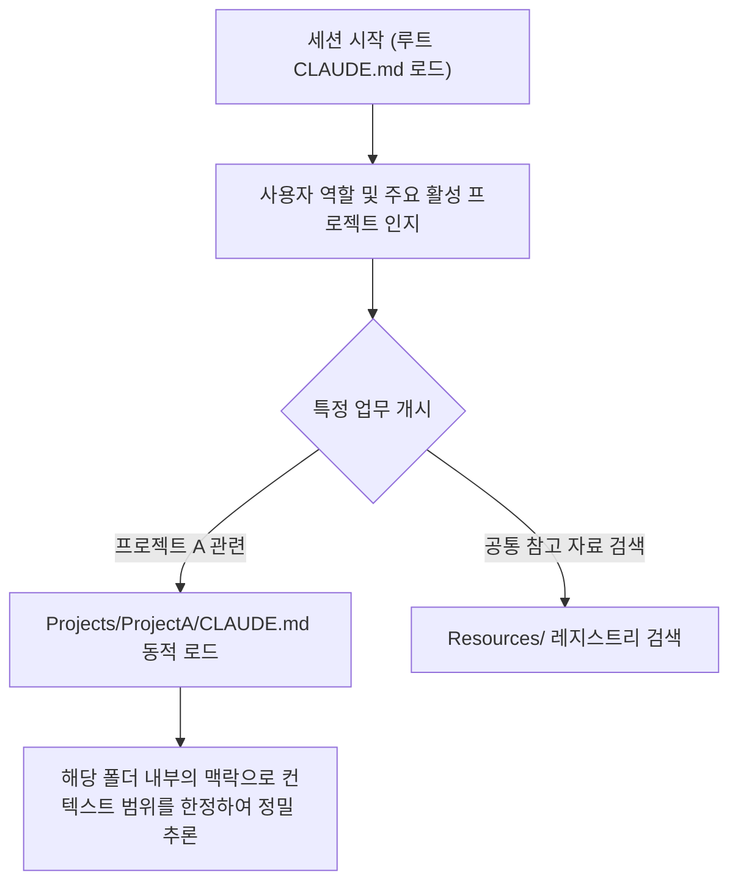

# AI 세컨드 브레인

## 한 줄 정의
AI 세컨드 브레인은 메타(Meta)가 6만 명 이상의 임직원을 대상으로 구축한 지속적이고 구조화된 에이전트 작업 공간(Workspace) 및 지식 시스템으로, 생산성 PARA 방법론과 `CLAUDE.md`를 활용해 대화의 지속적 맥락을 유지하고 다양한 사내 시스템과 연동한 에코시스템이다.

## 핵심 요지
- **PARA 워크스페이스 구조**: 티아고 포르테의 PARA(Projects, Areas, Resources, Archives) 방법론을 에이전트 파일 시스템에 도입해 활성 업무와 백업 자료의 위치 및 컨텍스트 경계를 에이전트가 자동 이해하도록 지도를 형성한다.
- **점진적 공개 (Progressive Disclosure)**: 대규모 컨텍스트 입력으로 인한 모델 성능 저하와 토큰 낭비를 막기 위해 루트 `CLAUDE.md`로 세션을 가볍게 시작하고, 에이전트가 특정 프로젝트 폴더로 진입할 때만 해당 폴더의 세부 `CLAUDE.md`를 로드한다. [출처](file:///Users/railscraft/Obsidian/raw/How%20We%20Built%20an%20AI%20Second%20Brain%20for%2060K%20Knowledge%20Workers-ko.md#L31)
- **사내 시스템 인프라 연동**: MCP(Model Context Protocol) 및 CLI를 활용해 내부 문서 에디터, 메신저, 코드 리뷰, 위키 등의 사내 도구들과 안전한 인증 계층을 맺어 자율 에이전트가 실제 업무를 처리하도록 돕는다.
- **마크다운 기반 재사용 스킬**: `/para-init`, `/debrief:team` 과 같이 반복되는 업무 절차를 개발자가 아닌 실무자가 일반 마크다운 파일로 작성하여 에이전트에게 매뉴얼로 학습 및 자발적 공유할 수 있게 했다.

## 상세
### 점진적 컨텍스트 로딩 구조
메타 세컨드 브레인 팀은 단일 저장소 전체의 지식을 한꺼번에 넘기는 대신, 아래와 같이 단계별로 정보를 호출하는 기법을 구현했다.

### 사내 기여 확산의 동력: 구성성 (Composability)
에이전트 스킬을 복잡한 애플리케이션 코드가 아닌, 누구나 읽고 고칠 수 있는 마크다운과 단순 스크립트로 구성하게 한 전략이 메타 내 자발적 확장(설치 63,000건 달성)을 가져왔다. [출처](file:///Users/railscraft/Obsidian/raw/How%20We%20Built%20an%20AI%20Second%20Brain%20for%2060K%20Knowledge%20Workers-ko.md#L70) 디자이너, PM, 엔지니어들이 각 직군에 특화된 패키지 9종과 수천 개의 커스텀 스킬을 만들어 사내 라이브러리에 기여하며 단순 도구를 지식 플랫폼으로 승격시켰다.

## 예시 스킬 흐름
- **`/para-init`**: 사용자의 최근 사내 활동(게시물, 할 일 목록, 코드 리뷰 등)을 스캔해 에이전트가 맞춤형 PARA 폴더 구조를 생성하고 관련 컨텍스트 파일을 자동 빌드해 진입 장벽을 제거한다.
- **`/read-meeting-notes`**: 신규 회의록의 키워드 매칭 가중치 및 참여자 목록을 대조해 가장 어울리는 프로젝트 폴더로 회의록을 자동 이동시키고 후속 작업(Action Items)을 추출한다.

## 관련 노트
- [[Claude.md 운영 원칙]]
- [[Context Engineering]]
- [[Agent Harness]]
- [[Agent Native Infrastructure]]

