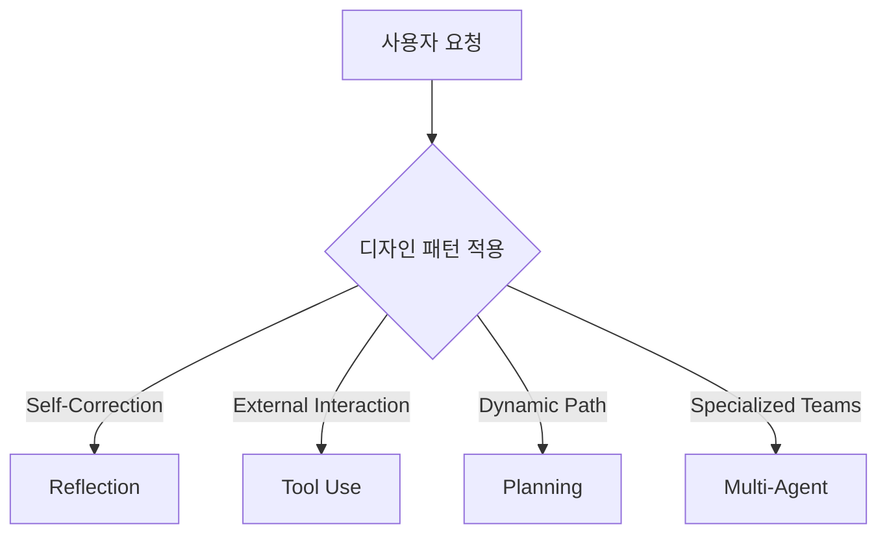

# AI 에이전트 아키텍처 완전 가이드

AI 에이전트(Agent)는 단순 일회성 프롬프트-응답 구조를 넘어, 목표를 달성하기 위해 스스로 단계를 계획하고 도구를 사용하며 결과를 평가 및 수정하는 반복(Iterative) 루프 기반 시스템이다. 본 노트는 초급부터 프로덕션 수준의 고도화된 에이전트 설계 및 최적화 전략을 포괄적으로 다룬다.

---

## 1. 에이전트의 기초 (초급)

### 1.1 에이전트의 작동 원리 (ReAct 루프)
전통적인 LLM 사용 방식이 단 한 번에 전체 답을 출력하는 구조라면, 에이전틱 AI(Agentic AI)는 사람처럼 단계를 밟아가며 작업을 수행한다.
- **Thought (추론)**: 목표에 도달하기 위해 다음에 무엇을 해야 할지 판단한다.
- **Act (행동/도구 호출)**: 웹 검색, API 호출, 데이터베이스 조회 등의 행동을 취한다.
- **Observe (관찰)**: 도구 실행 결과를 분석하고 상태를 업데이트한다.
이 과정을 만족할 만한 최종 답변이 나올 때까지 반복한다.

### 1.2 자율성의 스펙트럼
에이전트의 자율성은 설계 목적에 따라 스펙트럼 형태로 구성된다.
- **스크립트형 에이전트 (Scripted)**: 개발자가 모든 흐름과 도구 호출 순서를 코드로 엄격하게 제어하고, 모델은 텍스트 작성이나 간단한 분류만 수행한다. 제어가 쉽고 예측 가능하다.
- **반자율 에이전트 (Semi-Autonomous)**: 정의된 도구 목록과 가드레일 내에서 모델이 판단하여 도구를 동적으로 기용한다. 현업의 대부분 프로덕션 시스템이 이 영역에 속한다.
- **고도 자율 에이전트 (Highly Autonomous)**: 모델이 수행 경로, 도구 사용 여부, 검색 방식 등을 스스로 전적으로 결정한다. 심지어 임시 코드를 직접 작성해 실행하기도 한다. 강력하지만 통제가 어렵다.

### 1.3 컨텍스트 엔지니어링 (Context Engineering)
에이전트의 지능은 모델 단독으로 나오지 않으며, 모델을 둘러싼 **컨텍스트 환경 설계**에 의존한다.
- 작업의 배경 지식 및 목표 명세
- 페르소나 및 역할 정의
- 도구 목록 및 스키마 명세
- 대화 및 실행 이력을 저장하는 메모리([[Context Engineering]] 참고)

---

## 2. 디자인 패턴 및 아키텍처 (중급)

에이전트 품질을 안정적으로 향상하기 위한 4대 핵심 디자인 패턴은 다음과 같다.

### 2.1 성찰 (Reflection)
모델이 출력한 첫 번째 결과물(초안)에 머무르지 않고, **자가 비판(Critique)** 단계를 거쳐 품질을 개선하는 패턴이다.
- **구조**: `초안 작성 -> 검토 에이전트의 분석 및 결점 탐지 -> 피드백 반영한 수정본 작성`
- **외부 피드백 연동**: 코드 작성 태스크에서 오류 메시지나 컴파일 결과를 피드백으로 주입하여 스스로 버그를 고치게 할 때 극적인 효과를 낸다.

### 2.2 도구 사용 (Tool Use)
LLM이 외부 시스템과 상호작용하도록 백엔드 함수 명세(API, DB 조회, 연산 코드 등)를 에이전트에게 쥐여주는 패턴이다.
- **작동 기법**: 모델은 물리적 실행을 직접 하지 않고, JSON 등 정의된 포맷으로 "함수 호출 요청(Request)"만 발생시킨다. 실제 실행은 시스템 백엔드 코드가 대행하여 그 결과를 다시 모델의 컨텍스트로 넘긴다.
- **인터페이스 설계**: 도구 이름, 자연어 설명(기능 및 용도), 입력값 형식 지정을 위한 엄격한 Typed Schema(예: Pydantic)를 구성해야 한다.

### 2.3 계획 수립 (Planning)
고정된 실행 파이프라인을 하드코딩하지 않고, 주어진 목표에 맞추어 할 일과 그 순서를 모델이 동적으로 설계하도록 맡기는 기법이다.
- 예: *"재고가 있는 선글라스 중 100달러 미만의 동그란 프레임 제품 검색"* -> 모델이 스스로 `설명 검색 -> 재고 확인 -> 가격 필터링` 단계를 계획 및 순차 수행한다.
- 대표적으로 고도화된 에이전트 코딩 시스템([[AI 코딩 에이전트 검증 전략]])에서 자주 활용된다.

### 2.4 멀티 에이전트 협업 (Multi-Agent)
컨텍스트 부하를 줄이고 각 태스크의 전문성을 극대화하기 위해, 명확한 R&R(역할과 책임)을 가진 여러 에이전트 팀을 구성하는 기법이다.
- **순차형 (Sequential)**: 한 에이전트의 결과물이 다음 에이전트의 입력으로 흐르는 벨트 라인 구조 (가장 예측 가능하고 디버깅이 쉬움).
- **병렬형 (Parallel)**: 상호 의존성이 없는 작업을 동시에 실행하여 지연 시간을 단축한다.
- **단일 관리자 계층형 (Single Manager)**: 관리자 에이전트가 하위 실무 에이전트들을 조율하고 통제하며 동적으로 수정 사항을 분기하는 구조 (현업 표준).
- **전체 대 전체 (All-to-All)**: 제한 없는 토론식 구조. 창의적 브레인스토밍에는 유용하나 상용 서비스 구현에는 부적합하다.

---

## 3. 실서비스 프로덕션 최적화 (고급)

에이전트 시스템을 단순 데모에서 실서비스 수준으로 전환하기 위해 거쳐야 하는 최적화 여정이다.

### 3.1 고급 작업 분해 패턴 (Advanced Task Decomposition)
복잡도가 매우 높은 대규모 프로젝트를 처리할 때 작업을 쪼개는 4가지 축이다.
1. **기능적 분해 (Functional)**: 기술 영역이나 도메인(프론트엔드, 백엔드, DB 설계 등)에 따라 역할을 구분한다.
2. **공간적 분해 (Spatial)**: 코드베이스의 디렉터리나 파일 영역별로 작업 범위를 분할하여 병렬 처리 및 충돌 방지를 꾀한다.
3. **시간적 분해 (Temporal)**: 이전 단계 완료가 다음 단계의 기동 조건이 되는 타임라인(Research -> Plan -> Design -> Launch) 기반 단계 격리다.
4. **데이터 기반 분해 (Data-Driven)**: 대용량 데이터 세트를 파티셔닝(예: 1주 차 로그, 2주 차 로그 등)하여 독립 에이전트가 처리한 후 병합한다.

### 3.2 품질 개선 전략
- **Non-LLM 컴포넌트**: 검색 임계값, RAG 청크 크기, top-k 등의 하이퍼파라미터를 미세 튜닝하거나 OCR/비전/검색 API 공급업체를 신속히 전환한다.
- **LLM 컴포넌트**: 퓨샷(Few-shot) 예시를 프롬프트에 제공하고, 각 작업 성격에 특화된 모델(Reasoning 모델, 코딩 모델 등)을 적재적소에 계층화하여 배치한다. 파인튜닝은 마지막 한 자릿수 품질 개선을 위한 최후의 수단으로 남겨둔다.

### 3.3 지연 시간 및 비용 단축
- **병렬 처리**: 의존성 없는 외부 API 호출 및 RAG 검색을 완전 비동기(Async) 병렬 기동한다.
- **모델 계층화 (Tiering)**: 단순 JSON 포맷 유효성 검사, 키워드 추출 등에는 단가가 낮고 처리 속도가 빠른 소형 로컬/클라우드 모델을 배치한다.
- **적극적 캐싱**: 동일 데이터 임베딩, 정적 DB 쿼리, 검색 결과 등은 캐싱(Redis 등)하여 중복 비용과 시간 손실을 차단한다.

### 3.4 관찰 가능성 및 보안
- **의사결정 이력(Trace) 기록**: 에이전트가 왜 그런 판단을 내렸고 어떤 도구를 썼는지의 중간 실행 상태와 샌드박스 로그를 보존한다. 디버깅과 샘플링 검수에 필수적이다.
- **보안 및 서킷 브레이커**: 프롬프트 인젝션 탐지 필터를 적용하고, 에이전트가 코드 실행 도구를 기용할 경우 철저히 격리된 **가상 샌드박스**에서만 구동되게 제한하며, 무한 루프나 누적 비용 임계 도달 시 즉시 작동을 멈추는 서킷 브레이커(Circuit Breaker)를 탑재해야 한다.

---

## 4. 관련 위키 노트

- [[Agent Harness]] — 에이전트 외부 실행 제어 환경(하네스) 구축 상세
- [[Harness Engineering]] — 하네스 엔지니어링의 상세 방법론
- [[Andrew Ng 4 에이전틱 디자인 패턴]] — 앤드류 응 교수의 4가지 에이전트 설계 패턴
- [[Agentic 패턴 진화]] — 에이전틱 패턴의 발전 경향성
- [[AI 에이전트 런타임 역할 맵]] — 실시간 에이전트 오케스트레이션 역할 정의
- [[AI 코딩 에이전트 검증 전략]] — 코딩 전용 에이전트의 검증 루프 설계
- [[파이썬 AI 에이전트 프레임워크 6종 비교 분석]] — 실전 프레임워크 툴킷 분석
