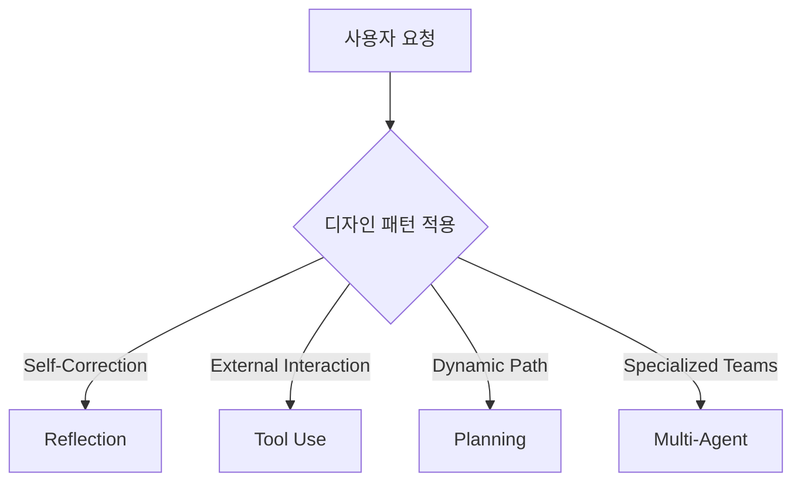

---
aliases:
  - AI 에이전트 완전 가이드
  - 에이전트 아키텍처
  - 멀티 에이전트 시스템
core: true
created: 2026-06-12
sources:
  - raw/AI Agents. Complete Course.md
  - raw/The Agentic AI Engineer Roadmap for 2026. Skills, Stack, and Order.md
  - raw/테일윈드의 고군분투는 무너지는 사상누각의 징조다.md
  - raw/AI가 내 글쓰기 커리어를 죽였다. AI 만세.md
  - raw/AI 네이티브 세컨드 브레인을 구축하는 방법 (2026년 방식).md
  - raw/My Complete Productivity Stack in 2026. Every Tool I Actually Use, What I Pay,
  - raw/AI는 개발자를 대체하는 것이 아니라 더 심각한 일을 하고 있다.md
  - raw/모든 AI 엔지니어가 알아야 할 10가지 LangChain 및 LangGraph 개념.md
  - raw/옵시디언 마스터하기 - 노트를 세컨드 브레인으로 만드는 완벽 가이드.md
  - raw/AI로 몰래 쓴 글을 가려내는 명백한 방법들.md
  - raw/The 10 Engineering Papers Behind Netflix, Uber, Amazon & Google.md
  - raw/1 Aviation Rule That Will Instantly Improve Your Focus.md
  - raw/디지털 제품 제작은 잊으세요. 대신 이것에 집중하세요.md
  - raw/How to Do Hard Things When You Have Zero Motivation.md
  - raw/Anthropic이 Opus 4.8에 대해 말하지 않은 것 - 하네스를 흡수하는 Anthropic.md
  - raw/How top companies are using AI in their design workflows.md
  - raw/좋은 삶을 만드는 것에 대한 지루한 진실.md
  - raw/Claude Code를 위한 Figma 스킬 완벽 가이드.md
  - raw/2026년 AI 보조 코딩은 하나의 기술이다. 실제로 이 기술을 마스터하는 방법.md
  - raw/10 Things Every Investor Should Know (but most learn too late).md
  - raw/내가 Obsidian을 정리하는 방법 - 다니엘 프린디.md
  - raw/Claude Code를 밑바닥부터 직접 구현해 보았다.md
  - raw/Claude Code 프로젝트를 위한 MEMORY.md.md
  - raw/마이크로서비스 대신 모듈러 모놀리스 — AI 에이전트가 코드를 읽기 시작했을 때 바뀐 것들.md
  - raw/The Signs of a Pseudo-Smart Person Are Easy To Spot.md
  - raw/40억 달러 대기업이 깨뜨린 오픈소스와 개발자 협박의 역풍.md
  - raw/The S&P 500 Illusion. Why Your “Diversified” Index Is Really a Bet on 10 Stocks.md
  - raw/Your Wandering Mind Is Not the Enemy of Focus.md
  - raw/BofA’s May Survey Says Investors Are Back in Stocks. The 30-Year Is the Risk..md
  - raw/내 주의 집중 시간을 되돌려준 11가지 사소한 생활 습관의 변화.md
  - raw/7 Coding Patterns I Stole From Senior Engineers.md
  - raw/LLM에게 옵시디언 볼트 열쇠를 주면 일어나는 일.md
  - raw/I will never walk into a backend interview without solving these 20 questions..md
  - raw/2026년을 위한 웹 디자인 및 빌드 워크플로우.md
  - raw/Most Developers Are Solving the Wrong Problem.md
  - raw/These 3 ETFs Created More Millionaires Than Any Stock.md
  - raw/The Next 5 Years. How To Stay Relevant Between 2026–2030 As A Designer.md
  - raw/60일간 11번의 기술 인터뷰를 치르며 깨달은 아무도 말해주지 않는 패턴.md
  - raw/Run a Useful Local LLM in 30 Minutes (Coding, RAG, Voice).md
  - raw/Design’s craft crisis. senior designers built it.md
  - raw/만약 단 5편의 AI 논문만 읽어야 한다면 바로 이것입니다.md
  - raw/AI 코딩 에이전트와 함께하는 명세 기반 개발 결정판 가이드.md
  - raw/Skills Alone Won’t Save You in the AI Economy.md
  - raw/RAG 시스템 초보자부터 전문가까지의 완전 가이드 (2026년 에디션).md
  - 'raw/나만의 개인용 에이전트 시스템 개발하기: 단계별 가이드.md'
status: evergreen
tags:
  - ai-agent
  - architecture
  - orchestration
  - productivity
  - optimization
  - llm
  - agent
type: concept
updated: 2026-07-10
---

# AI 에이전트 아키텍처 완전 가이드

> [!summary]
> - AI 에이전트는 stateless LLM 외부에서 상태, 도구, 성찰(Reflection), 계획(Planning) 루프를 통제하는 아키텍처 체계이다.
> - 멀티 에이전트 설계 시 순차형(Sequential), 병렬형(Parallel), 계층형(Hierarchy) 등의 오케스트레이션 패턴을 상황에 맞게 기용한다.
> - 실서비스 프로덕션으로 전환 시, 고급 작업 분해 기법과 품질/지연시간/비용 모니터링 및 샌드박스 보안 가드레일을 촘촘히 얹어야 한다.

AI 에이전트(Agent)는 단순 일회성 프롬프트-응답 구조를 넘어, 목표를 달성하기 위해 스스로 단계를 계획하고 도구를 사용하며 결과를 평가 및 수정하는 반복(Iterative) 루프 기반 시스템이다. 본 노트는 초급부터 프로덕션 수준의 고도화된 에이전트 설계 및 최적화 전략을 포괄적으로 다룬다.

---

## 1. 에이전트의 기초 (초급)

### 1.1 에이전트의 작동 원리 (ReAct 루프)
전통적인 LLM 사용 방식이 단 한 번에 전체 답을 출력하는 구조라면, 에이전틱 AI(Agentic AI)는 사람처럼 단계를 밟아가며 작업을 수행한다.
- **Thought (추론)**: 목표에 도달하기 위해 다음에 무엇을 해야 할지 판단한다.
- **Act (행동/도구 호출)**: 웹 검색, API 호출, 데이터베이스 조회 등의 행동을 취한다.
- **Observe (관찰)**: 도구 실행 결과를 분석하고 상태를 업데이트한다.
이 과정을 만족할 만한 최종 답변이 나올 때까지 반복한다.

### 1.2 자율성의 스펙트럼
에이전트의 자율성은 설계 목적에 따라 스펙트럼 형태로 구성된다.
- **스크립트형 에이전트 (Scripted)**: 개발자가 모든 흐름과 도구 호출 순서를 코드로 엄격하게 제어하고, 모델은 텍스트 작성이나 간단한 분류만 수행한다. 제어가 쉽고 예측 가능하다.
- **반자율 에이전트 (Semi-Autonomous)**: 정의된 도구 목록과 가드레일 내에서 모델이 판단하여 도구를 동적으로 기용한다. 현업의 대부분 프로덕션 시스템이 이 영역에 속한다.
- **고도 자율 에이전트 (Highly Autonomous)**: 모델이 수행 경로, 도구 사용 여부, 검색 방식 등을 스스로 전적으로 결정한다. 심지어 임시 코드를 직접 작성해 실행하기도 한다. 강력하지만 통제가 어렵다.

### 1.3 컨텍스트 엔지니어링 ([[Context Engineering]])
에이전트의 지능은 모델 단독으로 나오지 않으며, 모델을 둘러싼 **컨텍스트 환경 설계**에 의존한다.
- 작업의 배경 지식 및 목표 명세
- 페르소나 및 역할 정의
- 도구 목록 및 스키마 명세
- 대화 및 실행 이력을 저장하는 메모리([[Context Engineering]] 참고)

---

## 2. 디자인 패턴 및 아키텍처 (중급)

에이전트 품질을 안정적으로 향상하기 위한 4대 핵심 디자인 패턴은 다음과 같다.



### 2.1 성찰 (Reflection)
모델이 출력한 첫 번째 결과물(초안)에 머무르지 않고, **자가 비판(Critique)** 단계를 거쳐 품질을 개선하는 패턴이다.
- **구조**: `초안 작성 -> 검토 에이전트의 분석 및 결점 탐지 -> 피드백 반영한 수정본 작성`
- **외부 피드백 연동**: 코드 작성 태스크에서 오류 메시지나 컴파일 결과를 피드백으로 주입하여 스스로 버그를 고치게 할 때 극적인 효과를 낸다.

### 2.2 도구 사용 (Tool Use)
LLM이 외부 시스템과 상호작용하도록 백엔드 함수 명세(API, DB 조회, 연산 코드 등)를 에이전트에게 쥐여주는 패턴이다.
- **작동 기법**: 모델은 물리적 실행을 직접 하지 않고, JSON 등 정의된 포맷으로 "함수 호출 요청(Request)"만 발생시킨다. 실제 실행은 시스템 백엔드 코드가 대행하여 그 결과를 다시 모델의 컨텍스트로 넘긴다.
- **인터페이스 설계**: 도구 이름, 자연어 설명(기능 및 용도), 입력값 형식 지정을 위한 엄격한 Typed Schema(예: Pydantic)를 구성해야 한다.

### 2.3 계획 수립 (Planning)
고정된 실행 파이프라인을 하드코딩하지 않고, 주어진 목표에 맞추어 할 일과 그 순서를 모델이 동적으로 설계하도록 맡기는 기법이다.
- 예: *"재고가 있는 선글라스 중 100달러 미만의 동그란 프레임 제품 검색"* -> 모델이 스스로 `설명 검색 -> 재고 확인 -> 가격 필터링` 단계를 계획 및 순차 수행한다.
- 대표적으로 고도화된 에이전트 코딩 시스템([[AI 코딩 에이전트 검증 전략]])에서 자주 활용된다.

### 2.4 멀티 에이전트 협업 (Multi-Agent)
컨텍스트 부하를 줄이고 각 태스크의 전문성을 극대화하기 위해, 명확한 R&R(역할과 책임)을 가진 여러 에이전트 팀을 구성하는 기법이다.
- **순차형 (Sequential)**: 한 에이전트의 결과물이 다음 에이전트의 입력으로 흐르는 벨트 라인 구조 (가장 예측 가능하고 디버깅이 쉬움).
- **병렬형 (Parallel)**: 상호 의존성이 없는 작업을 동시에 실행하여 지연 시간을 단축한다.
- **단일 관리자 계층형 (Single Manager)**: 관리자 에이전트가 하위 실무 에이전트들을 조율하고 통제하며 동적으로 수정 사항을 분기하는 구조 (현업 표준).
- **전체 대 전체 (All-to-All)**: 제한 없는 토론식 구조. 창의적 브레인스토밍에는 유용하나 상용 서비스 구현에는 부적합하다.
- **2026 오케스트레이션 표준 (LangGraph)**: 파이썬 에이전트 오케스트레이션은 단순 loop 대신 StateGraph, ReAct 에이전트, Send/Command 구조, checkpointers를 사용하는 **LangGraph**가 지배적인 표준으로 자리 잡았다. 데이터가 영구 보존되는 durable execution을 보장하여 다단계 그래프 실행 복구와 Human-in-the-loop를 유기적으로 결합한다.

### 2.5 4대 아키텍처 계층 (2026 Roadmap 기준)
에이전트 인프라는 다음 4개 계층으로 세분화되어 발전하고 있다.
1. **Foundation Layer**: 비동기 Python(asyncio/Pydantic), SSE(Server-Sent Events) 스트리밍, message queues와 지수 백오프 등을 활용한 분산 영속 실행(durable execution).
2. **LLM Layer**: Structured outputs 강제(JSON Schema), 모델 선택 및 비용 제어(Opus, Sonnet, Haiku, Gemini, 로컬 Qwen/Llama 등 모델 간 티어링), prompt design 및 캐싱.
3. **Agent Layer**: LangGraph 기반 그래프 제어 및 메모리 관리(작업 memory, 일화 memory, 의미 memory). sqlite-vec(로컬), Qdrant(오픈소스 프로덕션), Turbopuffer(서버리스) 등의 2026 표준 데이터 스택 활용.
4. **Production Layer**: 격리된 샌드박스 내부 코드 실행 및 MCP([[Model Context Protocol]]) 표준 연동.

### 2.6 LLM 운영체제와 고급 오케스트레이션
LLM을 컴퓨터의 핵심 CPU 연산 코어, 토큰을 바이트, 컨텍스트 윈도우를 RAM, RAG 검색/벡터 DB를 보조 하드디스크에 매핑하는 안드레 카파시의 'LLM 운영체제(LLMos)' 패러다임이 2026년 에이전트 아키텍처 설계의 기본 뼈대로 공고화되었다. 단일 모놀리식 프롬프트의 덫(컨텍스트 포화, 작업 엉킴, 불투명한 블랙박스)을 탈피하기 위해 태스크를 세분화하여 격리하는 방식이 필수적이다.
특히 단순 RAG의 국소성 한계를 딛고 '분석 -> 요약 -> 계층 병합 -> 거시 추론 -> 생성'을 단계적으로 밟아가는 **[[계층적 전역 추론 워크플로]]**와, 토론 대립 구도에서 지엽적 소모전을 예방하기 위해 중립적 사회자(Moderator)가 Agreements/Disagreements를 중립 축약 정리하고 채점 에이전트(Scoring Agent)가 수렴 상태를 수치로 환산하여 조기 종료(Early stopping)를 동적으로 지시하는 **[[토론 수렴 스코어링 메커니즘]]**이 핵심적인 오케스트레이션 기법으로 검증되었다.

---

## 3. 실서비스 프로덕션 최적화 (고급)

에이전트 시스템을 단순 데모에서 실서비스 수준으로 전환하기 위해 거쳐야 하는 최적화 여정이다.

### 3.1 고급 작업 분해 패턴 (Advanced Task Decomposition)
복잡도가 매우 높은 대규모 프로젝트를 처리할 때 작업을 쪼개는 4가지 축이다.
1. **기능적 분해 (Functional)**: 기술 영역이나 도메인(프론트엔드, 백엔드, DB 설계 등)에 따라 역할을 구분한다.
2. **공간적 분해 (Spatial)**: 코드베이스의 디렉터리나 파일 영역별로 작업 범위를 분할하여 병렬 처리 및 충돌 방지를 꾀한다.
3. **시간적 분해 (Temporal)**: 이전 단계 완료가 다음 단계의 기동 조건이 되는 타임라인(Research -> Plan -> Design -> Launch) 기반 단계 격리다.
4. **데이터 기반 분해 (Data-Driven)**: 대용량 데이터 세트를 파티셔닝(예: 1주 차 로그, 2주 차 로그 등)하여 독립 에이전트가 처리한 후 병합한다.

### 3.2 품질 개선 전략
- **Non-LLM 컴포넌트**: 검색 임계값, RAG 청크 크기, top-k 등의 하이퍼파라미터를 미세 튜닝하거나 OCR/비전/검색 API 공급업체를 신속히 전환한다.
- **LLM 컴포넌트**: 퓨샷(Few-shot) 예시를 프롬프트에 제공하고, 각 작업 성격에 특화된 모델(Reasoning 모델, 코딩 모델 등)을 적재적소에 계층화하여 배치한다. 파인튜닝은 마지막 한 자릿수 품질 개선을 위한 최후의 수단으로 남겨둔다.

### 3.3 지연 시간 및 비용 단축
- **병렬 처리**: 의존성 없는 외부 API 호출 및 RAG 검색을 완전 비동기(Async) 병렬 기동한다.
- **모델 계층화 (Tiering)**: 단순 JSON 포맷 유효성 검사, 키워드 추출 등에는 단가가 낮고 처리 속도가 빠른 소형 로컬/클라우드 모델을 배치한다.
- **적극적 캐싱**: 동일 데이터 임베딩, 정적 DB 쿼리, 검색 결과 등은 캐싱(Redis 등)하여 중복 비용과 시간 손실을 차단한다.

### 3.4 관찰 가능성 및 보안
- **의사결정 이력(Trace) 기록**: 에이전트가 왜 그런 판단을 내렸고 어떤 도구를 썼는지의 중간 실행 상태와 샌드박스 로그를 보존한다. 디버깅과 샘플링 검수에 필수적이며, Promptfoo, RAGAS 등의 자동 평가 도구(evals)를 적용하여 아키텍처 성능 저하를 방지한다.
- **보안 및 서킷 브레이커**: 프롬프트 인젝션 방어 시스템을 탑재하고, 에이전트가 코드 실행 도구를 사용할 경우 호스트 보호를 위해 `E2B`, `Modal Sandbox`, `Daytona` 같은 격리된 일시적 샌드박스 환경(ephemeral environments)을 의무화해야 한다. 무한 루프나 누적 비용 임계 도달 시 작동을 멈추는 서킷 브레이커(Circuit Breaker)를 결합한다.

---

## 한 줄 정의
AI 에이전트는 stateless LLM 외부에서 상태, 도구, 성찰(Reflection), 계획(Planning) 루프를 통제하는 아키텍처 체계이다.

## 핵심 요지
- 복잡성/정밀도 매트릭스: 에이전틱 AI는 높은 복잡성과 상대적으로 낮은 정밀도가 허용되는 업무(예: 강의 노트 요약 및 검토)에서 가장 빠르게 높은 ROI를 증명할 수 있으며, 세금 신고서처럼 높은 정확도가 요구되는 분야는 더 촘촘한 가드레일이 수반되어야 한다.
- 2026 에이전트 오케스트레이션은 단순한 LLM 프롬프트 결합을 넘어 상태 중심 그래프(LangGraph)로 수렴한다. (출처: 모든 AI 엔지니어가 알아야 할 10가지 LangChain 및 LangGraph 개념.md)
- 사용자 동의가 필요한 액션(결제, 승인 등)은 Human-in-the-loop(HITL) 설계의 checkpointers 상태 저장 기능을 통해 안전하게 일시 중단 및 재개된다.

## 상세

### 멀티 에이전트 설계 및 비효율 제거
멀티 에이전트 오케스트레이션 설계 시 R&R을 명확히 쪼개어 중복 연산(Duplicate Work)과 불필요한 직렬화(Unnecessary Serialization)로 인한 지연 시간 및 토큰 낭비를 차단해야 한다.

### LangGraph 기반 상태 중심 아키텍처 표준 (2026)

2026년 기준 복잡한 멀티 에이전트 오케스트레이션은 에이전트의 대화 히스토리와 중간 생성 결과물을 단일 `State` 클래스(TypedDict 등)로 래핑하여 에이전트 노드들이 이를 수정 및 갱신해 나가는 **상태 그래프(State Graph)** 패턴으로 전환되었다.

- **상태 정의 (TypedDict State)**: 그래프 내 모든 노드가 공유하며 수정하는 런타임 상태 객체.
- **노드 (Nodes)**: 특정 비즈니스 로직이나 LLM 호출을 담당하고 상태의 변동 분량을 딕셔너리로 반환하여 그래프 상태를 누적 업데이트함.
- **에이전트 제어 루프**: 상태 내부의 특정 필드(예: `risk_score`)를 평가하여 에이전트 루프의 분기 혹은 휴먼 승인(Human-in-the-loop) 인터럽트를 결정함.

## 예시

### 선글라스 쇼핑 쇼핑몰 계획 수립 예시
'100달러 미만의 동그란 프레임 선글라스 검색' 쿼리 시, 하드코딩되지 않은 에이전트가 `get_item_descriptions`로 둥근 안경 검색 -> `check_inventory`로 재고 확인 -> `get_item_price`로 100달러 미만 필터링 단계를 동적으로 계획해 실행한다.

### 마케팅 브로셔 공동 제작 멀티 에이전트 팀 예시
- **조사원 에이전트**: 시장 트렌드 웹 검색 및 JIT retrieval 지식 조회
- **디자이너 에이전트**: 데이터 차트 렌더링 코드 실행 및 이미지 생성
- **작가 에이전트**: 조사 결과와 디자인 그래픽 에셋을 취합해 최종 브로셔 문구 집필

```python
from typing import Annotated, TypedDict
from langgraph.graph import StateGraph, START, END
from langgraph.graph.message import add_messages
from langgraph.checkpoint.memory import MemorySaver

# 1. State 정의
class AgentState(TypedDict):
    messages: Annotated[list, add_messages]
    risk_score: float
    needs_approval: bool

# 2. Node 함수 정의
def analyze_request(state: AgentState):
    # 요청 분석 후 risk_score 평가 노드
    risk = 0.85 # 임의 계산 값
    return {
        "messages": [{"role": "assistant", "content": f"Risk score calculated: {risk}"}],
        "risk_score": risk,
        "needs_approval": risk > 0.7
    }

def process_action(state: AgentState):
    # 실행 노드
    return {
        "messages": [{"role": "assistant", "content": "Action successfully processed."}]
    }

# 3. conditional edge 라우팅 함수
def check_approval(state: AgentState):
    if state.get("needs_approval", False):
        return "approval_required"
    return "process"

# 4. 그래프 빌드
builder = StateGraph(AgentState)
builder.add_node("analyzer", analyze_request)
builder.add_node("executor", process_action)

builder.add_edge(START, "analyzer")
# risk_score에 따라 실행 노드로 바로 갈지, 휴먼 피드백을 받기 위해 중단할지 분기
builder.add_conditional_edges(
    "analyzer",
    check_approval,
    {
        "approval_required": END, # checkpointer가 상태를 저장하고 일시 중단
        "process": "executor"
    }
)
builder.add_edge("executor", END)

# 5. Checkpointer 결합을 통한 Human-in-the-loop 일시 중단 활성화
memory = MemorySaver()
graph = builder.compile(checkpointer=memory, interrupt_before=["executor"])
```

## 충돌
## 관련 노트
- [[Agent Harness]] — 에이전트 외부 실행 제어 환경(하네스) 구축 상세
- [[Harness Engineering]] — 하네스 엔지니어링의 상세 방법론
- [[Andrew Ng 4 에이전틱 디자인 패턴]] — 앤드류 응 교수의 4가지 에이전트 설계 패턴
- [[Agentic 패턴 진화]] — 에이전틱 패턴의 발전 경향성
- [[AI 에이전트 런타임 역할 맵]] — 실시간 에이전트 오케스트레이션 역할 정의
- [[AI 코딩 에이전트 검증 전략]] — 코딩 전용 에이전트의 검증 루프 설계
- [[파이썬 AI 에이전트 프레임워크 6종 비교 분석]] — 실전 프레임워크 툴킷 분석
- [[에이전틱 AI 엔지니어 실무 로드맵]] — 2026 [[에이전틱 AI 엔지니어]] 역량과 스택 로드맵
- [[Claude.md 운영 원칙]]
- [[Vibe Coding과 Agentic Engineering]]

