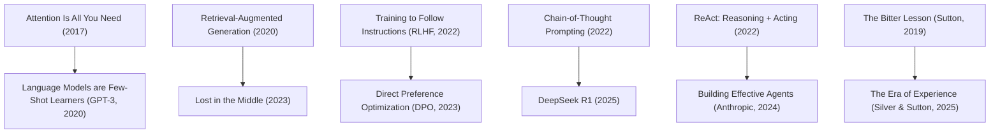

---
aliases:
- AI 엔지니어 필수 논문 5선
- 필수 AI 논문
- AI-엔지니어-필수-논문
core: false
created: 2026-06-12
sources:
- raw/만약 단 5편의 AI 논문만 읽어야 한다면 바로 이것입니다.md
- raw/테일윈드의 고군분투는 무너지는 사상누각의 징조다.md
- raw/AI가 내 글쓰기 커리어를 죽였다. AI 만세.md
- raw/AI 네이티브 세컨드 브레인을 구축하는 방법 (2026년 방식).md
- raw/My Complete Productivity Stack in 2026. Every Tool I Actually Use, What I Pay,
  and What I Rejected.md
- raw/AI는 개발자를 대체하는 것이 아니라 더 심각한 일을 하고 있다.md
- raw/모든 AI 엔지니어가 알아야 할 10가지 LangChain 및 LangGraph 개념.md
- raw/옵시디언 마스터하기 - 노트를 세컨드 브레인으로 만드는 완벽 가이드.md
- raw/AI로 몰래 쓴 글을 가려내는 명백한 방법들.md
- raw/The 10 Engineering Papers Behind Netflix, Uber, Amazon & Google.md
- raw/1 Aviation Rule That Will Instantly Improve Your Focus.md
- raw/디지털 제품 제작은 잊으세요. 대신 이것에 집중하세요.md
- raw/AI Agents. Complete Course.md
- raw/How to Do Hard Things When You Have Zero Motivation.md
- raw/Anthropic이 Opus 4.8에 대해 말하지 않은 것 - 하네스를 흡수하는 Anthropic.md
- raw/How top companies are using AI in their design workflows.md
- raw/좋은 삶을 만드는 것에 대한 지루한 진실.md
- raw/Claude Code를 위한 Figma 스킬 완벽 가이드.md
- raw/2026년 AI 보조 코딩은 하나의 기술이다. 실제로 이 기술을 마스터하는 방법.md
- raw/10 Things Every Investor Should Know (but most learn too late).md
- raw/내가 Obsidian을 정리하는 방법 - 다니엘 프린디.md
- raw/Claude Code를 밑바닥부터 직접 구현해 보았다.md
- raw/Claude Code 프로젝트를 위한 MEMORY.md.md
- raw/마이크로서비스 대신 모듈러 모놀리스 — AI 에이전트가 코드를 읽기 시작했을 때 바뀐 것들.md
- raw/The Signs of a Pseudo-Smart Person Are Easy To Spot.md
- raw/40억 달러 대기업이 깨뜨린 오픈소스와 개발자 협박의 역풍.md
- raw/The S&P 500 Illusion. Why Your “Diversified” Index Is Really a Bet on 10 Stocks.md
- raw/Your Wandering Mind Is Not the Enemy of Focus.md
- raw/BofA’s May Survey Says Investors Are Back in Stocks. The 30-Year Is the Risk..md
- raw/내 주의 집중 시간을 되돌려준 11가지 사소한 생활 습관의 변화.md
- raw/7 Coding Patterns I Stole From Senior Engineers.md
- raw/LLM에게 옵시디언 볼트 열쇠를 주면 일어나는 일.md
- raw/I will never walk into a backend interview without solving these 20 questions..md
- raw/2026년을 위한 웹 디자인 및 빌드 워크플로우.md
- raw/Most Developers Are Solving the Wrong Problem.md
- raw/These 3 ETFs Created More Millionaires Than Any Stock.md
- raw/The Next 5 Years. How To Stay Relevant Between 2026–2030 As A Designer.md
- raw/60일간 11번의 기술 인터뷰를 치르며 깨달은 아무도 말해주지 않는 패턴.md
- raw/Run a Useful Local LLM in 30 Minutes (Coding, RAG, Voice).md
- raw/Design’s craft crisis. senior designers built it.md
- raw/The Agentic AI Engineer Roadmap for 2026. Skills, Stack, and Order.md
- raw/AI 코딩 에이전트와 함께하는 명세 기반 개발 결정판 가이드.md
- raw/Skills Alone Won’t Save You in the AI Economy.md
- raw/RAG 시스템 초보자부터 전문가까지의 완전 가이드 (2026년 에디션).md
status: evergreen
tags:
- paper
- education
- agent
- machine-learning
type: concept
updated: '2026-06-22'
---
# AI 엔지니어 필수 논문 (Essential AI Papers)

## 한 줄 정의
현대 생성형 AI와 에이전틱 엔지니어링의 근간을 형성한 5편의 학술 논문과 1편의 역사적 에세이의 핵심 작동 원리 및 실무적 로드맵이다.

## 핵심 요지
1. **아키텍처(Attention)**: 트랜스포머의 병렬 처리가 가능해진 셀프 어텐션의 원리를 이해한다.
2. **지식 격리(RAG)**: 매개변수 메모리(가중치)와 비매개변수 메모리(외부 DB)의 분리를 통한 지식 관리를 이해한다.
3. **정렬(RLHF)**: 다음 단어 예측 엔진을 인간 지시에 응답하는 비서로 정렬하는 사후 학습 파이프라인을 이해한다.
4. **추론(CoT)**: 풀이 과정을 텍스트로 적어내는 행위 자체가 테스트 시점 연산(test-time compute)을 늘리는 자원임을 파악한다.
5. **동적 제어(ReAct)**: 추론과 행동의 결합을 통해 모델을 외부 상태 머신 및 제어 루프로 확장하는 원리를 이해한다.
6. **확장성 규칙(The Bitter Lesson)**: 인간의 수동 규칙 주입 대신 계산 자원을 극대화하는 범용 알고리즘(검색 및 학습)의 최종 승리를 인식한다.

## 상세

### 1. Attention Is All You Need (Vaswani et al., 2017)
- **핵심 기여**: 기존 RNN의 순차적(sequential) 연산 병목을 극복하고 **셀프 어텐션(self-attention)** 메커니즘을 제안하여 수천 개의 GPU에서 병렬 학습을 실현함.
- **실무 트레이드오프**: 시권스 내 모든 토큰 쌍의 유사도를 연산하므로 비용이 길이의 제곱($O(N^2)$)으로 증가한다. 이는 롱 컨텍스트 내 중간 유실(Lost in the Middle)의 원인이 된다.
- **후속 논문**: *Language Models are Few-Shot Learners* (Brown et al., 2020) — GPT-3의 대규모 확장 증명.

### 2. Retrieval-Augmented Generation for Knowledge-Intensive NLP Tasks (Lewis et al., 2020)
- **핵심 기여**: 지식 베이스와 추론 엔진의 분리. 검색기(Retriever)가 외부 Vector DB에서 관련 텍스트 조각을 찾아 생성기(Generator)에 컨텍스트로 제공하는 **비매개변수 메모리(non-parametric memory)** 개념 정립.
- **실무 의의**: 잦은 갱신이 필요하거나 보안이 강조되는 사실 정보는 파인튜닝 대신 DB 행 수정으로 관리하며, 에러 트레이싱이 투명해진다.
- **후속 연구**: *Lost in the Middle* (Liu et al., 2023) — 단순 롱 컨텍스트 입력의 성능 저하 검증.

### 3. Training Language Models to Follow Instructions with Human Feedback (Ouyang et al., 2022)
- **핵심 기여**: 지도 미세 조정(SFT) -> 보상 모델(Reward Model) 학습 -> 인간 피드백 기반 강화학습(RLHF)으로 이어지는 사후 학습 파이프라인 정립.
- **실무 의의**: 베이스 모델의 단순 텍스트 채우기 성향을 사용자의 지시 준수 및 안전성 요구에 부합하도록 교정함.
- **후속 연구**: *Direct Preference Optimization* (Rafailov et al., 2023) — 보상 모델 없이 단순화된 DPO 미세 조정.

### 4. Chain-of-Thought Prompting in Large Language Models (Wei et al., 2022)
- **핵심 기여**: 즉각적인 결론 대신 중간 생각의 사슬(CoT)을 생성하게 하여, 생성된 토큰 자체를 추론용 메모장으로 삼는 연산 자원 확보.
- **실무 의의**: 테스트 시점 연산(test-time compute)의 중요성을 환기시켰으며, 복잡한 로직 및 수학 문제의 정답률을 향상시킴.
- **후속 성과**: *DeepSeek R1* (DeepSeek, 2025) — 순수 강화 학습을 통해 자가 추론 경로(CoT)를 자율적으로 생성하게 만듦.

### 5. ReAct: Synergizing Reasoning and Acting in Language Models (Yao et al., 2022)
- **핵심 기여**: 추론(Reasoning, 생각 기록)과 행동(Acting, 도구 호출 및 결과 관찰)을 순환식 루프로 결합함.
- **실무 의의**: LLM을 텍스트 생성기에서 에이전틱 제어 루프(control loop)를 지닌 상태 머신으로 승격시킴. 엔지니어링의 역할이 프롬프트 미세 조정에서 신뢰성 있는 외부 도구 설계 및 검증으로 전환됨.
- **후속 연구**: *Building Effective Agents* (Anthropic, 2024) — 대규모 에이전트 라우팅 및 오케스트레이션 설계 가이드.

### 6. The Bitter Lesson (Sutton, 2019)
- **핵심 기여**: 인공지능 연구 역사상 인간의 휴리스틱이나 지식 모델을 기계에 주입하는 하드코딩 설계는 결국 하드웨어 계산 확장이 적용된 범용 알고리즘에 추월당한다는 격언.
- **실무 의의**: 에이전트 오케스트레이션을 설계할 때 사람이 인위적으로 짠 복잡한 라우팅 규칙보다 자가 개선과 강화 학습 기반의 설계가 결국 최종 생존할 것임을 명심해야 한다.

## AI 엔지니어링 추천 로드맵 (Reading Tree)

## 관련 노트
- [[Software 3.0]]
  - 트랜스포머 추론 모델이 컴퓨터 CPU 인터프리터가 되고 컨텍스트를 메모리/프로그램으로 쓰는 구조적 연관성.
- [[Context Engineering]]
  - RAG 및 롱 컨텍스트 내의 정보 밀도와 탐색 효율을 극대화하는 컨텍스트 설계 기법.
- [[Agent Harness]]
  - ReAct 루프를 안전하고 지속적으로 실행하기 위한 가이드레일 및 인프라 구조.
- [[빅테크 아키텍처 10대 엔지니어링 논문]]
  - 분산 시스템, NoSQL, 가십 프로토콜 등 시스템 아키텍처의 학술적/실무적 기원.

