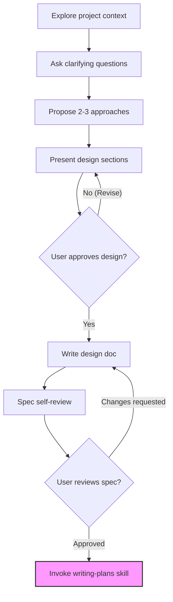

---
aliases:
  - brainstorming
  - 'superpowers:brainstorming'
  - 디자인 승인 하드게이트
  - 아이디어를 디자인으로 브레인스토밍하기
core: false
created: 2026-06-30
sources:
  - raw/superpowers-brainstorming.md
status: draft
tags:
  - llm
  - agent
  - skill
  - design
type: workflow
updated: 2026-07-10
---

# Brainstorming 스킬 운영 원칙

## 한 줄 정의
`brainstorming` 스킬은 AI 에이전트가 기능 구현이나 코드 작성을 시작하기 전에, 아이디어를 명확한 설계 명세서(Spec)로 정제하고 사용자의 승인을 받도록 통제하는 워크플로우 제어 레이어다.

## 핵심 요지
- **디자인 승인 하드게이트 (Design Approval Hard-Gate)**: 디자인 명세를 작성하고 사용자가 명시적으로 승인하기 전에는 어떠한 코드 작성, 스캐폴딩, 프로젝트 구성 등의 구현 행위도 금지한다.
- **체크리스트 기반 단계별 전개**: 프로젝트의 맥락을 분석하고, 명확화 질문(한 번에 하나씩), 대안 제시, 상세 설계 제시, Spec 문서화(`docs/superpowers/specs/` 하위 저장), 셀프 리뷰 순으로 순차 진행한다.
- **적시 비주얼 컴패니언 (Just-in-Time Visual Companion) 활용**: 시각적 설명이 정말로 필요한 순간에만 브라우저 기반의 컴패니언 도구 연동을 제안하며, 제안 메시지는 반드시 단독으로 전송해야 한다.
- **구현 계획 스킬로의 전환**: 설계 승인이 완료되면 다음 단계인 `writing-plans` 스킬을 기동하여 구체적인 구현 계획을 수립한다.
- 디자인 승인 하드게이트(Design Approval Hard-Gate): 명세가 작성되고 명시적 승인을 획득하기 전까지는 어떠한 코드 작성, 프로젝트 스캐폴딩 등 구현 행동도 전면 금지된다.
- 설계 및 브레인스토밍의 최종 종단 상태(terminal state)는 오직 writing-plans 스킬의 기동이며, 그 외의 구현 및 스타일링 스킬을 brainstorming 단계에서 직접 기동할 수 없다.
- Visual Companion(비주얼 도구)은 적시에만(Just-in-time) 단독 메시지로 제안하며, 레이아웃이나 와이어프레임 등 시각적인 영역에만 한정적으로 활성화하고 텍스트 질문은 터미널을 고수한다.

## 상세

### 1. "너무 간단해서 설계가 필요 없다"는 안티패턴 방지
- **디자인 대상의 보편성**: Todo 리스트, 단일 유틸리티 함수 생성, 설정 파일 변경과 같이 극히 단순해 보이는 작업조차도 암묵적 가정으로 인한 오작동을 막기 위해 반드시 설계를 거쳐야 한다.
- **설계의 확장성**: 단순한 작업은 단 몇 줄의 설계 요약으로도 충분하지만, 이를 사용자에게 제시하고 명시적 합의(승인)를 얻는 과정 자체는 생략할 수 없다.

### 2. 브레인스토밍 9단계 체크리스트
스킬이 실행되면 에이전트는 다음 단계를 순서대로 명시적인 작업으로 생성하고 완수해야 한다.
1. **프로젝트 맥락 탐색**: 기존 코드, 파일 구조, 문서, 최근 커밋 기록을 먼저 점검한다.
2. **비주얼 컴패니언 제안 검토**: 설계 과정 중 레이아웃이나 아키텍처 다이어그램 등 시각화가 필요한 시점에만 비주얼 컴패니언을 제안한다. (사전 제안 금지)
3. **질의응답 및 명확화**: 한 번에 하나의 질문만 던져 요구사항, 제약 조건, 성공 기준을 구체화한다.
4. **2~3가지 접근법 제시**: 트레이드오프와 함께 추천 경로 및 이유를 제공한다.
5. **섹션별 디자인 제시**: 구조화된 디자인을 제시하고 사용자의 피드백을 통해 점진적으로 승인을 받는다.
6. **디자인 명세서 작성**: 승인된 내용을 `docs/superpowers/specs/YYYY-MM-DD-<topic>-design.md` 경로에 마크다운 파일로 작성하고 Git에 커밋한다.
7. **명세서 자체 리뷰 (Spec Self-Review)**: TBD/TODO 같은 자리표시자, 논리적 모순, 모호한 요구사항 등을 스스로 검토하고 즉시 수정한다.
8. **사용자 검토 및 최종 승인**: 사용자에게 생성된 명세서 경로를 공유하고 검토를 요청한다.
9. **구현 단계 전환**: 승인 즉시 `writing-plans` 스킬을 호출하여 구현 계획을 작성한다.

### 3. 격리와 명확성을 고려한 디자인 (Design for Isolation)
- **단일 책임 유닛 분할**: 전체 시스템을 각각 명확한 목적을 가지고 독립적으로 테스트 가능한 작은 단위(Unit)로 쪼갠다.
- **인터페이스 중심 설계**: 유닛 간의 소통은 잘 정의된 인터페이스를 통해 이루어져야 하며, 내부 구현이 변경되어도 소비처(Consumer)가 깨지지 않는 경계를 구축한다.

### 4. 비주얼 컴패니언 (Visual Companion) 운영 규칙
- **제안 방식**: visual companion 제안 메시지는 다른 질문이나 정보와 섞지 않고 오직 제안 목적의 단독 메시지로 전송한다.
- **conceptual vs visual 분기 기준**:
  - **텍스트(터미널) 유지**: 개념 정의, 옵션 선택지, 요구사항 질문, 의사결정 프레임 등.
  - **브라우저 전송**: 와이어프레임, 아키텍처 다이어그램, UI 컴포넌트 목업, 레이아웃 비교 등.

### 1. 브레인스토밍 9단계 실천 체크리스트
에이전트는 브레인스토밍 진입 시 다음 작업을 차례대로 정의하고 실행해야 한다.
1. **Explore project context**: 기존 코드 구조, 최근 커밋, 문서 스캔.
2. **Visual Companion 제안**: 시각적 설명이 정말 필요한 시점에만 단독 제안 메시지 발송.
3. **Clarifying questions**: 요구사항, 제약 조건, 성공 지표를 위해 한 번에 하나의 질문만 수행.
4. **Propose 2-3 approaches**: 추천 경로와 근거를 포함한 트레이드오프 분석 제안.
5. **Present design**: 구조화된 설계 세부 정보를 섹션별로 전달해 피드백 획득.
6. **Write design doc**: `docs/superpowers/specs/YYYY-MM-DD-<topic>-design.md` 경로에 명세 저장 및 커밋.
7. **Spec self-review**: TODO, TBD 등의 미완성 문장이나 모순점을 스스로 스캔하고 즉시 보완.
8. **User reviews written spec**: 사용자에게 커밋된 명세 경로를 제시하고 최종 검토 요청.
9. **Transition to implementation**: 승인 즉시 `writing-plans` 스킬 기동 및 다음 계획 작성으로 전환.

## 예시

### 1. 단순 작업에 대한 하드게이트 적용 예시
설정 파일(`.env.example`)에 환경 변수를 하나 추가하는 단순 작업이라 하더라도 즉각 구현하지 않고 다음과 같이 설계를 제시한다.
> **설계 제안**:
> - 목적: API 키 추가
> - 변경 파일: `.env.example`
> - 적용 방식: `API_KEY=your_key_here` 환경변수 추가 및 사용 매뉴얼에 명시
> 
> 이 설계가 괜찮으시다면 승인해주시기 바랍니다. 승인 이후 구현 계획을 작성하겠습니다.

### 2. 비주얼 컴패니언의 적시 제안 예시
UI 레이아웃 옵션을 시각적으로 비교해야 하는 시점에 도달하면 다음과 같이 단독 메시지로 제안한다.
> 이 다음 단계는 화면 배치를 결정하는 것입니다. 옵션 A(사이드바 고정형)와 옵션 B(탑 내비게이션형)를 시각적으로 비교할 수 있도록 브라우저 탭에 목업과 비교 다이어그램을 띄워 설명해 드릴 수 있습니다. visual companion을 열어 진행할까요?

### 2. 격리 및 명확성 극대화를 위한 설계 원칙
- **단일 책임 유닛 분할**: 시스템을 명확한 역할을 가지며 독립적으로 테스트와 변경이 용이한 최소 단위(Unit)로 해체한다.
- **인터페이스 경계 수호**: 유닛 간 통신은 잘 정의된 규격에만 의존하게 설계하여, 내부의 변경이 외부로 전파되어 시스템 전체를 깨뜨리는 부작용을 원천 차단한다.

## 충돌

## 관련 노트
- `[[Cursor Superpowers 플러그인]]`: Superpowers 프레임워크와 스킬 오케스트레이션 전반을 다룬다.
- `[[Plan Mode 기반 AI 작업]]`: 구현 전에 위험 요소와 승인 경계를 지정하는 에이전트 행동 지침.
- `[[사양 기반 개발 (Spec Driven Development)]]`: 바이브 코딩에서 탈피하여 명세서 중심의 점진적 구현 루틴을 다룬다.
- `[[Harness Engineering]]`: 비결정적인 LLM 출력을 외부 통제 절차로 제어하는 상위 패러다임.
- [[Gajae-Code]]

