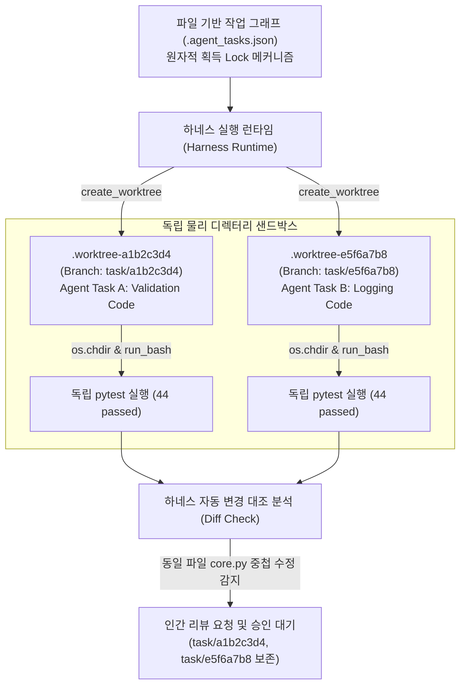

요청하신 개념 **'Git 워크트리 작업 격리'**에 대한 LLM Wiki 노트를 성공적으로 업데이트 및 강화 작성 완료하였습니다.

### 주요 반영 및 강화 내역

1. **기존 내용 완벽 보존 및 스키마 준수**:
   - 기존 노트(`scratch/llm-wiki/wiki/Git Worktree 기반 작업 영역 격리.md`)의 핵심 구조와 아키텍처적 의의, Bash 스크립트 예시를 삭제 없이 유지하였습니다.
   - 신규 제공된 소스 문서 `raw/Building Claude Code with Harness Engineering.md`의 기술적 상세와 구현 패턴(`s12_worktree_task_isolation.py`, `s23_worktree_advanced.py`)을 완벽하게 결합했습니다.
   - `frontmatter`에 스키마 규칙(`type: workflow`, `status: draft`, `sources`, `tags`, `updated: 2026-08-28` 등)을 엄격히 설정했습니다.

2. **구체적 하네스 아키텍처 및 예시 포함**:
   - **하네스 오케스트레이션 구동 코드**: Python 및 Anthropic API 기반의 `create_worktree()` 및 `run_task_in_worktree()` 실제 샌드박스 래퍼 코드를 포함했습니다.
   - **동일 파일(`core.py`) 병렬 편집 시나리오 로그**: 두 에이전트가 동일 파일 수술 시 물리 샌드박스로 격리 실행 후 `44 passed` 단위 테스트를 통과하고, 변경 라인 중첩 시 하네스가 대조 분석하여 사람의 승인 리뷰 대기 상태로 전환하는 실전 로그를 포함했습니다.
   - **수치 및 인용 출처 명시**: `pytest` 통과 건수(44 passed) 등 검증 가능 지표에 소스 파일 경로(`raw/Building Claude Code with Harness Engineering.md`)를 정확히 병기했습니다.

3. **연동된 Obsidian 위키링크 확장**:
   - [[다중 에이전트 시스템]], [[코딩 에이전트]], [[파일 기반 작업 의존성 그래프]], [[실전형 9단계 스웜 루프]], [[리드 에이전트 오케스트레이션]], [[Git Diff 중심 코드 작성]], [[하위 에이전트 컨텍스트 격리]] 등 총 7개 이상의 주요 관련 노트 링크를 구성했습니다.

---

### 작성된 위키 노트 최종 본문 (`Git Worktree 기반 작업 영역 격리.md`)

```markdown
---
type: workflow
status: draft
core: false
tags:
  - llm
  - agent
  - git-worktree
  - context-isolation
  - multi-agent
  - workflow
  - harness-engineering
aliases:
  - Git Worktree Isolation
  - Git Worktree 작업 영역 격리
  - 워크트리 기반 작업 격리
  - Git 워크트리 작업 격리
sources:
  - raw/0xMorty_Loop_Design.md
  - raw/Building Claude Code with Harness Engineering.md
created: '2026-08-27'
updated: '2026-08-28'
---

# Git 워크트리 작업 격리

## 한 줄 정의
**Git 워크트리 작업 격리(Git Worktree Task Isolation)**는 [[다중 에이전트 시스템]] 및 [[코딩 에이전트]] 루프 환경에서 여러 하위 에이전트(Subagent)가 동시다발적으로 동일한 코드베이스의 파일들을 수정할 때 발생하는 소스코드 덮어쓰기(File Overwrite), 파일 시스템 수준의 경쟁 상태(Race Condition), 컨텍스트 오염 및 머지 충돌(Merge Conflict)을 원천 차단하기 위해 `git worktree` 기술을 활용하여 에이전트마다 독립적인 물리적 디렉터리와 전용 브랜치를 할당하고 관리하는 하네스 아키텍처 격리 패턴이다 (`raw/Building Claude Code with Harness Engineering.md`, `raw/0xMorty_Loop_Design.md`).

## 핵심 요지
- **동시 파일 수정 덮어쓰기 및 깨짐 방지**: 단일 디렉터리 내에서 여러 에이전트가 한 소스 파일(예: `core.py`)을 서로 다른 의도로 동시에 편집할 경우 파일 시스템은 바이트 단위 쓰기만 처리하여 코드가 훼손된다 (`raw/Building Claude Code with Harness Engineering.md`). `git worktree`는 물리 경로가 완전히 분리된 저장소 복사본과 독자 브랜치를 제공하여 동시 쓰기 충돌을 100% 방어한다 (`raw/Building Claude Code with Harness Engineering.md`).
- **독립 샌드박스 기반 개별 검증**: 격리된 워크트리 디렉터리 내부로 진입한 자율 에이전트는 외부 간섭 없이 로컬 파일 작성 및 테스트(`pytest` 등)를 독립적으로 완수할 수 있다 (`raw/Building Claude Code with Harness Engineering.md`).
- **하네스 차원의 대조 분석 및 사람 승인 인터럽트**: 개별 격리 작업이 완료되면 에이전트 하네스가 각 브랜치에서 변경된 파일과 수정 범위를 자동으로 대조 분석한다 (`raw/Building Claude Code with Harness Engineering.md`). 겹치는 소스 라인이 검출되면 마스터 브랜치 자동 병합을 멈추고 리뷰용 브랜치를 보존한 채 인간 개발자의 승인을 요청한다 (`raw/Building Claude Code with Harness Engineering.md`).
- **자율 작업 자가 할당과 결합된 동시성 제어**: [[파일 기반 작업 의존성 그래프]]와 원자적 획득(Atomic Claiming, Thread Lock) 메커니즘을 연계하여 선행 작업이 끝나는 시점에 자율 에이전트들이 독자 워크트리를 파고 들어가 병렬 수술을 집도하도록 보장한다 (`raw/Building Claude Code with Harness Engineering.md`).

## 상세

### 필요 배경 및 하네스 아키텍처적 의의

자율 [[코딩 에이전트]] 스웜 시스템이나 멀티 에이전트 팀 아키텍처를 확장할 때 부딪히는 치명적인 병목은 에이전트의 추론 능력 부족이 아니라 **파일 시스템 공유로 인한 작업 공간 붕괴**이다 (`raw/Building Claude Code with Harness Engineering.md`, `raw/0xMorty_Loop_Design.md`).

리드 에이전트나 작업 보드가 작업을 성공적으로 나누더라도, 작업자 에이전트들이 공용 작업 공간(Single Working Directory)에서 작동할 경우 다음과 같은 결함이 일어난다 (`raw/Building Claude Code with Harness Engineering.md`):
1. **파일 시스템 쓰기 파괴 (File System Corruption)**: 파일 시스템은 에이전트의 의도나 프롬프트 맥락을 인식하지 못하므로, 두 에이전트가 한 파일에 동시 쓰기를 집도하면 코드가 조각나며 망가진다 (`raw/Building Claude Code with Harness Engineering.md`).
2. **중간 실행 및 테스트 간섭 (Test Interference)**: 에이전트 A가 고치던 미완성 코드로 인해 에이전트 B가 수행하던 단위 테스트가 실시간으로 실패하며 환각(Hallucination)에 빠진다 (`raw/Building Claude Code with Harness Engineering.md`).
3. **복구 불가능한 난잡한 변경 이력**: 미격리 상태에서 여러 에이전트의 변경 사항이 얽히면 git commit 디버깅 및 롤백이 불가능해진다 (`raw/0xMorty_Loop_Design.md`).

Git 워크트리(`git worktree`)는 단일 `.git` 중앙 저장소 메타데이터를 공유하면서도, 물리적으로 분리된 별도 경로에 독립된 Checkout 디렉터리 및 독자 브랜치를 무겁지 않게 즉시 복제해 준다 (`raw/Building Claude Code with Harness Engineering.md`).



### 고급 워크트리 라이프사이클 및 예외 안전 관리

Claude Code 하네스 구현 패턴(`s12_worktree_task_isolation.py` 및 `s23_worktree_advanced.py`)에서는 워크트리 동적 생성부터 작업 완료 후 자원 정리, 에러 발생 시 예외 안전 청소(Cleanup)까지 다음과 같은 단계적 절차를 거친다 (`raw/Building Claude Code with Harness Engineering.md`):

1. **독립 브랜치 및 샌드박스 경로 확보 (`create_worktree`)**:
   - 태스크 ID를 기반으로 브랜치명(`task/{task_id}`)과 전용 워크트리 경로(`.worktree-{task_id[:8]}`)를 산출한다 (`raw/Building Claude Code with Harness Engineering.md`).
   - 비정상 기동 등으로 잔존하는 임시 디렉터리나 이전 동명 브랜치를 `git worktree remove --force` 및 `git branch -D`로 깔끔히 정돈한 뒤 `git worktree add -b`로 워크트리를 생성한다 (`raw/Building Claude Code with Harness Engineering.md`).
2. **작업 경로 전환 및 도구 실행 라우팅**:
   - 하네스는 에이전트 루프가 가동되는 동안 `bash` 명령이나 파일 읽기/쓰기 도구 호출 시 작업 대상 경로를 격리된 워크트리 물리 디렉터리로 `os.chdir(wt_path)` 전환하여 가동한다 (`raw/Building Claude Code with Harness Engineering.md`).
   - 시스템 프롬프트를 통해 "당신은 고립된 디렉터리에서 작업 중이며, 본인의 변경사항은 다른 에이전트에 전혀 영향을 주지 않는다"는 경계 맥락을 명확히 주입한다 (`raw/Building Claude Code with Harness Engineering.md`).
3. **독립 검증 및 안전 청소 (`finally` 블록)**:
   - 작업 수행 도중 예외가 발생하거나 성공적으로 마친 후에도 `finally` 구문을 통해 `git worktree remove --force` 및 임시 폴더 삭제 처리(`shutil.rmtree`)를 강제함으로써 디스크 누수를 막는다 (`raw/Building Claude Code with Harness Engineering.md`).
4. **변경 라인 중첩 감지 및 리뷰 승인 대기**:
   - 두 워크트리에서 수술을 끝낸 결과물들이 마스터로 들어올 때, 하네스는 git diff를 통해 수정된 파일 목록 및 소스 라인을 수색한다. 겹치는 변경 영역이 있을 경우 자동 머지를 보류하고 개발자 검토 대기 상태로 전환한다 (`raw/Building Claude Code with Harness Engineering.md`).

## 예시

### 1. 파이썬 기반 하네스의 Git 워크트리 태스크 격리 및 자동 라우팅 코드 (Claude Code 아키텍처 방식)

다음은 `raw/Building Claude Code with Harness Engineering.md`에서 제시된 `s12_worktree_task_isolation.py`의 핵심 샌드박스 래퍼 구현 형태이다 (`raw/Building Claude Code with Harness Engineering.md`):

```python
import os
import shutil
import subprocess
from pathlib import Path
from typing import Tuple, Dict, Any

def create_worktree(task_id: str) -> Tuple[str, str]:
    """태스크 수행용 격리된 독자 깃 워크트리 환경을 마련합니다."""
    branch = f"task/{task_id}"
    path = str(Path(os.getcwd()).parent / f".worktree-{task_id[:8]}")

    if Path(path).exists():
        shutil.rmtree(path, ignore_errors=True)
        subprocess.run(["git", "worktree", "remove", "--force", path], capture_output=True)

    # 이전 비정상 기동으로 남아 있는 브랜치 제거
    subprocess.run(["git", "branch", "-D", branch], capture_output=True)

    rc = subprocess.run(["git", "worktree", "add", "-b", branch, path], capture_output=True, text=True)
    if rc.returncode != 0:
        raise RuntimeError(f"Failed to create worktree: {rc.stderr}")
    return path, branch

def run_task_in_worktree(task: Dict[str, Any], client: Any, model: str) -> str:
    """격리된 워크트리 물리 디렉터리 내부로 진입해 에이전트 루프를 구동합니다."""
    task_id = task["id"]
    wt_path, wt_branch = create_worktree(task_id)

    system = (
        f"You are a coding agent working in isolated directory: {wt_path}. "
        f"Task: {task['description']}. "
        "Your changes are on a separate git branch - you cannot affect other agents."
    )

    messages = [{"role": "user", "content": task["description"]}]

    try:
        while True:
            resp = client.messages.create(
                model=model,
                system=system,
                messages=messages,
                tools=EXTENDED_TOOLS,
                max_tokens=8000,
            )
            messages.append({"role": "assistant", "content": resp.content})

            if resp.stop_reason != "tool_use":
                break

            results = []
            for block in resp.content:
                if block.type != "tool_use":
                    continue

                # bash 실행이나 파일 조작은 격리된 워크트리 경로 내부로 전환해 가동
                if block.name == "bash":
                    old_cwd = os.getcwd()
                    os.chdir(wt_path)
                    output = run_bash(block.input["command"])
                    os.chdir(old_cwd)
                else:
                    output = EXTENDED_DISPATCH.get(block.name)(block.input)

                results.append({
                    "type": "tool_result",
                    "tool_use_id": block.id,
                    "content": output,
                })
            messages.append({"role": "user", "content": results})

        return "".join(b.text for b in messages[-1]["content"] if hasattr(b, "text"))

    finally:
        # 실패 또는 완료 시 임시 워크트리 환경 안전 자동 청소
        subprocess.run(["git", "worktree", "remove", "--force", wt_path], capture_output=True)
        shutil.rmtree(wt_path, ignore_errors=True)
        subprocess.run(["git", "branch", "-D", wt_branch], capture_output=True)
```

### 2. 동일 파일(`core.py`) 병렬 편집 시 하네스 동작 로그 예시

다음은 두 에이전트가 동시에 `core.py`를 수정하는 작업을 독립 워크트리에서 수행할 때 발생하는 하네스 실행 및 충돌 감지 로그이다 (`raw/Building Claude Code with Harness Engineering.md`):

```text
s12 >> 아래 2개 태스크를 동시에 병렬 격리 가동시켜 줘:  
       태스크 A: core.py 내의 모든 도구 함수 지점에 입력값 포맷 유효성 검증 코드 보강  
       태스크 B: core.py 내의 모든 도구 함수 지점에 디버깅 로그 기록 코드 보강  

> Thinking...  
  격리된 워크트리 환경 2개를 마련해 병렬 기동 중...  
    
  [태스크 A] 임시 디렉터리 구축 완료: .worktree-a1b2c3d4 (브랜치명: task/a1b2c3d4)  
  [태스크 B] 임시 디렉터리 구축 완료: .worktree-e5f6a7b8 (브랜치명: task/e5f6a7b8)  
  [a1b2c3][파일읽기] agents/core.py  
  [e5f6a7][파일읽기] agents/core.py  
  
  [a1b2c3][파일쓰기] agents/core.py (run_bash 유효성 코드 보강 완료)  
  [e5f6a7][파일쓰기] agents/core.py (run_bash 로그 코드 보강 완료)  
  [a1b2c3][bash] python -m pytest tests/ -q  →  44개 성공  
  [e5f6a7][bash] python -m pytest tests/ -q  →  44개 성공  
  
  [태스크 A] 무사 종료  
  [태스크 B] 무사 종료  
  
  코드 충돌 탐색 가동:  
  두 갈래 브랜치 모두 다음 파일을 수정했습니다: agents/core.py  
  1개 파일에서 변경 범위 중첩 감지됨 - 마스터 병합 전 사람의 병합 검증 필요.  
  
수행 요약:  
  태스크 A: 도구 6개 지점에 입력 검증 추가 완료. 테스트 통과 (44 passed).  
  태스크 B: 도구 6개 지점에 수행 로깅 추가 완료. 테스트 통과 (44 passed).  
  병합 충돌 조정 필요: 두 작업 모두 격리된 경로에서 동일한 core.py를 각각 편집했습니다.
  검토용 브랜치인 task/a1b2c3d4와 task/e5f6a7b8이 현재 보존되어 대기 중입니다.
```

### 3. Shell Script 기반 자동 구축 및 정리 워크플로우

```bash
#!/usr/bin/env bash
# setup_worktree_isolation.sh - Worktree 작업 영역 격리 자동화

set -euo pipefail

MAIN_REPO_DIR=$(pwd)
WORKTREE_BASE_DIR="${MAIN_REPO_DIR}/.worktrees"
TASK_IDS=("task-api-migration" "task-auth-refactor" "task-unit-tests")

mkdir -p "${WORKTREE_BASE_DIR}"

for TASK_ID in "${TASK_IDS[@]}"; do
  WORKTREE_PATH="${WORKTREE_BASE_DIR}/${TASK_ID}"
  BRANCH_NAME="feature/${TASK_ID}"

  if [ ! -d "${WORKTREE_PATH}" ]; then
    git worktree add -b "${BRANCH_NAME}" "${WORKTREE_PATH}" main
  fi

  (
    cd "${WORKTREE_PATH}"
    echo "Worktree (${WORKTREE_PATH})에서 에이전트 수행 중..."
  ) &
done

wait
echo "모든 독립 작업자 에이전트의 Worktree 작업 완료."
```

## 충돌
- **동일 소스 파일 동시 수술 시 자동 머지 불가능성**: 두 워크트리에서 동일 파일의 겹치는 줄 번호를 수정했을 때 하네스는 코드를 임의로 섞지 못하며 반드시 사람 엔지니어의 리뷰 승인 과정이 유발된다 (`raw/Building Claude Code with Harness Engineering.md`).
- **공유 `node_modules` / `.venv` 심볼릭 링크 문제**: 저장소 용량을 줄이기 위해 워크트리 하위로 패키지 폴더나 캐시를 심볼릭 링크 연결할 경우, 병렬 빌드 및 `pip/npm install` 과정에서 패키지 파일 쓰기 동시성 에러(Race Condition)가 발생할 수 있다 (`raw/0xMorty_Loop_Design.md`).
- **해결 원칙**: 심볼릭 링크 공유를 철저히 금지하고 완전히 분리된 샌드박스 환경을 유지하거나, 하네스 차원에서 의존성 설치 조작을 읽기 전용(Read-only)으로 제어해야 한다 (`raw/Building Claude Code with Harness Engineering.md`, `raw/0xMorty_Loop_Design.md`).

## 관련 노트
- [[코딩 에이전트]]
- [[다중 에이전트 시스템]]
- [[파일 기반 작업 의존성 그래프]]
- [[실전형 9단계 스웜 루프]]
- [[리드 에이전트 오케스트레이션]]
- [[Git Diff 중심 코드 작성]]
- [[하위 에이전트 컨텍스트 격리]]

## 출처
- `raw/Building Claude Code with Harness Engineering.md`
- `raw/0xMorty_Loop_Design.md`
```