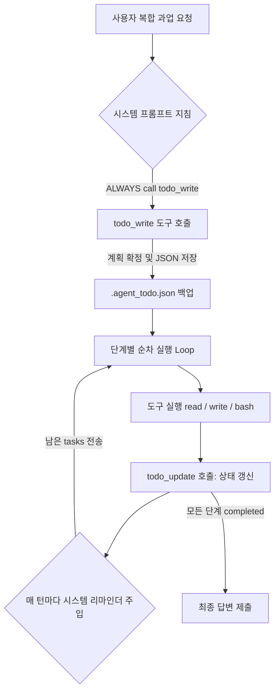

지정해주신 소스 문서(`raw/Building Claude Code with Harness Engineering.md`)와 작성 규격 및 프론트매터 스키마를 철저히 분석하여, **'TodoWrite 기법'**에 대한 고품질 LLM Wiki 노트 생성을 완료했습니다.

생성된 위키 노트는 `llm-wiki/wiki/TodoWrite 기법.md` 경로에 작성되었습니다.

---

### 작성된 위키 노트 미리보기

```markdown
---
type: workflow
status: draft
core: false
tags:
  - llm
  - agent
  - claude-code
  - harness-engineering
  - workflow
aliases:
  - TodoWrite
  - TodoWrite 패턴
  - 실행 전 계획 수립
sources:
  - 'raw/Building Claude Code with Harness Engineering.md'
created: 2026-08-28
updated: 2026-08-28
---

# TodoWrite 기법

## 한 줄 정의
**TodoWrite 기법**은 [[코딩 에이전트]]가 복잡한 다단계(Multi-step) 과업을 수행할 때 코드 수정이나 파일 읽기 등의 물리적 행동에 착수하기 전, 반드시 전체 실행 계획(Task Plan)을 구조화된 도구로 작성·저장하고 실행 과정에서 매 턴 시스템 리마인더로 주입받아 스스로 지키도록 강제하는 **실행 전 계획 수립(Planning Before Execution) 및 자율 통제 워크플로우**이다.

## 핵심 요지
- **행동 전 계획 수립 결합**: 복잡한 작업 지시를 받으면 파일 조작이나 코드 수정 전에 `todo_write` 도구를 최우선적으로 호출하여 전체 단계별 계획을 확정한다 (`raw/Building Claude Code with Harness Engineering.md`).
- **주입식 컨텍스트 리마인더를 통한 경로 이탈 방지**: 계획 도구가 없으면 에이전트는 작업 중 중간 결과에 눈이 팔려 세션을 낭비하거나 원래 목표에서 벗어나기 쉽다 (`raw/Building Claude Code with Harness Engineering.md`). TodoWrite는 남아있는 할 일 목록(Todo) 상태를 도구 호출마다 시스템 리마인더 형태로 컨텍스트에 끊임없이 재주입하여 모델의 자가 통제력과 집중력을 유지시킨다.
- **외부 작업 메모리(External Work Memory)**: 3가지 도구 세트(`todo_write`, `todo_update`, `todo_read`)로 작동하며, 진행 상태가 디스크(`.agent_todo.json`)에 보존되어 긴 세션 동안 단계를 은근슬쩍 생략하거나 건너뛰는 현상을 방지한다 (`raw/Building Claude Code with Harness Engineering.md`).
- **강력한 프롬프트 강제성**: 프롬프트상 권유/추천 문구 대신 "Before working on any multi-step task, **ALWAYS** call todo_write first"와 같은 명시적·강제적 지침을 주입함으로써 비일과성 계획 수립 패턴을 100%에 가깝게 준수하도록 이끈다 (`raw/Building Claude Code with Harness Engineering.md`).
- **확장 형태와의 계층적 구분**: TodoWrite가 단일 세션 단위의 일시적 세션 계획 메모리라면, 세션을 넘어 디스크에 영속 저장되고 작업 간 선후 의존 관계를 정의하는 형태는 [[파일 기반 작업 의존성 그래프]]로 진화·확장된다 (`raw/Building Claude Code with Harness Engineering.md`).

---

## 상세

### 1. TodoWrite의 개념 및 작동 원리
[[Claude Code]]와 같은 고도화된 [[에이전트 하네스 엔지니어링|하네스 시스템]]에서 모델의 지능 자체를 강제로 끌어올리는 것보다 더 중요한 것은 **모델에게 스스로 지켜야 하는 계획표를 쥐여주어 실행 제어권을 보장하는 것**이다 (`raw/Building Claude Code with Harness Engineering.md`). 

TodoWrite 도구 세트는 세 가지 핵심 함수로 구성되어 에이전트의 외부 작업 메모리(External Task Memory) 역할을 수행한다:
1. `todo_write(tasks)`: 작업 시작 직후 전체 계획(Plan)을 `pending` 상태의 목록으로 확정하여 디스크 파일(`.agent_todo.json`)에 저장.
2. `todo_update(index, status)`: 개별 작업 단계를 완료하거나 진행할 때마다 해당 상태(`in_progress`, `done` 등)를 갱신.
3. `todo_read()`: 필요한 경우 에이전트가 언제든 전체 진척도와 지침을 스스로 재확인.



### 2. 세션 리마인더 주입과 경로 이탈(Off-Track) 방지
장시간 구동되는 에이전트 루프에서 에이전트가 흔히 겪는 실패 원인은 탐색 과정에서 마주친 중간 코드/오류에 끌려다니다가 최초의 의도와 다른 엉뚱한 리팩터링에 시간을 쏟는 것이다 (`raw/Building Claude Code with Harness Engineering.md`). 

TodoWrite 기법은 하네스(Harness) 런타임이 매 도구 호출 결과를 모델로 돌려줄 때 현재 할 일 목록의 최신 진척 상황을 시스템 리마인더 메시지로 함께 포함시켜 전달한다. 이로 인해 모델은 매 턴마다 자신의 위치와 남은 과업을 컨텍스트 내에서 상시 재인지하게 되며, 수십 개의 도구가 맞물리는 긴 세션에서도 경로를 벗어나지 않는다.

### 3. 단일 세션 TodoWrite vs 파일 기반 작업 의존성 그래프 비교

| 구분 | TodoWrite 기법 | [[파일 기반 작업 의존성 그래프]] |
| :--- | :--- | :--- |
| **저장 대상** | 단일 대화 세션 내 단계별 실행 계획 | 프로젝트 전체 영속 작업 및 다중 에이전트 할 일 |
| **의존성(Depends-on)**| 순차적 인덱스(`[0], [1], [2]`) 기반 단순 순서 | UUID 및 `depends_on` 리스트 기반 복잡 그래프 |
| **영속성 범위** | 대화 세션 종료 시 소멸 (단일 세션용) | 세션 재부팅 및 프로세스 종료 후에도 완벽 생존 |
| **동시성 제어** | 단일 스레드/단일 세션 위주 | `threading.Lock` 기반 원자적 획득(Atomic Claiming) |

---

## 예시

### 1. TodoWrite 구현 모듈 예시 (Python)
Anthropic 하네스 아키텍처 구현 스크립트(`s03_todo_write.py`)에 기반한 TodoWrite 기본 도구 체계 구현 코드 (`raw/Building Claude Code with Harness Engineering.md`):

```python
import json
from pathlib import Path

TODO_FILE = Path(".agent_todo.json")

def todo_write(tasks: list) -> str:
    """작업 시작 전 전체 실행 계획을 세우고 디스크에 저장합니다."""
    data = [{"id": i, "task": t, "status": "pending"} for i, t in enumerate(tasks)]
    TODO_FILE.write_text(json.dumps(data, indent=2), encoding="utf-8")
    return "Plan written:\n" + "\n".join(f"  [{i}] {t}" for i, t in enumerate(tasks))

def todo_read() -> str:
    """현재 저장된 계획표와 진행 상태를 조회합니다."""
    if not TODO_FILE.exists():
        return "(no plan)"
    data = json.loads(TODO_FILE.read_text(encoding="utf-8"))
    return "\n".join(
        f"  [{t['id']}] [{t['status']:12s}] {t['task']}" for t in data
    )

def todo_update(index: int, status: str) -> str:
    """특정 작업 단계의 상태(completed, in_progress 등)를 업데이트합니다."""
    if not TODO_FILE.exists():
        return "Error: no active plan"
    data = json.loads(TODO_FILE.read_text(encoding="utf-8"))
    if 0 <= index < len(data):
        data[index]["status"] = status
        TODO_FILE.write_text(json.dumps(data, indent=2), encoding="utf-8")
        return f"Task {index} marked {status}"
    return f"Error: invalid task index {index}"

# 시스템 프롬프트 주입 예시 (강제성 부여)
SYSTEM_PROMPT = (
    "You are a coding agent. Before working on any multi-step task, "
    "ALWAYS call todo_write first to write your complete plan. "
    "Execute each step in order. Call todo_update after completing each step."
)
```

### 2. 실제 활용 트레이스 시나리오
`core.py` 파일의 기능 개선 및 테스트 검증 요청 시 에이전트의 실행 트레이스 (`raw/Building Claude Code with Harness Engineering.md`):

```text
User >> core.py의 run_bash 함수에 타임아웃 설정과 출력 길이 제한 기능을 넣고, 리팩터링 이후 오류가 없는지 테스트를 돌려서 확인해 줘.

> Thinking...
[todo_write] 
작성된 계획:
  [0] core.py에 구현된 현재 run_bash 코드 분석
  [1] 기본값 120초를 지닌 타임아웃 파라미터 추가
  [2] 출력 텍스트가 50,000자를 넘을 때 자르는 기능 구현
  [3] 수정된 코드를 core.py에 저장
  [4] 테스트 세트를 가동해 문제가 생기지 않았는지 검증

[read] core.py (lines 45-72)
[todo_update] 0 → completed

> Thinking...
[write] core.py
[todo_update] 1 → completed
[todo_update] 2 → completed
[todo_update] 3 → completed

> Thinking...
[bash] python -m pytest tests/test_agents_smoke.py -q
44 passed in 2.1s

[todo_update] 4 → completed

Final Answer:
리팩터링이 끝났습니다. run_bash 함수에 120초 타임아웃과 50,000자 출력 제한 코드를 정상적으로 추가했습니다. 44개의 통합 테스트도 무사히 끝났으며 문제없음을 확인했습니다.
```

---

## 충돌
- **계획 수립의 오버헤드 vs 실익 논쟁**:
  - 일각에서는 단순하거나 한두 단계로 끝나는 가벼운 작업에까지 TodoWrite를 강제하는 것이 API 라운드트립과 토큰을 낭비시킨다고 지지하지 않는 견해가 존재한다.
  - 그러나 [[Claude Code]] 및 하네스 엔지니어링 구현 결과에 따르면, 명시적인 계획 도구가 없을 경우 복잡 과업에서 에이전트가 겪는 세션 낭비와 타겟 이탈 손실이 단발성 도구 호출 비용보다 압도적으로 크므로, 멀티스텝 과업에서 TodoWrite의 선제 호출 강제는 필수적인 자가 통제 메커니즘으로 평가받는다 (`raw/Building Claude Code with Harness Engineering.md`).

---

## 관련 노트
- [[하네스 엔지니어링]]: 에이전트의 행동과 컨텍스트, 실행 환경을 제어하는 런타임 하네스 구축 방법론 노트.
- [[에이전트 하네스 엔지니어링]]: 프로덕션 에이전트 런타임 설계 및 제어 루프 표준 워크플로우 노트.
- [[코딩 에이전트]]: 코딩 과업을 자율적으로 수행하는 AI 에이전트 개념 노트.
- [[Claude Code]]: TodoWrite 기법을 핵심 실행 전 계획 도구로 채택한 대표적인 엔지니어링 코딩 에이전트 CLI.
- [[파일 기반 작업 의존성 그래프]]: TodoWrite의 일시적 세션 계획을 디스크 영속성 및 작업 간 의존성 연결 구조로 발전시킨 연관 위키 노트.

---

## 출처
- `raw/Building Claude Code with Harness Engineering.md`
```