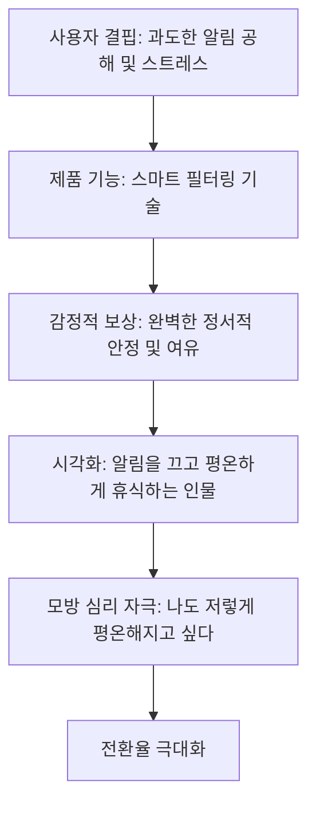

# 감정적 보상 시각화를 통한 모방 심리 자극

## 한 줄 정의
제품의 기능 자체나 단순한 추상적 시각 자료를 넘어, 제품 사용 이후 고객이 도달하게 될 최종 혜택과 감정적 가치(Payoff)를 시각화하여 사용자가 무의식적으로 자신을 대입하게 만들고 전환을 촉진하는 디자인 및 카피라이팅 설계 전략.

## 핵심 요지
- **제품 기능 너머의 가치 전달**: 단순히 서비스의 작동 원리(How)를 설명하는 비주얼을 넘어, 해당 서비스를 통해 얻게 될 최종 혜택(Benefit)을 인물이 느끼는 평온함, 성취감 등 정서적 상태로 묘사한다 (`raw/Popular design trends that destroy conversion.md`).
- **모방 심리(Perceived Emulation) 작동**: 사용자는 동경하거나 부러워하는 정서적 상태의 모델(예: 스마트폰 소음에서 해방되어 명상하는 인물)을 볼 때, 무의식적으로 자신을 그 상태에 투영하여 해당 행동이나 제품 사용을 모방하고 싶어 한다 (`raw/Popular design trends that destroy conversion.md`).
- **카피 및 수치와의 완벽한 일치(Relevance)**: 시각화된 감정적 보상과 랜딩 페이지의 H1 카피라이팅 및 혜택 수치는 한 치의 오차도 없이 맞물려야 한다 (`raw/Popular design trends that destroy conversion.md`). 예컨대 카피에서는 '5개의 핵심 알림'이라고 하고 비주얼에서는 3개의 알림만 묘사되면, 뇌는 이 미세한 어긋남(Disassociation)을 감지하고 신뢰도를 저하시킨다 (`raw/Popular design trends that destroy conversion.md`).
- **스톡/AI 이미지의 한계 극복**: 기성 스톡 이미지나 맥락 없이 생성된 AI 이미지는 타겟 오디언스에게 깊은 정서적 공감을 주기 어렵다. 철저한 타겟 고객 리서치와 배포 후의 정교한 A/B 테스트가 수반되어야 한다 (`raw/Popular design trends that destroy conversion.md`).

## 상세
사용자는 랜딩 페이지를 방문했을 때 **2초 이내**에 계속 머무를지 이탈할지를 결정한다 (`raw/Popular design trends that destroy conversion.md`). 이 극도로 제한된 시간 내에 사용자의 뇌에 인지적 과부하를 주지 않고 자사 제품의 혜택을 뇌리에 꽂아 넣기 위해 활용할 수 있는 최상위 개념의 설계 원칙이 '감정적 보상 시각화를 통한 모방 심리 자극'이다.

웹사이트 비주얼의 정합성과 설계 수준을 5단계로 분류할 때, 이 전략은 가장 높은 단계인 **5단계(정점에 도달한 정합성)**에 해당한다 (`raw/Popular design trends that destroy conversion.md`).



### 작동 프로세스
1. **문제 제시와 해결책 제안**: 제품이 해결하고자 하는 명확한 문제점(Problem)과 해결책(Solution)을 먼저 확립한다.
2. **논리적 혜택과 수치의 시각적 매핑**: 수천 개의 알림 중 스마트 필터링을 통해 중요한 소수(예: 5개)만 남겨준다는 논리를 시각적으로 묘사한다.
3. **감정적 상태의 결합**: 단순히 깔때기나 스마트폰 스크린샷만 보여주는 것이 아니라, 그 결과로 얻어진 평온함과 여유를 즐기는 인물의 감정 상태를 시각화하여 사용자가 무의식적으로 자신을 모델에 대입하도록 유도한다 (`raw/Popular design trends that destroy conversion.md`).
4. **모방 심리 자극**: 사용자는 "이 제품을 사용하면 저 인물처럼 평온해질 수 있다"는 확신을 가지며, 이를 통해 가입이나 구매라는 전환 행동으로 이어진다 (`raw/Popular design trends that destroy conversion.md`).

## 예시
### AI 기반 프론트엔드 에이전트의 개인화 랜딩 페이지 시나리오
`Claude 3.5 Sonnet` 또는 `GPT-4o` 같은 고성능 [[LLM]] 에이전트 모델이 사용자의 유입 검색 쿼리와 페르소나 정보를 분석하여, 랜딩 페이지의 카피와 '감정적 보상' 시각 자료를 실시간으로 맞춤화하는 동적 UI/UX 컴포넌트 예시이다.

사용자의 검색 인텐트가 **'스트레스 해소와 휴식(rest)'**인 경우, 에이전트는 사용자가 겪고 있는 알림 소음 문제를 짚고, 스마트폰을 내려두고 휴식을 취하는 인물의 시각적 모델과 그 혜택을 연계한다.

```tsx
import React from 'react';

interface PayoffHeroProps {
  userPersona: 'busy-developer' | 'stressed-manager';
  deviceCount: number; // 수신 알림 통계 수치 예: 636개 (raw/Popular design trends that destroy conversion.md)
}

export const EmulativeRewardHero: React.FC<PayoffHeroProps> = ({ userPersona, deviceCount }) => {
  // 사용자의 유입 목적에 따라 카피 및 감정적 보상 상태를 동기화
  const isDeveloper = userPersona === 'busy-developer';
  
  const content = {
    kicker: isDeveloper 
      ? '💻 14,209명의 개발자가 백그라운드 소음을 끄기 위해 선택' 
      : '🧘‍♂️ 17,308명의 팀장이 저녁의 평온을 위해 선택',
    headline: isDeveloper 
      ? '슬랙 알림 폭탄 해방, 단 5개의 장애 메시지만 통과' 
      : `매일 쌓이는 ${deviceCount}개의 알림, 단 5개의 중요 보고로 압축`,
    description: isDeveloper
      ? '코드 빌드 중 발생하는 무의미한 알림은 모두 잠재우고, 긴급 서버 장애와 PM의 다이렉트 멘션만 화면에 띄웁니다.'
      : '퇴근 이후의 불필요한 단톡방 소음과 업무 메일을 완전 격리합니다. 진정한 쉼을 되찾으십시오.',
    payoffTag: isDeveloper ? '☕ 연속 4시간 몰입 보장' : '✨ 오늘 스마트폰 확인 횟수 0회',
    payoffDetail: isDeveloper ? '방해 없이 완료된 배포 완료 상태를 경험하십시오.' : '가족과의 저녁 식사 도중 폰을 열어보지 않는 자유를 누리세요.'
  };

  return (
    <div className="relative flex flex-col lg:flex-row items-center justify-between bg-slate-900 border border-slate-800 rounded-3xl p-10 lg:p-16 text-white gap-12 max-w-6xl mx-auto overflow-hidden">
      {/* 좌측: 논리적 정보 계층 및 혜택 카피 */}
      <div className="flex-1 space-y-6">
        <div className="inline-block bg-slate-800 text-indigo-300 text-xs font-semibold px-3 py-1.5 rounded-full border border-indigo-900/30">
          {content.kicker}
        </div>
        <h1 className="text-4xl lg:text-5xl font-extrabold leading-tight">
          {content.headline}
        </h1>
        <p className="text-slate-400 text-lg leading-relaxed">
          {content.description}
        </p>
        <div className="flex flex-col sm:flex-row gap-4 pt-4">
          <button className="bg-indigo-600 hover:bg-indigo-500 text-white font-bold px-8 py-4 rounded-xl shadow-lg shadow-indigo-500/25 transition">
            신용카드 없이 시작하기
          </button>
          <span className="text-xs text-slate-500 self-center">약정 없음 • 1분 만에 적용</span>
        </div>
      </div>

      {/* 우측: 감정적 보상 시각화 및 모방 심리 자극 컴포넌트 */}
      <div className="flex-1 w-full relative flex justify-center">
        {/* 제품 작동의 실체 (정확히 5개의 알림과 필터 장벽) */}
        <div className="relative w-80 h-[480px] bg-slate-950 border-4 border-slate-800 rounded-[36px] shadow-2xl p-6 overflow-hidden">
          <div className="text-[10px] text-slate-500 border-b border-slate-800 pb-2 mb-4">Hushy 스마트 필터링 가동 중</div>
          
          {/* 정확히 5개의 메시지 말풍선 (수치적 일치) */}
          <div className="space-y-3 z-10 relative">
            <div className="bg-slate-900 border-l-4 border-l-red-500 p-3 rounded-lg text-xs">
              <span className="font-bold text-slate-300">⚠️ Production Error</span>
              <p className="text-slate-400 mt-1">에러율 임계치 3% 초과 감지</p>
            </div>
            <div className="bg-slate-900 border-l-4 border-l-emerald-500 p-3 rounded-lg text-xs">
              <span className="font-bold text-slate-300">💰 Sales System</span>
              <p className="text-slate-400 mt-1">₩1,200,000 결제 완료</p>
            </div>
            <div className="bg-slate-900 border-l-4 border-l-indigo-500 p-3 rounded-lg text-xs">
              <span className="font-bold text-slate-300">💬 Product Manager</span>
              <p className="text-slate-400 mt-1">버전 2.4 배포 승인이 필요합니다.</p>
            </div>
            <div className="bg-slate-900 border-l-4 border-l-amber-500 p-3 rounded-lg text-xs">
              <span className="font-bold text-slate-300">🔒 Security Alert</span>
              <p className="text-slate-400 mt-1">새 디바이스 로그인 요청</p>
            </div>
            <div className="bg-slate-900 border-l-4 border-l-pink-500 p-3 rounded-lg text-xs">
              <span className="font-bold text-slate-300">❤️ Family Care</span>
              <p className="text-slate-400 mt-1">오늘 저녁 약속 장소 확정</p>
            </div>
          </div>
          
          {/* 스마트폰 너머에 있는 사용자가 동경하게 될 감정적 보상(평온함)의 인물 삽화 */}
          <div className="absolute inset-0 bg-gradient-to-t from-slate-950 via-slate-950/40 to-transparent flex items-end justify-center pb-8">
            <div className="text-center p-4 bg-slate-900/90 border border-slate-800 rounded-2xl w-[90%] shadow-lg">
              <div className="text-3xl mb-1">🧘‍♂️</div>
              <div className="text-xs font-bold text-indigo-400">{content.payoffTag}</div>
              <div className="text-[10px] text-slate-400 mt-1">{content.payoffDetail}</div>
            </div>
          </div>
        </div>

        {/* 10가지 시안 그래프 매핑을 유도하는 백그라운드 디자인 디테일 */}
        <div className="absolute -bottom-10 -right-10 w-40 h-40 bg-indigo-900/10 blur-3xl rounded-full" />
      </div>
    </div>
  );
};
```

## 충돌
- **기능적 상세 묘사(Dashboard/UI) vs 정서적 혜택 묘사(Payoff)**
  - 개발 부서 및 엔지니어 중심의 전통적인 디자인관에서는 고객에게 시스템의 실제 작동 대시보드나 상세 코드를 보여주는 것이 더 높은 전문성과 신뢰를 준다고 본다.
  - 하지만 전환율 최적화(CRO) 및 행동 분석학 관점에서는 사용자가 대시보드를 해석하는 과정에 수반되는 [[인지적 비용]]을 회피하고자 하므로, 제품이 최종적으로 주는 감정적 보상 상태(평온함, 성취감 등)를 모델 형태로 노출하여 모방 심리를 자극하는 것이 전환 및 구매 행동 유도에 훨씬 유리하다며 기존 관점과 충돌한다 (`raw/Popular design trends that destroy conversion.md`).

## 관련 노트
- [[미적 사용성 효과]]: 예쁜 비주얼이 시스템 기능성 신뢰로 이어지는 인지 편향.
- [[키 비주얼 연관성 분석 그래프]]: 추상성 대 연관성의 2차원 축을 기반으로 키 비주얼 수준을 측정하는 틀.
- [[기만적인 디자인]]: 텍스트 메시지 및 본질과 동떨어진 채, 공간 채우기 식으로 얹어놓은 무의미한 비주얼 기법.
- [[숫자 기반 설득 패턴]]: 혜택과 수치 논리를 동일 선상에서 정렬해 사용자의 신뢰도를 강화하는 기법.
- [[인지적 비용]]: 사용자가 디자인을 해독하고 메시지와의 연관성을 추론하는 과정에서 소모하는 에너지.

## 출처
- `raw/Popular design trends that destroy conversion.md`
