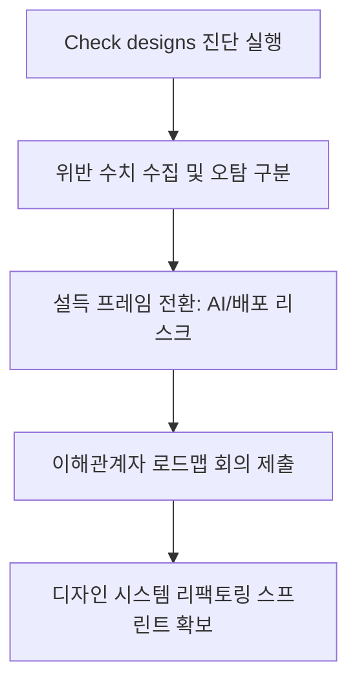

# 디자인 시스템 부채 관리

## 한 줄 정의
디자인 시스템 부채 관리는 제품 내 컴포넌트·토큰 파편화와 정합성 오류를 단순 디자이너의 유지를 넘어 AI 에이전트 구동 및 프로덕션 코드 인계의 핵심 종속성(Dependency)으로 재정의하고, 객관적 위반 수치를 기반으로 조직적 자원 배분을 이끌어내는 정량적 개선 워크플로우다.

## 핵심 요지
- **부채의 전사적 가시화**: Figma Config 2026의 Check designs, Code Connect UI, AI 에이전트 기능은 부실한 디자인 시스템 부채를 단순 디자이너의 불평이 아닌 개발자, PM, 마케터 등 모든 이해관계자의 눈앞에 구체적 숫자로 노출시켰다.
- **설득 프레임의 전환**: '장인 정신'이나 미학적 일관성이라는 주장에서 벗어나, AI 에이전트 정확도, 로컬 코드 매핑, 자동화 PR 배포의 생존 리스크로 설득 논리를 전환한다.
- **정량적 위반 리포팅**: 캔버스 대조 도구를 통해 토큰 미적용, WCAG 가독성 미달, 핑거프린트 분리 컴포넌트의 위반 건수를 측정해 로드맵 회의의 지렛대로 활용한다.
- **노이즈 필터링과 거버넌스 소유**: Check designs의 오탐(주석, disabled 상태의 대비율 오판 등)을 보완하는 도메인 맥락 판단을 통해 불필요한 반론을 차단한다.

## 상세

### Figma Config 2026 생태계와 부채의 연결
Figma는 2026년 상반기 디자인 시스템을 중심으로 한 주요 기능들을 연이어 출시했다:
- 2026년 3월 4일: 실제 React 임포트 구문과 캔버스 컴포넌트를 매핑하는 Code Connect UI 출시 [raw/Figma just made your design system debt everyone’s problem. Now use it..md#L20-L25]
- 2026년 3월 24일: 개발 컨벤션을 에이전트에 전달하는 `skills` 마크다운 통제 정의 [raw/Figma just made your design system debt everyone’s problem. Now use it..md#L20-L25]
- 2026년 5월 20일: 캔버스 UI 생성 전용 Figma AI 에이전트 출시 [raw/Figma just made your design system debt everyone’s problem. Now use it..md#L20-L25]
- 2026년 5월 28일: 로컬 코드베이스 수정 및 PR을 전송하는 Figma Make 고도화 [raw/Figma just made your design system debt everyone’s problem. Now use it..md#L20-L25]
- 2026년 6월 4일: 디자인 시스템 위반 수치를 대조·산출하는 Check designs 패널 공식 배포 [raw/Figma just made your design system debt everyone’s problem. Now use it..md#L20-L25]

이러한 도구들은 단일 디자인 라이브러리를 공통 입력값으로 삼는다. 따라서 시스템이 무너져 있으면 에이전트는 낯설고 천편일률적인 화면을 뱉어내고, 엔지니어는 인계 파일에서 픽셀을 눈대중으로 맞추는 이전 방식으로 후퇴하게 된다.

### 단계별 진단 및 리소스 확보 워크플로우

1. **상태 진단**: 신규 기획 수립 전, 가장 부채가 심각한 작업 파일과 일반 작업자가 넘긴 파일 2곳 이상에서 Check designs를 구동한다.
2. **수치화 및 노이즈 검증**: 하드코딩 색상, off-token 치수, 깨진 컴포넌트 등의 오류 수치(예: 파일당 47개 위반)를 수집하되, 주석(annotation)이나 비활성(disabled) 버튼의 가독성 경고처럼 의도된 예외 항목은 노이즈로 사전 분리한다 [raw/Figma just made your design system debt everyone’s problem. Now use it..md#L54-L61].
3. **위험의 타인 전가**: 부채로 인해 배포 실패, 코드 PR 검토 오버헤드, 온-브랜드 훼손 배너 양산 등의 실질적인 피해를 겪는 엔지니어링 및 마케팅 리드와 연대한다.
4. **우선순위 지렛대 행사**: 단순 유지보수 백로그가 아닌 "AI 에이전트 정상 구동 및 배포 자동화를 위한 필수 기반" 카드로 로드맵 회의에 안건을 상정한다.

## 예시
- **Check designs 정합성 대조 데모**: 2026년 6월 데모 파일 검사 결과, 색상 위반 4건, 치수 위반 13건, 타이포그래피 위반 3건, 컴포넌트 위반 11건 등 총 31건의 오프-토큰 값이 25개 요소에서 적발되어 원클릭 "Apply 13" 적용 패널로 가시화됨 [raw/Figma just made your design system debt everyone’s problem. Now use it..md#L6-L8].

## 충돌
- **증거의 가시화 vs 권한의 부재**: Check designs로 뚜렷한 부채 수치를 증명하더라도, 기획 및 예산 권한을 쥔 승인권자가 신규 기능 출시만을 강요하면 부채 해결 작업이 여전히 무산될 수 있음 [raw/Figma just made your design system debt everyone’s problem. Now use it..md#L48-L53]. 도구는 명분과 수치만 줄 뿐, 리더십 승인 전략은 별도로 수립되어야 한다.

## 관련 노트
- [[디자인 시스템 기본값]]
- [[AI 시대 디자인 시스템]]
- [[Figma 에이전트 연동]]
- [[완전히 기계 읽기 가능한 디자인 시스템]]

## 출처
- [Figma just made your design system debt everyone’s problem. Now use it.](file:///Users/railscraft/Obsidian/raw/Figma%20just%20made%20your%20design%20system%20debt%20everyone%E2%80%99s%20problem.%20Now%20use%20it..md)
- [Check designs in Figma](https://help.figma.com/hc/en-us/articles/39592284074263-Check-designs-in-Figma)
