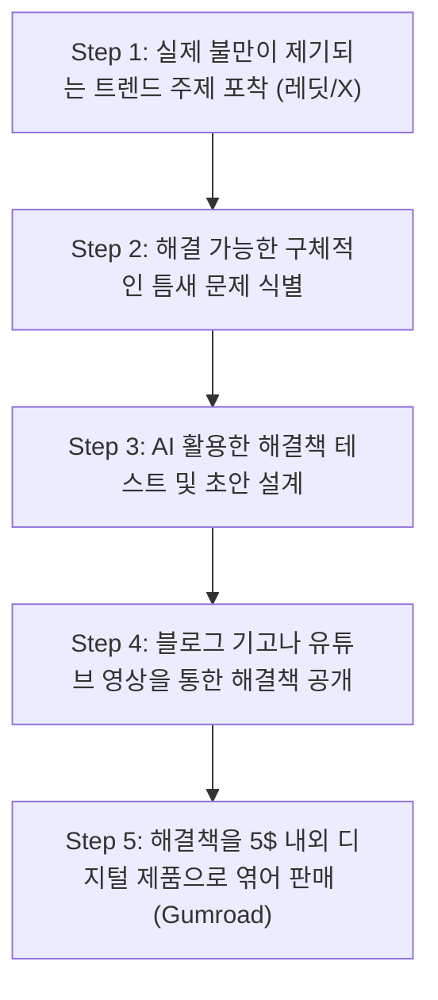

---aliases:
  - 디지털-제품-생산-및-출시-워크플로우
- 디지털 상품 출시 프로세스
- 지식 상품 패키징
- 검로드 부업 워크플로우
core: false
created: 2026-06-12
sources:
- raw/단 하루 오후 만에 디지털 상품을 출시하고 월 3,000달러 부업으로 키운 실전 프로세스.md
- raw/디지털 제품 제작은 잊으세요. 대신 이것에 집중하세요.md
- raw/4개월 만에 사라진 15만 개의 테크 일자리 — 데이터 리더들이 차마 말하지 못하는 진실.md
- raw/월급을 대체하고 조기 은퇴를 실현해 줄 5가지 ETF.md
- raw/우리가 초대받지 못한 새로운 AI 시대의 개막.md
- raw/내가 매주 쓰는 클로드와 챗GPT 프롬프트 10선 (즉시 복사하여 사용 가능).md
- raw/경제 붕괴 직전, 부자들이 미리 사두는 4가지 자산.md
- raw/단돈 100달러로 주식 투자 시작하기.md
- raw/오늘날 AI를 배우는 대부분의 사람들이 존재하지 않는 직업을 준비하고 있다.md
- raw/남다르게 생각하도록 뇌를 훈련하는 법.md
- raw/미룰 때마다 결제되는 알람 앱을 만들었다. 그리고 애플의 이메일 한 통에 무산되었다.md
- raw/초보 투자자가 저지르는 가장 큰 투자 실수 15가지.md
status: evergreen
tags:
- digital-product
- side-hustle
- workflow
- monetization
type: workflow
updated: '2026-06-22'
---
# 디지털 제품 생산 및 출시 워크플로우

## 한 줄 정의

디지털 제품 생산 및 출시 워크플로우는 개인이 이미 발행한 콘텐츠나 레딧, X 등의 채널에서 관찰된 실제 고객의 불만(Pain points)을 기반으로, 초기 투자금 없이 무료 디자인 도구(Canva)와 수수료 기반 결제 플랫폼(Gumroad)을 통해 단 몇 시간 만에 정보성 제품(PDF 가이드, 프롬프트 북 등)을 패키징하여 즉각적인 수익 파이프라인을 형성하는 비즈니스 프로세스다.

## 핵심 요지

- **[[진짜 문제 해결]] 우선**: 대부분의 실패는 제품(노션 템플릿, PDF 등)을 먼저 만들고 구매자를 기다리는 데서 기인한다. 반드시 대중의 구체적이고 실제적인 고통(Pain points)을 먼저 발견하고 해결책을 설계하는 순서로 가야 한다.
- **수요의 채널 포착**: 레딧(서브레딧의 'Top this week' 정렬 후 500단어 이상의 장문 불만 댓글 추적) 및 X(트렌드 주제 답글 내의 반복적인 불만과 질문 추적)를 통해 실제 사용자가 검색과 생성형 AI로도 해결하지 못한 틈새 수요를 수집한다.
- **리스크 제로(Zero-Cost) 인프라**: 유료 도구나 대형 광고비 집행 없이, Canva의 무료 템플릿으로 PDF를 설계하고 판매 금액의 10%를 수수료로 차감하는 Gumroad 결제 시스템을 적용해 초기 자본 부담을 0달러로 억제한다.
- **AI의 보조적 활용**: 해결책 도출 단계에서 가설 테스트, 프레임워크 초안 작성, 자료 요약 및 예시 작성을 가속하기 위해 AI를 활용한다. (단, AI가 인간의 문제 발견 단계를 대체할 수는 없다).

## 상세

### 1. 실전 5단계 워크플로우

#### Step 1: 실제 불만이 제기되는 트렌드 주제 포착
- **레딧(Reddit)**: 특정 카테고리 서브레딧에서 '이번 주 인기글(Top this week)'로 필터링한 후, 사람들이 똑같은 질문을 반복하거나 어떤 기능에 대해 500자 이상으로 쏟아낸 구체적인 불만 댓글을 수집한다.
- **X (Twitter)**: 바이럴 트렌드 주제의 '답글(Replies)'을 훑으며 사용자들이 실패한 경험담이나 에러 상황을 추적한다. 동일한 불만이 세 번 이상 다른 형태로 포착되면 분명한 수요 신호로 판단한다.

#### Step 2: 해결 가능한 구체적인 틈새 문제 식별
- 단순히 범위가 넓은 'AI 가이드'가 아니라, 구체적인 도구의 작동상 한계를 극복하는 우회 공식을 식별한다. (예: Suno AI에서 아티스트 이름을 직접 사용하지 못하는 제약을 피하기 위해, 해당 아티스트의 음악적 기법을 텍스트 프롬프트 키워드로 분해해 제시하는 가이드라인 기획).

#### Step 3: AI를 활용한 해결책 제작 및 패키징
- AI(ChatGPT, Claude 등)를 개발 속도를 극대화하는 보조 도구로 삼아, 우회 키워드 목록의 초안을 얻고, 상세한 가이드북 예시와 템플릿의 문맥을 채운다.
- Canva 무료 템플릿을 활용해 20페이지 내외의 PDF 또는 복사-붙여넣기(Copy-paste)가 가능한 스와이프 파일 형태로 상품을 디자인한다. (제작 시간 2~3시간 타깃).

#### Step 4: 채널 연동을 통한 해결책 공개
- 가치를 먼저 증명하기 위해, 포착했던 문제에 대한 명쾌한 솔루션을 정리하여 미디엄(Medium) 블로그 글이나 유튜브(YouTube) 영상으로 무료 배포한다.

#### Step 5: 디지털 상품 연동 및 판매
- 무료 솔루션을 접한 사람들이 더 심화된 리소스를 즉각 가져다 쓸 수 있도록 5달러 내외의 저가로 Gumroad에 상품을 올린 뒤, 기존 기고문 및 영상 하단에 인라인 결제 링크를 걸어 유기적 트래픽을 매출로 전환한다.

## 예시

- **Suno AI 250 프롬프트 가이드**: 크리에이터 트래브 닉슨(Trav Nicholson)은 사람들이 Suno AI로 원하는 아티스트(예: 빌리 아일리시 스타일)의 사운드를 내는 데 실패한다는 고통을 포착했다. 그는 아티스트들의 음악 스타일을 텍스트 프롬프트로 세분화한 5달러짜리 PDF 가이드를 제작하여 Gumroad에 출시했고, 이를 유튜브와 연동해 총 30,000달러(약 4,000만 원)의 누적 매출을 달성하는 부수입 파이프라인으로 성장시켰다.

## 충돌

- **복잡한 이메일 마케팅 퍼널 vs. 린(Lean)한 즉시 출시**: 마케팅 학계에서는 리드 마그넷(Lead Magnet) 수집, 복잡한 이메일 시퀀스, 고가의 랜딩 페이지 제작을 필수 권장하나, 개인 크리에이터의 초기 검증 단계에서는 이러한 시스템이 진입 장벽이 된다. 검색 노출이 되는 고효율 콘텐츠 내에 심플한 Gumroad 결제 링크 하나를 즉시 거는 것이 리소스 배분상 훨씬 유리하다.

## 관련 노트

- [[추월차선과 서행차선]] : 한 번 구축하면 24시간 자율적으로 동작하며 복제 비용이 0에 수렴하는 디지털 제품 자산 구축 논리를 설명한다.
- [[AI 네이티브 작업 시스템]] : AI 도구를 통해 상품 기획 및 패키징 속도를 10배 이상 가속하는 시스템적 접근법을 다룬다.

