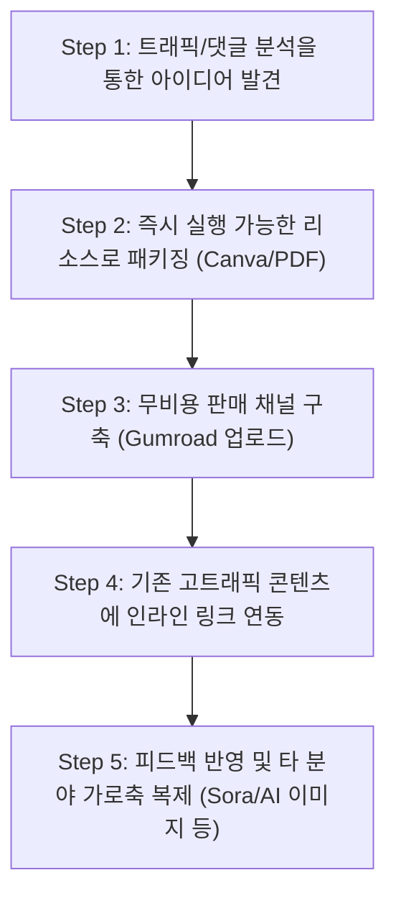

# 디지털 제품 생산 및 출시 워크플로우 (Digital Product Production & Launch Workflow)

## 한 줄 정의

디지털 제품 생산 및 출시 워크플로우는 개인이 이미 발행한 콘텐츠나 보유한 특정 틈새 지식을 기반으로, 초기 자본 투자 없이 디자인 도구(Canva)와 무비용 결제 플랫폼(Gumroad)을 활용해 단 몇 시간 만에 정보성 제품(PDF 가이드, 프롬프트 북 등)을 패키징하고 유기적 검색 트래픽에 연동시켜 즉각적인 부수입을 창출하는 초경량 비즈니스 실행 프로세스다.

## 핵심 요지

- **정보의 유용성(Utility) 패키징**: 단편적인 무료 정보도 체계적인 포맷(템플릿, 프롬프트 라이브러리, 체크리스트 등)으로 구조화하여 즉각 사용 가능한 리소스로 조립해 두면, 소비자는 정리 정돈의 편의성과 시간 절약에 기꺼이 비용을 지불한다.
- **리스크 제로(Zero-Cost) 시스템**: 유료 소프트웨어 구매나 디자이너 고용 없이 Canva 무료 템플릿으로 상품을 제작하고, 선 비용 없이 판매 시 수수료(Gumroad 기준 10%)만 차감되는 결제 대행 플랫폼을 연동하여 초기 투자금을 0달러로 제한한다.
- **오가닉 검색 엔진 최적화(SEO) 유입**: 미디엄(Medium)과 같이 높은 도메인 권위(Domain Authority)를 갖춘 플랫폼에 구체적인 해결책을 담은 글을 기고해 구글 검색 상단에 올린 뒤, 검색 가망 고객을 마케팅 퍼널 최상단(Top-of-tunnel)으로 흡수하여 상시 링크 전환을 유도한다.

## 상세

### 1. 단계별 실전 프로세스

#### Step 1: 수요 탐색 및 가망 고객 발견
- 소셜 미디어나 블로그 플랫폼(Medium 등)에서 가장 조회수가 높거나 댓글 질문이 집중되는 병목 주제를 분석한다.
- 단순히 "조회수가 많이 나오는 글"을 넘어, 독자들이 직면하고 있는 구체적인 한계와 틈새 니즈(Niche needs)를 포착한다.

#### Step 2: 실질적 해결책 설계 및 패키징
- 플랫폼 제약이나 규칙을 해결해 주는 '우회 공식' 또는 '우수 템플릿'을 설계한다. (예: 아티스트 이름을 직접 사용할 수 없는 Suno AI 음향 플랫폼의 특성을 극복하기 위해, 특정 아티스트의 음악적 특징(Sonic Signature)을 대안 텍스트로 치환한 프롬프트 가이드 제작).
- 줄글 형식의 무료 콘텐츠와 차별화되도록 템플릿, 프롬프트 묶음집, 스와이프 파일 등 다운로드 후 **즉시 복사하여 복붙(Copy-paste)할 수 있는 포맷**으로 디자인한다. (Canva 활용, 20페이지 내외).

#### Step 3: 리스크 없는 판매 인프라 설정
- 결제 수수료 기반(예: 고정 요금 없이 판매당 10% 차감)으로 동작하는 Gumroad 등의 호스팅 플랫폼에 무료 판매자 등록을 마친다.
- 랜딩 페이지 디자인에 집착하지 않고, 유용성이 강조된 짧은 설명과 가격 설정만으로 린(Lean)하게 제품을 개시한다. (심미성보다 유용성이 언제나 구매를 리드한다).

#### Step 4: 무비용 마케팅 채널(SEO) 연결
- 별도의 유료 광고나 대규모 이메일 구독자 기반 없이, 이미 구글 검색 상위에 노출 중인 기존 글에 맥락을 고려한 추천 문구("250개 프롬프트 라이브러리가 필요하다면 여기서 확인하세요")와 함께 Gumroad 결제 링크를 삽입한다.

#### Step 5: 피드백 루프 및 수평 스케일링
- 첫 판매 데이터를 바탕으로 고객 질문과 요청을 반영해 가이드를 개정한다.
- 검증된 유통 공식을 바탕으로, 인접 도메인(예: 영상 생성 툴 Sora, AI 이미지 제어 프롬프트 등)에 동일한 패키징 프로세스를 가로축으로 복제(Horizontal Replication)하고 관련 묶음 상품(Bundle)을 제안하여 객단가와 매출 총액을 극대화한다.

## 예시

- **Suno AI 250 프롬프트 가이드**: 빌이 아일리시 스타일을 "어두운 베드룸 팝, 속삭이는 보컬, 미니멀한 프로덕션, 로파이 분위기"와 같은 구체적인 음악적 키워드로 역조립하여 패키징. Canva 템플릿을 활용해 2~3시간 만에 PDF로 제작하여 출시 당일 판매 성공 및 일평균 30달러 수익 파이프라인 형성. 이후 Sora 2 가이드, AI 이미지 생성 가이드 등으로 복제하여 총합 월 3,000달러 규모로 육성 (출처: 단 하루 오후 만에 디지털 상품을 출시하고 월 3,000달러 부업으로 키운 실전 프로세스).

## 충돌

- **완벽한 랜딩 페이지와 이메일 마케팅 퍼널 구축 vs. 린(Lean)한 즉시 출시**: 전통적인 디지털 마케팅 서사에서는 리드 마그넷(Lead Magnet) 수집, 복잡한 이메일 시퀀스, 고가의 랜딩 페이지 빌더 설치를 필수 권장하나, 개인 부업 초창기에는 이러한 설정 자체가 리스크와 피로도를 유발한다. 초기에는 구글 검색 트래픽(SEO)이 직접 닿는 고도화된 콘텐츠에 텍스트 링크 하나만 걸어 검증하는 것이 리소스 배분 측면에서 압도적으로 효율적이다.

## 관련 노트

- [[추월차선과 서행차선]] : 시간 대비 소득 효율성이 고정된 노동(서행차선)을 넘어, 한 번 구축하면 24시간 자율적으로 동작하며 복제 비용이 0에 수렴하는 디지털 제품 자산(추월차선) 구축 논리를 설명한다.
- [[AI 네이티브 작업 시스템]] : AI 도구(ChatGPT, Claude 등)와의 협업을 통해 자료 분석과 텍스트 번역, 프롬프트 생성 등 상품 기획 및 패키징 속도를 10배 이상 가속화하는 시스템적 접근법을 다룬다.

