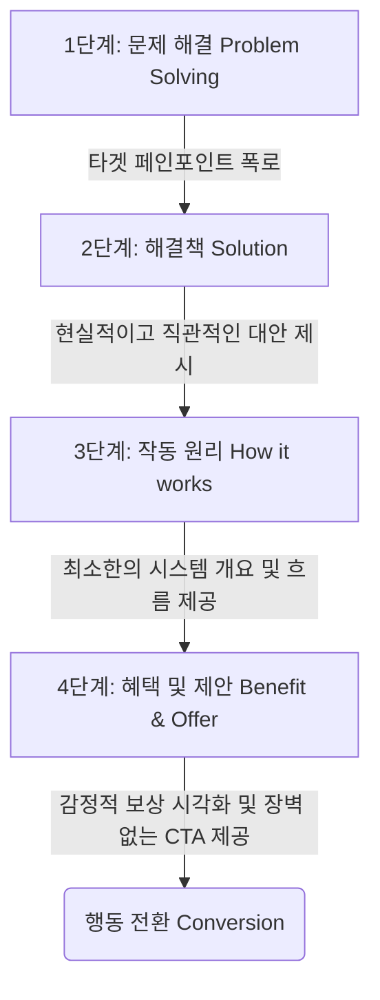

# 랜딩 페이지 메시지 전달 4단계 워크플로우

## 한 줄 정의
**랜딩 페이지 메시지 전달 4단계 워크플로우**는 사용자의 인지 과부하를 방지하고 웹사이트 방문자를 행동(전환)으로 이끌기 위해 '문제 해결 → 해결책 → 작동 원리 → 혜택 및 제안' 순으로 핵심 메시지를 전개하는 세일즈 웹사이트 설계 프레임워크이다.

## 핵심 요지
* **방문자의 단시간 이탈 방지**: 웹사이트 방문자는 평균 2초 이내의 매우 짧은 순간에 서비스를 계속 이용할지 결정한다(raw/Popular design trends that destroy conversion.md).
* **인지적 정합성 확보**: [[미적 사용성 효과]](Aesthetic usability effect)에만 매몰되어 서비스 본질과 무관한 추상적인 그래픽 블롭(Blob)이나 격자 다이어그램 등 [[기만적인 디자인]]을 히어로 영역에 배치할 경우, 뇌의 인지 부하가 가중되어 전환율이 급락한다(raw/Popular design trends that destroy conversion.md).
* **4단계 순차적 설득**: 성공적인 메시지 전달은 '① 문제 해결 -> ② 현실적 해결책 -> ③ 작동 원리 개요 -> ④ 혜택 및 진입장벽이 낮은 제안'의 일관된 흐름을 지녀야 한다(raw/Popular design trends that destroy conversion.md).
* **시각-카피 동조화**: 텍스트 카피에서 제시하는 정량적 수치와 키 비주얼 내 요소의 수는 한 치의 오차도 없이 직관적으로 일치(예: '5개 알림 필터링' 약속 시 이미지에도 5개 알림 말풍선 배치)해야 신뢰도를 담보할 수 있다(raw/Popular design trends that destroy conversion.md).

## 상세

이 워크플로우는 사용자가 랜딩 페이지에 도달한 직후 겪게 되는 심리적 흐름에 맞춰 설계되었습니다. 



### 1단계: 문제 해결 (Problem Solving)
* **목적**: 고객이 현재 마주하고 있는 가장 큰 통점(Pain Point)을 짚어내어 호기심과 공감을 유도합니다.
* **실행**: 단순히 "알림을 직접 제어하세요" 같이 귀찮은 문제 해결 작업을 사용자에게 전가하거나 떠넘기는 문구는 피해야 합니다(raw/Popular design trends that destroy conversion.md). 대신, 일상에서 겪는 공해(예: 하루에도 수없이 쏟아지는 불필요한 알림)를 직접 고발해야 합니다.
* **설득 패턴**: 정량적인 수치 변화를 내림차순 등으로 시각화하여 사용자가 직관적으로 문제의 심각성을 흐름으로 느끼게 만드는 [[숫자 기반 설득 패턴]]을 적용하면 효과적입니다(raw/Popular design trends that destroy conversion.md).

### 2단계: 해결책 (Solution)
* **목적**: 문제가 어떻게 해결되는지에 대한 방향성을 제시합니다.
* **실행**: "마법 같은 인공지능 알고리즘이 해결해 줍니다"처럼 실체 없는 미사여구(BS Word Salad)나 뜬구름 잡는 소리는 지양하고(raw/Popular design trends that destroy conversion.md), 철저히 현실에 기반한 해결책을 약속해야 합니다.

### 3단계: 작동 원리 (How it works)
* **목적**: 사용자의 뇌가 서비스의 동작 메커니즘을 자연스럽게 이해할 수 있도록 논리적인 신뢰를 구축합니다.
* **실행**: 서비스가 '어떻게(HOW)' 작동하는지 최소한의 작동 원리 개요를 시각자료와 매칭하여 전달합니다. 이 과정에서 입자 깔때기(Funnel) 같은 은유 모델을 사용할 수 있으나, 필터링되어 나오는 출력 개수가 카피와 일치해야 합니다(raw/Popular design trends that destroy conversion.md).

### 4단계: 혜택 및 제안 (Benefit & Offer)
* **목적**: 사용자에게 확실한 동기부여를 제공하고, 클릭이나 가입의 가로막는 심리적 저항을 최소화합니다.
* **실행**: 
  * **정서적 혜택 제공**: 제품의 순수 기능 소개 단계를 넘어 사용자가 이 서비스를 이용함으로써 궁극적으로 얻게 될 최종 쾌적함의 상태, 즉 **감정적 보상(Payoff)**을 보여줍니다. 예를 들어, 스마트폰을 뒤로한 채 평온하게 휴식을 취하는 인물의 연출 이미지를 활용하여 사용자가 동경하는 상태를 자신과 매칭하는 [[감정적 보상 시각화를 통한 모방 심리 자극]](Perceived Emulation)을 극대화합니다(raw/Popular design trends that destroy conversion.md).
  * **진입 장벽이 낮은 CTA**: "카드 등록 없이 3초 만에 무료 시작하기" 같이 신규 가입자가 가지는 계약이나 요금 청구에 대한 두려움을 덜어주는 제안을 배치합니다(raw/Popular design trends that destroy conversion.md).

---

## 예시
### 1. [[LLM]] (Claude 3.5 Sonnet) 기반 메시지 전달 카피라이팅 및 비주얼 기획 자동화 시나리오
아래 코드는 `Claude 3.5 Sonnet` 혹은 `GPT-4o` 같은 대규모 언어 모델을 활용하여, 특정 제품 정보와 고객 통점을 입력받았을 때 본 **4단계 워크플로우**에 최적화된 웹사이트 히어로 카피 및 이미지 생성 프롬프트를 자동으로 구조화해 주는 Python 예시입니다.

```python
import os
from openai import OpenAI

def generate_landing_page_assets(product_name, product_description, pain_point, core_benefit, model_name="gpt-4o"):
    """
    '랜딩 페이지 메시지 전달 4단계 워크플로우'를 준수하여 세일즈 카피와 시각 기획안을 생성합니다.
    """
    client = OpenAI(api_key=os.environ.get("OPENAI_API_KEY"))
    
    prompt_instruction = f"""
    당신은 전환율 극대화 전문 UX 카피라이터이자 비주얼 디렉터입니다.
    아래 제품 정보를 바탕으로 '랜딩 페이지 메시지 전달 4단계 워크플로우'를 준수하는 카피와 이미지 기획안을 작성해 주세요.
    
    [입력 제품 정보]
    - 제품명: {product_name}
    - 제품 정보: {product_description}
    - 대상 고객의 페인포인트: {pain_point}
    - 사용자가 얻을 최종 혜택: {core_benefit}
    
    [메시지 전달 4단계 작성 원칙]
    1단계 [문제 해결]: 사용자에게 스스로 해결하라고 떠넘기는 대신, 구체적인 수치를 내림차순(예: '17,308개에서 단 5개로')으로 전개하여 문제의 심각성에 공감시킵니다.
    2단계 [해결책]: '혁신적 알고리즘' 같은 모호한 수식어는 배제하고, 필터링 시스템 등 현실적인 해결책을 밝힙니다.
    3단계 [작동 원리]: 서비스가 '어떻게 작동하는지' 3단계 내외의 최소한의 흐름을 텍스트로 요약합니다.
    4단계 [혜택 및 제안]: 감정적 보상(평온, 해방감)을 녹여내고, 카드 등록 없이 무료로 이용할 수 있는 심리적 장벽이 낮은 CTA 버튼명을 설계합니다.
    
    [비주얼 설계 규칙]:
    - 미적 사용성 효과에만 기댄 무의미한 3D 도형(Blob)이나 복잡한 아이소메트릭 그래픽 기만적 설계를 지양합니다.
    - 카피에서 약속한 숫자는 키 비주얼 이미지 내 개체 수와 한 치의 오차도 없이 정합해야 합니다.
    - 최종 혜택을 누리는 인물이 평온해하는 모습을 시각화하여 모방 심리(Perceived Emulation)를 적극 유도합니다.

    [출력 포맷]
    1. Kicker (구체적인 사회적 증거 제시, 예: "12,842명의 지식 노동자가 사용 중")
    2. Headline (H1, 혜택 중심 카피)
    3. Sub-headline (작동 원리 및 솔루션 기술)
    4. CTA Button (카드 불필요, 무료 진입 보장 문구)
    5. Key Visual Description (키 비주얼 시각 정합 설계 지침 및 Midjourney 생성용 이미지 프롬프트)
    """
    
    response = client.chat.completions.create(
        model=model_name,
        messages=[{"role": "user", "content": prompt_instruction}],
        temperature=0.3
    )
    return response.choices[0].message.content

# 실행 예시 (가상 알림 서비스 Hushy의 케이스 자동 설계)
if __name__ == "__main__":
    copy_results = generate_landing_page_assets(
        product_name="Hushy (허쉬)",
        product_description="AI 기반 지능형 알림 필터링 SaaS",
        pain_point="매일 쏟아지는 수백 개의 불필요한 슬랙, 이메일, 메신저 알림으로 인한 업무 집중도 분산",
        core_benefit="하루 중 정말 나에게 필요한 엄선된 5개의 알림만 통과시키고 나머지는 숨겨 얻는 마음의 평온함"
    )
    print(copy_results)
```

---

## 충돌
* **무비주얼 미니멀리즘 vs [[미적 사용성 효과]]**: 텍스트 카피만으로 완벽한 설득력을 갖추어야 한다는 주장(raw/Popular design trends that destroy conversion.md)과 외관이 아름다운 디자인이 기능적으로도 뛰어날 것이라 평가하는 [[미적 사용성 효과]](raw/Popular design trends that destroy conversion.md) 사이의 절충이 요구됩니다. 비주얼은 독자적인 장식이 아닌, '카피의 의미를 시각적으로 강화하고 확장하는 보좌역'으로서만 추가되어야 한다는 관점으로 이 모순을 해소합니다(raw/Popular design trends that destroy conversion.md).

## 관련 노트
* [[미적 사용성 효과]]: 외관이 아름다운 디자인이 주는 긍정적 후광 효과와 한계점
* [[기만적인 디자인]]: 본질적인 문제 해결 없이 화려함으로 시선을 속이는 격자 구조도와 블롭(Blob)의 한계
* [[숫자 기반 설득 패턴]]: 뇌의 논리적 정보 인지를 돕는 내림차순 수치 전개 기법
* [[감정적 보상 시각화를 통한 모방 심리 자극]]: 기능 나열을 넘어 정서적 보상을 제시해 행동 전환율을 극대화하는 키 비주얼 최상위 설계
* [[키 비주얼 연관성 분석 그래프]]: 추상성과 연관성을 기반으로 랜딩 페이지의 그래픽을 플로팅하여 평가하는 모델

## 출처
* `raw/Popular design trends that destroy conversion.md`
