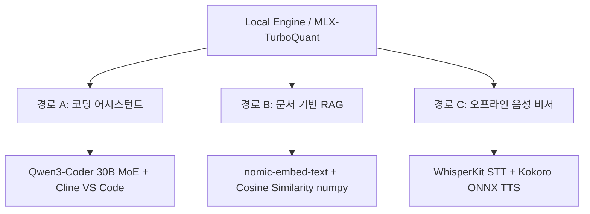

# 로컬 LLM 30분 실전 가이드

> [!summary]
> - 구독료 지출과 인터넷 유출 우려 없이 개인 기기(PC/Mac)에서 최신 MLX 엔진 기반 Ollama 및 TurboQuant 압축 기술을 통해 고성능 로컬 모델을 초고속으로 구동하는 온디바이스 AI 가이드다.
> - VS Code 에디터(Cline 연동), 경량 벡터리스 RAG 스크립트, 실시간 로컬 오프라인 음성 비서 파이프라인의 3대 실무 구축 경로 및 3계층 하이브리드 아키텍처를 설명한다.
> - 로컬 구동 시 속도는 메모리 대역폭(Memory Bandwidth)과 KV 캐시 압축률에 직접 비례하므로, 하드웨어 사양에 맞추어 모델 스펙을 영리하게 계층화해야 한다.

구독 요금 결제나 인터넷 연결 없이 전적으로 로컬 기기(특히 Apple Silicon Mac)에서 가동되는 온디바이스(On-device) AI 환경 구축 방법 및 실무 활용 경로를 기술한다.

---

## 1. 기반 설정 (Ollama & MLX 엔진)

로컬 LLM 구동의 표준 추론 엔진인 **Ollama**를 설치한다. 특히 **Ollama 0.19(2026년 3월 30일 출시)**부터 Apple Silicon의 추론 엔진이 MLX로 교체되어, M5 Max 기기 기준 Qwen3.5-35B-A3B 실행 시 사전 입력 처리(Prefill) 속도는 57%(1,810 tok/s), 디코드(Decode) 속도는 93%(112 tok/s) 가량 대폭 향상되었다.

### 1.1 엔진 설치
- **macOS (Homebrew)**: `brew install ollama`
- **Linux**: `curl -fsSL https://ollama.com/install.sh | sh`
- **Windows**: Ollama 공식 웹사이트에서 MSI 설치 프로그램 다운로드

### 1.2 모델 로드 및 기동 테스트
기본 범용 모델로 대중적인 **Qwen 3 (8B)** 모델을 사용한다. (디스크 용량 약 5GB 필요, 16GB RAM 권장)
```bash
# 모델 다운로드
ollama pull qwen3:8b

# 로컬 추론 동작 검증
ollama run qwen3:8b "Write a python script to reverse a string."
```
> [!NOTE]
> 만약 8GB RAM 이하의 저사양 기기라면 스왑 디스크 부하로 속도가 저하되므로 `qwen3:4b` 또는 `gemma3:4b`로 다운그레이드할 것을 권장하며, 반대로 24GB VRAM GPU나 M시리즈 고사양 Mac이라면 `qwen3:14b` 이상으로 체급을 올리는 것이 유리하다.

---

## 2. 하드웨어 사이징 및 런타임 선택

### 2.1 실용적인 기기별 추천 스펙
*   **M1 / M1 Pro (8–16GB)**: 하드웨어 내장 3B 온디바이스 파운데이션 모델 활용 권장. 무거운 작업 시 Q4(4비트) 양자화된 7~8B 모델 사용. STT는 WhisperKit 기반 Whisper-base/small 권장.
*   **M2 / M2 Pro (16–32GB)**: Q4 양자화된 Qwen 3 8B 모델(메모리 약 5GB) 및 WhisperKit large-v3 turbo 버전 추천. 로컬-클라우드 조합 하이브리드 스택 시작 가능.
*   **M3 Pro / M3 Max (18–128GB)**: 1인 개발자 스윗스팟. Qwen 3 8B 상주 및 정밀 추론용 Phi-4 14B Q4 병용.
*   **M4 Pro / M4 Max (24–128GB)**: 30B급 모델 쾌적 구동. DeepSeek-V3-Distill-32B 추천(디코드 60~90 tok/s). Llama 4 Scout Q4 기동 가능.
*   **M5 / M5 Max (32–128GB)**: 70B급 모델 가동 및 Qwen3.5-35B-A3B 최적 구동(디코드 112 tok/s 이상).

### 2.2 4가지 핵심 런타임 비교
1.  **Apple 파운데이션 모델 (Swift 프레임워크)**: macOS 26 / iOS 26 기본 내장 3B 모델. `@Generable` 매크로 기반 타입 안전 구조화 출력 및 도구 호출 지원. 네이티브 앱 배포에 적합.
2.  **Ollama 0.19+ (MLX 백엔드)**: REST API 기반 범용적 서빙. 1,000개 이상의 모델 지원.
3.  **MLX Direct (Python/Swift)**: 최상의 속도와 긴밀한 하드웨어 통합(llama.cpp 대비 20~30% 우수). macMLX 및 Rapid-MLX(Ollama 대비 4.2배 속도) 등도 활용 가능.
4.  **LM Studio (GUI)**: 데스크톱 그래픽 환경 테스트 및 팀 전파용.

---

## 3. KV 캐시 압축 기술: TurboQuant

로컬 LLM 구동의 최대 병목은 가중치(Weights) 크기뿐 아니라, 컨텍스트가 길어짐에 따라 기하급수적으로 늘어나 메모리를 고갈시키는 **KV 캐시(KV Cache)**다. 32B 모델로 128K 컨텍스트를 처리할 경우 KV 캐시만 30~40GB를 점유하여 시스템이 마비된다.

이를 위해 구글 리서치가 개발한 **TurboQuant(arXiv:2504.19874, ICLR 2026)**는 재학습 없이 정확도 손실을 최소화하면서 KV 캐시 메모리 사용량을 4~6배 절감하고 최대 8배 속도를 높인다.

### 3.1 작동 메커니즘

1.  **1단계: 폴라퀀트(PolarQuant)**: 
    - 무작위 회전(Random Rotation)을 적용하여 특정 축에 몰려 어텐션 정확도를 깨뜨리던 이상치(Outlier)를 Gaussian 분포로 골고루 분산시킵니다.
    - 회전된 벡터를 극좌표계의 '방향(3비트)'과 '크기(8비트)'로 분해 양자화합니다. 추가 메모리 오버헤드가 사실상 제로에 수렴합니다.
2.  **2단계: QJL(Quantised Johnson-Lindenstrauss)**:
    - 원본과 PolarQuant 벡터 간의 오차(잔차)를 무작위 행렬로 투영(JL 변환)한 뒤, 차원당 단 1비트의 부호 비트(+1 또는 -1)로 저장하여 소프트맥스 연산 직전에 이를 완벽히 보정합니다.

### 3.2 MLX 구현체 및 벤치마크 결과
- **arozanov/turboquant-mlx**: 커스텀 퓨즈드 메탈(Fused Metal) 커널을 구현하여 V3 방식의 연산 병목을 극복하고, FP16 속도의 91~98% 수준을 유지하며 **4.6배 캐시 압축률**을 달성했다. `mlx-lm`과 드롭인 대체가 가능하다.
- **flovflo/turboquant-mlx-qwen35-kv**: Qwen3.5-35B-A3B-4bit 기준, 문장 생성 속도를 44.8 tok/s 수준으로 유지하면서 메모리를 급격히 절약한다.
- **성능 개선 효과**: Gemma 3/4 등 헤드 차원(D)이 큰 모델(D=256)에서 Llama 계열(D=128)보다 더 우수한 복원력을 보여주며, V2 4비트 회전 모드 적용 시 FP16 원본 대비 펄플렉시티(Perplexity)가 오히려 소폭 개선되는 정규화 필터 효과를 나타낸다.

---

## 4. 실무 활용 경로



### 4.1 경로 A: 로컬 코딩 어시스턴트
VS Code의 에이전트 확장 프로그램인 **Cline**과 로컬 최강 코딩 모델인 **Qwen3-Coder**를 연동한다. 
TurboQuant가 적용된 `arozanov/turboquant-mlx` 모듈을 연동하면 긴 컨텍스트 세션에서도 메모리 한계 없이 가동 가능하다.

1. **모델 다운로드**:
   - 고사양(32GB+ 통합 메모리): MoE 아키텍처 기반 `qwen3-coder:30b` (추론 시 3B 활성화)
   - 일반(16GB RAM): `qwen2.5-coder:7b` (약 4.7GB 크기)
   ```bash
   ollama pull qwen3-coder:30b  # or qwen2.5-coder:7b
   ```

2. **Cline 연동을 위한 Modelfile 작성**:
   컨텍스트 창 크기를 65,536 이상 확보하기 위해 파라미터를 강제 튜닝한다.
   
   ```dockerfile
   # ./Modelfile
   FROM qwen3-coder:30b
   PARAMETER num_ctx 65536
   PARAMETER temperature 0.2
   PARAMETER stop "<|im_end|>"
   ```
   
   ```bash
   # 커스텀 Cline 튜닝 모델 생성
   ollama create qwen3-coder-cline -f ./Modelfile
   ```

3. **VS Code Cline 설정**:
   - **API Provider**: `Ollama`
   - **Base URL**: `http://localhost:11434`
   - **Model**: `qwen3-coder-cline`
   - **Context Window**: `65536`

### 4.2 경로 B: 내 문서 기반 RAG
벡터 데이터베이스 대신, **Ollama Embeddings API**와 **NumPy** 코사인 유사도 연산만을 사용하여 60줄짜리 콤팩트한 문서 검색 엔진을 구축한다.

1. **임베딩 모델 다운로드**:
   ```bash
   ollama pull nomic-embed-text
   pip install ollama numpy
   ```

2. **구현 메커니즘 (Cosine Similarity)**:
   임베딩 벡터가 단위 길이(Norm = 1)로 정규화되어 있다면, 두 벡터의 내적(Dot Product) 연산이 곧 코사인 유사도가 된다. NumPy 행렬 곱(`scores = doc_matrix @ query_vector`) 한 번으로 Python 루프 없이 수백 개의 문서 청크 중 가장 유사도가 높은 Top-K 문서를 고속으로 회수한다.
   
   ```python
   # RAG 핵심 루직 스니펫
   q_vec = embed([query])[0]
   q = q_vec / (np.linalg.norm(q_vec) + 1e-8)
   d = doc_matrix / (np.linalg.norm(doc_matrix, axis=1, keepdims=True) + 1e-8)
   scores = d @ q
   top_indices = np.argsort(scores)[::-1][:k]
   ```
   
   RAG 질의 시 모델 환각을 억제하기 위해 프롬프트에 반드시 아래와 같은 제약 문구를 강제 주입해야 한다.
   > *"Answer the question using ONLY the context below. If the context does not contain the answer, say so plainly."*

### 4.3 경로 C: 오프라인 음성 비서
인터넷 유출 위험이 전혀 없이 로컬 하드웨어(CPU/GPU/ANE)로 가동하는 음성 대화 파이프라인이다.

- **STT (Speech-to-Text)**:
  - **WhisperKit** (Argmax): CoreML로 컴파일되어 Apple 뉴럴 엔진(ANE)에서 실행되는 표준 스택이다. Whisper-large-v3-turbo 사용 시 1시간 분량 오디오를 90초 만에 텍스트화한다.
  - **FluidAudio**: Parakeet 기반 CoreML 모델로, Large 모델 기준 전사 속도가 평균 0.19초에 불과해 WhisperKit 대비 고속 처리가 가능하다.
  - **피할 것**: whisper.cpp(뉴럴 엔진 미가속으로 속도 저하) 및 클라우드 API.
- **LLM**: 로컬 `qwen3:8b`가 대답을 생성한다.
- **TTS (Text-to-Speech)**: CPU에서도 실시간 음성 합성이 가능한 `Kokoro ONNX` 엔진(`AF_Sarah` 목소리 모델 등)을 이용한다.

```bash
# 의존 패키지 설치
brew install whisperkit-cli ffmpeg
pip install -U sounddevice ollama kokoro-onnx
```

> [!IMPORTANT]
> **음성 비서 파이프라인 주의사항**
> 1. **16kHz 모노 녹음 필수**: Whisper 모델은 16kHz 오디오로만 사전 학습되어, OS 기본 마이크 값인 44.1kHz를 그대로 집어넣으면 인식 불능 상태나 환각 텍스트를 마구 쏟아낸다. 반드시 다운샘플링하여 mono int16 포맷으로 녹음 후 집어넣어야 한다.
> 2. **마크다운 금지**: TTS 엔진(Kokoro)은 특수 기호(예: `*`, `-`)가 텍스트에 포함되면 기호까지 발음해 음성 출력이 깨진다. 시스템 프롬프트 수준에서 마크다운 및 리스트 출력 금지 가이드를 견고히 달아두어야 한다.

---

## 5. 최적의 3계층 하이브리드 아키텍처

로컬 컴퓨팅 자원과 프라이버시, 그리고 클라우드의 초고성능 지능을 결합하는 최적의 배포 전략이다.

1.  **Tier 1 (상시 활성화, 초저지연)**: Apple 파운데이션 모델 (3B, 무료)
    - 역할: 실시간 요청 분류, 라우팅(Routing), 구조화된 필드 추출, 간단한 요약.
2.  **Tier 2 (로컬 추론 분기)**: Qwen 3 8B / Qwen 3.5 35B (Ollama-MLX / TurboQuant)
    - 역할: 복잡한 논리 분석, 다단계 추론, 오프라인 질의, 긴 문장 생성.
3.  **Tier 3 (클라우드 확장)**: Claude Opus 4.7 / GPT-5.5
    - 역할: 사용자가 명시적 동의한 경우에만 가동하는 최고 난이도의 최종 추론.

---

## 6. 관련 위키 노트

- [[온디바이스 TTS]] — 로컬 구동 음성 합성 기술 및 설정
- [[AI 오픈소스 작업대]] — 로컬 환경에서의 AI 실험 구축 툴셋
- [[오픈소스 LLM 경제성과 벤더 종속성 해지]] — 로컬/오픈소스 모델 도입의 비용-효율적 고찰
- [[AI 세컨드 브레인]] — 개인 정보 유출 없는 나만의 지식 백본 RAG 연동
- [[GStack.md]] — 로컬 코딩 에이전트 인프라 구성 스택
- [[Claude Code 스킬 관리]] — 로컬 환경 스키마 및 메모리 절감 기법

---

## 7. 출처
- `raw/Run a Useful Local LLM in 30 Minutes (Coding, RAG, Voice).md`
- `raw/5배 적은 메모리로 맥에서 32B 모델 실행하기 - 구글 TurboQuant, 애플 실리콘 상륙.md`
- `raw/애플 실리콘을 위한 로컬 AI 스택: 한 차원 진화한 성능과 최적의 구축 가이드.md`
��야 한다.
   > *"Answer the question using ONLY the context below. If the context does not contain the answer, say so plainly."*

### 2.3 경로 C: 오프라인 음성 비서
인터넷 유출 위험이 전혀 없이 로컬 하드웨어(CPU/GPU)로 가동하는 음성 대화 파이프라인이다.
- **STT (Speech-to-Text)**: 극도로 최적화된 C++ 포팅 버전인 `Whisper.cpp`와 영어 기준 `ggml-base.en.bin` 모델을 사용한다.
- **LLM**: 로컬 `qwen3:8b`가 대답을 생성한다.
- **TTS (Text-to-Speech)**: CPU에서도 실시간 음성 합성이 가능한 `Kokoro ONNX` 엔진(`AF_Sarah` 목소리 모델 등)을 이용한다.

```bash
# 의존 패키지 설치
brew install whisper-cpp ffmpeg
pip install -U sounddevice ollama kokoro-onnx
```

> [!IMPORTANT]
> **음성 비서 파이프라인 주의사항**
> 1. **16kHz 모노 녹음 필수**: Whisper 모델은 16kHz 오디오로만 사전 학습되어, OS 기본 마이크 값인 44.1kHz를 그대로 집어넣으면 인식 불능 상태나 환각 텍스트를 마구 쏟아낸다. 반드시 다운샘플링하여 mono int16 포맷으로 녹음 후 집어넣어야 한다.
> 2. **마크다운 금지**: TTS 엔진(Kokoro)은 특수 기호(예: `*`, `-`)가 텍스트에 포함되면 기호까지 발음해 음성 출력이 깨진다. 시스템 프롬프트 수준에서 마크다운 및 리스트 출력 금지 가이드를 견고히 달아두어야 한다.

---

## 3. 하드웨어의 현실: 메모리 대역폭 (Bandwidth)

로컬 LLM의 토큰 생성 속도를 결정하는 절대적 병목은 프로세서의 연산 속도가 아니라, **RAM에서 프로세서 코어로 가중치를 전송하는 메모리 대역폭(Memory Bandwidth)**이다.

- **일반 CPU/DDR4-DDR5 노트북 (50~70 GB/s)**: CPU 추론 시 8B 모델 기준 초당 8~12 토큰 출력이 한계이며, 소형 RAG나 일회성 질의에는 적합하지만 코딩용 Cline 대화 루프에는 지연 시간이 길다.
- **Apple Silicon Mac (200~400 GB/s)**: 뛰어난 통합 메모리 대역폭과 MoE(Mixture of Experts) 모델의 활성화 매개변수 최소화 메커니즘이 결합하여 `qwen3-coder:30b` 수준의 대형 모델도 준수한 속도로 기동한다.
- **NVIDIA GPU (VRAM)**: 대역폭 한계가 가장 적어 VRAM 한계 내에서는 플래그십 클라우드에 준하는 실시간 스트리밍 대화 반응 속도를 체감할 수 있다.

---

## 4. 관련 위키 노트

- [[온디바이스 TTS]] — 로컬 구동 음성 합성 기술 및 설정
- [[AI 오픈소스 작업대]] — 로컬 환경에서의 AI 실험 구축 툴셋
- [[오픈소스 LLM 경제성과 벤더 종속성 해지]] — 로컬/오픈소스 모델 도입의 비용-효율적 고찰
- [[AI 세컨드 브레인]] — 개인 정보 유출 없는 나만의 지식 백본 RAG 연동
- [[GStack.md]] — 로컬 코딩 에이전트 인프라 구성 스택
