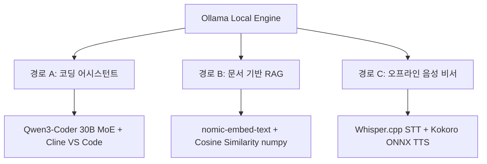

# 로컬 LLM 30분 실전 가이드

구독 요금 결제나 인터넷 연결 없이 전적으로 로컬 기기(PC/노트북)에서 가동되는 온디바이스(On-device) AI 환경 구축 방법 및 3대 실무 활용 경로(코딩 어시스턴트, 문서 RAG, 오프라인 음성 비서)를 기술한다.

---

## 1. 기반 설정 (Ollama 추론 엔진)

로컬 LLM 구동의 표준 추론 엔진인 **Ollama**를 설치하고 기본 8B 모델을 적재한다.

### 1.1 엔진 설치
- **macOS (Homebrew)**: `brew install ollama`
- **Linux**: `curl -fsSL https://ollama.com/install.sh | sh`
- **Windows**: Ollama 공식 웹사이트에서 MSI 설치 프로그램 다운로드

### 1.2 모델 로드 및 기동 테스트
기본 범용 모델로 대중적인 **Qwen 3 (8B)** 모델을 사용한다. (디스크 용량 약 5GB 필요, 16GB RAM 권장)
```bash
# 모델 다운로드
ollama pull qwen3:8b

# 로컬 추론 동작 검증
ollama run qwen3:8b "Write a python script to reverse a string."
```
> [!NOTE]
> 만약 8GB RAM 이하의 저사양 기기라면 스왑 디스크 부하로 속도가 저하되므로 `qwen3:4b` 또는 `gemma3:4b`로 다운그레이드할 것을 권장하며, 반대로 24GB VRAM GPU나 M시리즈 고사양 Mac이라면 `qwen3:14b` 이상으로 체급을 올리는 것이 유리하다.

---

## 2. 실무 활용 경로



### 2.1 경로 A: 로컬 코딩 어시스턴트
VS Code의 에이전트 확장 프로그램인 **Cline**과 로컬 최강 코딩 모델인 **Qwen3-Coder**를 연동한다.

1. **모델 다운로드**:
   - 고사양(32GB+ 통합 메모리): MoE 아키텍처 기반 `qwen3-coder:30b` (추론 시 3B 활성화)
   - 일반(16GB RAM): `qwen2.5-coder:7b` (약 4.7GB 크기)
   ```bash
   ollama pull qwen3-coder:30b  # or qwen2.5-coder:7b
   ```

2. **Cline 연동을 위한 Modelfile 작성**:
   Cline은 대량의 코드를 전송하여 컨텍스트 창이 최소 65,536 이상 확보되어야 오작동(포맷 유실 등)을 하지 않는다. 이를 위해 기본 컨텍스트 한계를 확장한 커스텀 모델을 빌드한다.
   
   ```dockerfile
   # ./Modelfile
   FROM qwen3-coder:30b
   
   # 컨텍스트 창 크기를 65,536으로 강제 조정
   PARAMETER num_ctx 65536
   
   # 코드 작성 일관성을 위해 온도를 낮춤 (기본 0.7 -> 0.2)
   PARAMETER temperature 0.2
   
   # 멈춤 토큰 지정
   PARAMETER stop "<|im_end|>"
   ```
   
   ```bash
   # 커스텀 Cline 튜닝 모델 생성
   ollama create qwen3-coder-cline -f ./Modelfile
   ```

3. **VS Code Cline 설정**:
   - **API Provider**: `Ollama`
   - **Base URL**: `http://localhost:11434`
   - **Model**: `qwen3-coder-cline`
   - **Context Window**: `65536`

### 2.2 경로 B: 내 문서 기반 RAG
벡터 데이터베이스 같은 거대 스택 대신, **Ollama Embeddings API**와 **NumPy** 코사인 유사도 연산만을 사용하여 60줄짜리 콤팩트한 문서 검색 엔진을 구축한다.

1. **임베딩 모델 다운로드**:
   ```bash
   ollama pull nomic-embed-text
   pip install ollama numpy
   ```

2. **구현 메커니즘 (Cosine Similarity)**:
   임베딩 벡터가 단위 길이(Norm = 1)로 정규화되어 있다면, 두 벡터의 내적(Dot Product) 연산이 곧 코사인 유사도가 된다. NumPy 행렬 곱(`scores = doc_matrix @ query_vector`) 한 번으로 Python 루프 없이 수백 개의 문서 청크 중 가장 유사도가 높은 Top-K 문서를 고속으로 회수한다.
   
   ```python
   # RAG 핵심 루직 스니펫
   q_vec = embed([query])[0]
   q = q_vec / (np.linalg.norm(q_vec) + 1e-8)
   d = doc_matrix / (np.linalg.norm(doc_matrix, axis=1, keepdims=True) + 1e-8)
   scores = d @ q
   top_indices = np.argsort(scores)[::-1][:k]
   ```
   
    RAG 질의 시 모델 환각을 억제하기 위해 프롬프트에 반드시 아래와 같은 제약 문구를 강제 주입해야 한다.
   > *"Answer the question using ONLY the context below. If the context does not contain the answer, say so plainly."*

### 2.3 경로 C: 오프라인 음성 비서
인터넷 유출 위험이 전혀 없이 로컬 하드웨어(CPU/GPU)로 가동하는 음성 대화 파이프라인이다.
- **STT (Speech-to-Text)**: 극도로 최적화된 C++ 포팅 버전인 `Whisper.cpp`와 영어 기준 `ggml-base.en.bin` 모델을 사용한다.
- **LLM**: 로컬 `qwen3:8b`가 대답을 생성한다.
- **TTS (Text-to-Speech)**: CPU에서도 실시간 음성 합성이 가능한 `Kokoro ONNX` 엔진(`AF_Sarah` 목소리 모델 등)을 이용한다.

```bash
# 의존 패키지 설치
brew install whisper-cpp ffmpeg
pip install -U sounddevice ollama kokoro-onnx
```

> [!IMPORTANT]
> **음성 비서 파이프라인 주의사항**
> 1. **16kHz 모노 녹음 필수**: Whisper 모델은 16kHz 오디오로만 사전 학습되어, OS 기본 마이크 값인 44.1kHz를 그대로 집어넣으면 인식 불능 상태나 환각 텍스트를 마구 쏟아낸다. 반드시 다운샘플링하여 mono int16 포맷으로 녹음 후 집어넣어야 한다.
> 2. **마크다운 금지**: TTS 엔진(Kokoro)은 특수 기호(예: `*`, `-`)가 텍스트에 포함되면 기호까지 발음해 음성 출력이 깨진다. 시스템 프롬프트 수준에서 마크다운 및 리스트 출력 금지 가이드를 견고히 달아두어야 한다.

---

## 3. 하드웨어의 현실: 메모리 대역폭 (Bandwidth)

로컬 LLM의 토큰 생성 속도를 결정하는 절대적 병목은 프로세서의 연산 속도가 아니라, **RAM에서 프로세서 코어로 가중치를 전송하는 메모리 대역폭(Memory Bandwidth)**이다.

- **일반 CPU/DDR4-DDR5 노트북 (50~70 GB/s)**: CPU 추론 시 8B 모델 기준 초당 8~12 토큰 출력이 한계이며, 소형 RAG나 일회성 질의에는 적합하지만 코딩용 Cline 대화 루프에는 지연 시간이 길다.
- **Apple Silicon Mac (200~400 GB/s)**: 뛰어난 통합 메모리 대역폭과 MoE(Mixture of Experts) 모델의 활성화 매개변수 최소화 메커니즘이 결합하여 `qwen3-coder:30b` 수준의 대형 모델도 준수한 속도로 기동한다.
- **NVIDIA GPU (VRAM)**: 대역폭 한계가 가장 적어 VRAM 한계 내에서는 플래그십 클라우드에 준하는 실시간 스트리밍 대화 반응 속도를 체감할 수 있다.

---

## 4. 관련 위키 노트

- [[온디바이스 TTS]] — 로컬 구동 음성 합성 기술 및 설정
- [[AI 오픈소스 작업대]] — 로컬 환경에서의 AI 실험 구축 툴셋
- [[오픈소스 LLM 경제성과 벤더 종속성 해지]] — 로컬/오픈소스 모델 도입의 비용-효율적 고찰
- [[AI 세컨드 브레인]] — 개인 정보 유출 없는 나만의 지식 백본 RAG 연동
- [[GStack.md]] — 로컬 코딩 에이전트 인프라 구성 스택
