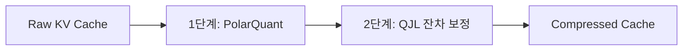

# 로컬 LLM 30분 실전 가이드

## 한 줄 정의
로컬 LLM 실전 가이드는 외부 API 요금 결제나 인터넷 개인정보 유출 우려 없이 개인 기기(PC/Mac)에서 최신 MLX 엔진 기반 Ollama, KV 캐시 압축 기술(TurboQuant) 및 디스크 스트리밍 기법을 융합하여 고성능 모델을 온디바이스로 초고속 구동하는 실무 기술 명세서다.

## 핵심 요지
- **엔진 진화 (Ollama-MLX)**: Ollama 0.19(2026년 3월 30일 출시)부터 애플 실리콘의 백엔드가 MLX로 교체되면서 M5 Max 환경 기준 Prefill 57%(1,810 tok/s), Decode 93%(112 tok/s) 수준의 비약적인 속도 성능 향상을 달성했다.
- **KV 캐시 메모리 벽 차단 (TurboQuant)**: 32B 이상 모델 구동 시 최대 병목인 KV 캐시를 PolarQuant와 QJL 2단계 파이프라인으로 압축하여 품질 손실 없이 4.6배 이상의 압축률과 디코드 속도 105%를 달성한다.
- **물리 RAM 한계 극복 (Expert Streaming)**: 256개 전문가 MoE 아키텍처의 희소성을 이용하여 매 토큰 연산 시 활성화되는 소수의 전문가 가중치만 Contiguous 바이트 오프셋에서 `pread`(`F_NOCACHE` 설정)로 적재함으로써 16GB Mac mini에서 54GB 크기의 122B 모델 구동에 성공했다.
- **3대 실무 구현 경로**: IDE 코딩 어시스턴트(Cline), 콤팩트 문서 RAG(Ollama+NumPy), 실시간 오프라인 음성 비서(WhisperKit+Kokoro ONNX)의 네이티브 구축 파이프라인을 다룬다.

## 상세

### 1. 하드웨어 스펙별 런타임 및 모델 매핑

| 하드웨어 구분 | 가용 물리 RAM | 추천 모델 | STT / TTS 엔진 | 디코드 성능 및 특징 |
| :--- | :--- | :--- | :--- | :--- |
| **M1 / M1 Pro** | 8 ~ 16GB | 내장 Apple 파운데이션 (3B)<br>Q4 Qwen3 (8B) | WhisperKit (base/small)<br>Kokoro ONNX | 스왑 부하 방지를 위해 3B~4B 이하 모델 권장 |
| **M2 / M2 Pro** | 16 ~ 32GB | Q4 Qwen3 (8B)<br>Phi-4 (14B) | WhisperKit (large-v3-turbo)<br>Kokoro ONNX | 이 사양부터 로컬-클라우드 하이브리드 구성 가능 |
| **M3 Pro / M3 Max** | 18 ~ 128GB | Qwen3 (8B) 상주<br>Phi-4 14B Q4 병용 | WhisperKit (large-v3-turbo)<br>Kokoro ONNX | 다수의 모델을 메모리에 상주(Resident)시켜 즉시 전환 가능 (1인 개발 스윗스팟) |
| **M4 Pro / M4 Max** | 24 ~ 128GB | DeepSeek-V3-Distill-32B<br>Llama 4 Scout Q4 | WhisperKit / FluidAudio (Parakeet)<br>Kokoro ONNX | 30B급 모델 디코드 속도 60~90 tok/s 도달 |
| **M5 / M5 Max** | 32 ~ 128GB | Qwen3.5-35B-A3B (최적)<br>70B급 양자화 모델 | FluidAudio (0.19초 전사)<br>Kokoro ONNX | M5 GPU 뉴럴 엑셀러레이터 지원으로 Qwen3.5-35B 디코드 112 tok/s 돌파 |

- **4대 로컬 런타임 비교**:
  1. *Apple 파운데이션 모델 (Swift)*: macOS/iOS 내장 3B 모델. `@Generable` 매크로 기반 타입 안전 구조화 출력 및 기본 도구 호출 지원.
  2. *Ollama 0.19+ (MLX)*: API 기반 범용 서빙 및 1000개 이상 모델 즉각 pull 지원.
  3. *MLX Direct (Python/Swift)*: 하드웨어 밀착 가속. llama.cpp 대비 20~30% 성능 우수. macMLX 활용 시 OpenAI API 호환 지원.
  4. *LM Studio*: 데스크톱 GUI 환경의 모델 및 API 서버 개설용.

---

### 2. KV 캐시 압축 기술 (TurboQuant)

로컬 추론의 크리티컬 병목은 컨텍스트 시퀀스 길이에 비례해 비대해지는 **KV 캐시**다. TurboQuant(arXiv:2504.19874, ICLR 2026 채택)는 재학습 없이 정확도를 보존하며 캐시를 4~6배 압축한다.



1. **폴라퀀트(PolarQuant)**: 무작위 회전(Random Rotation)을 적용하여 특정 차원의 이상치(Outlier)를 가우시안 분포로 골고루 펼친 후, 극좌표계의 '방향(3비트)'과 '크기(8비트)'로 분해 양자화한다. 추가 메타데이터 보존 오버헤드가 제로(effectively zero)에 가깝다.
2. **QJL(Quantised Johnson-Lindenstrauss)**: 폴라퀀트 복원 잔차 오차를 무작위 행렬 투영(JL 변환)을 거쳐 차원당 단 1비트의 부호 비트(+1/-1)로 기록한다. 소프트맥스 연산 직전에 오차를 거의 완벽히 복원한다.
3. **압축 모드 튜닝 전략**:
   - *V2 (속도 최적화)*: `mx.quantized_matmul` 활용 아핀 양자화. Llama3.2 3B 4비트 회전 모드 시 펄플렉시티 FP16 원본 대비 0.8% 역개선 (정규화 필터 효과). 헤드 차원이 클수록(Gemma D=256) 복원력 우수. 8K 토큰 디코드 속도 105% 달성.
   - *V3 (품질 최적화)*: 로이드-맥스 코드북 양자화. 3비트 극저비트에서 V2 대비 높은 정확도를 보이나, 커스텀 Metal 커널 없이는 5~6배 느려 `arozanov/turboquant-mlx` Fused Metal 커널 구현체를 써야만 제 속도를 낸다.

---

### 3. 물리 RAM 한계 해소: 개별 전문가 디스크 스트리밍

3비트 양자화된 Qwen3.5-122B-A10B 모델은 디스크 크기가 54GB에 달해 16GB Mac mini(가용 10~12GB)에서 구동이 불가능하다.

1. **지연 로딩(Lazy Loading)의 덫**: MLX에서 단순히 `lazy=True`로 로딩하면 첫 순방향 연산(forward pass)이 일어나는 순간 256개 전체 전문가 텐서가 물리 버퍼 위로 호출되어 기기가 스왑(Swap) 먹통이 된다.
2. **자율 수동 격리 설계**: 토큰당 256개 중 라우터가 활성화한 8개 전문가 가중치만 SSD에서 수동 적재하고 연산 즉시 해제한다. 자주 호출되는 전문가는 LRU 캐시에 담아둔다.
3. **F_NOCACHE 기반 페이지 캐시 차단**: 14GB가 넘는 전문가 가중치를 mmap 슬라이싱으로 빈번히 읽으면 macOS Unified buffer 캐시가 가용 메모리를 잠식한다. 파일 디스크립터에 fcntl 플래그 **`F_NOCACHE`**를 걸고 `os.pread`로 오프셋 직접 읽기를 하여 실제 물리 RSS를 3.9GB 수준으로 고정한다.
4. **Metal Wired Cap 통제**: 16GB Mac의 물리 장벽은 RAM 크기가 아닌 macOS GPU 커널이 스왑에서 제외하고 영구 고정하는 와이어드 메모리 제한선(약 10.5GB)이다. `mlx_peak ≈ 5GB(백본) + 캐시 용량`이므로 안전한 캐시 크기는 4~5GB로 제한한다. 이 골디락스 지점에서 디스크 대역폭 병목을 타고 **초당 1토큰(1 tok/s)** 속도로 122B 구동에 성공했다.

---

### 4. 3대 실무 구현 가이드

#### ① 경로 A: 로컬 코딩 어시스턴트 (VS Code + Cline)
- **추천 모델**: `qwen3-coder:30b` (30B MoE, 3B 활성화) / 저사양 노트북 `qwen2.5-coder:7b`.
- **Modelfile 튜닝**: Cline은 시스템 프롬프트만 25K 토큰을 초과하므로 num_ctx 65536으로 튜닝하여 diff 서식 유실 및 환각을 차단한다.
  ```dockerfile
  FROM qwen3-coder:30b
  PARAMETER num_ctx 65536
  PARAMETER temperature 0.2
  PARAMETER stop "<|im_end|>"
  ```
- **빌드 및 연동**:
  ```bash
  ollama create qwen3-coder-cline -f ./Modelfile
  # VS Code Cline 설정에서 Ollama 프로바이더 및 포트 11434 지정
  ```

#### ② 경로 B: 내 문서 기반 RAG (Ollama Embedding + NumPy)
- **임베딩 모델**: `nomic-embed-text` (137M 파라미터, 8,192 컨텍스트 창 지원).
- **NumPy 코사인 유사도**: 두 벡터가 정규화(Norm = 1)되어 있으면 벡터 내적이 곧 코사인 유사도가 된다. 루프 없이 행렬 곱 `scores = doc_matrix @ query_vector` 한 번으로 고속 검색을 처리한다.
  ```python
  q = query_vec / (np.linalg.norm(query_vec) + 1e-8)
  d = doc_matrix / (np.linalg.norm(doc_matrix, axis=1, keepdims=True) + 1e-8)
  scores = d @ q
  top_indices = np.argsort(scores)[::-1][:k]
  ```
- **가드레일**: 로컬 모델의 임의 창작을 억제하기 위해 프롬프트에 *"Answer using ONLY the context below. If the context does not contain the answer, say so plainly."*를 강제 주입한다. 코퍼스가 5000개 이상으로 커지면 `sqlite-vec`을 연동한다.

#### ③ 경로 C: 오프라인 음성 비서 (STT + LLM + TTS)
- **STT (Speech-to-Text)**: CoreML로 애플 뉴럴 엔진(ANE) 가속을 받는 **WhisperKit** (Whisper-large-v3-turbo 사용 시 1시간 분량을 90초 내 전사) 또는 Parakeet 기반의 **FluidAudio** (평균 전사 속도 0.19초)를 채택한다 (단순 CPU 연산인 whisper.cpp는 속도 저하로 배제).
- **TTS (Text-to-Speech)**: CPU 실시간 음성 합성이 가능한 **Kokoro ONNX** 엔진 활용.
- **2대 주의사항**:
  1. *16kHz 모노 녹음*: Whisper는 16kHz 규격으로 훈련되었으므로, 입력 녹음을 반드시 다운샘플링하여 mono int16 포맷으로 전달해야 한다 (그렇지 않으면 환각 텍스트 유발).
  2. *마크다운 및 기호 금지*: Kokoro TTS 엔진이 별표(`*`)나 하이픈(`-`) 기호 자체를 소리 내어 읽어 루프가 파괴되는 것을 방지하기 위해 시스템 프롬프트 단에서 마크다운을 금지한다.

---

### 5. 최적의 3계층 하이브리드 아키텍처

로컬 컴퓨팅 자원과 개인정보 보호, 그리고 클라우드 초고성능 모델을 결합하는 최선의 배포 전략이다.

```text
┌────────────────────────────────────────────────────────┐
│ 1계층: 상시 활성화, 초저지연 (Tier 1)                      │
│ → Apple 파운데이션 모델 (3B, Swift 네이티브, 비용 무료)       │
│ - 역할: 실시간 분류, 요청 라우팅, 간단한 필드 추출, 요약     │
├────────────────────────────────────────────────────────┤
│ 2계층: 필요 시 무거운 작업 처리 (Tier 2)                    │
│ → Qwen 3 8B / Qwen 3.5 35B (Ollama-MLX / TurboQuant)    │
│ - 역할: 복잡한 논리 분석, 다단계 추론, 오프라인 정밀 질의    │
├────────────────────────────────────────────────────────┤
│ 3계층: 필요 시 클라우드 확장 (Tier 3, 선택 동의)             │
│ → Claude Opus 4.7 / GPT-5.5                             │
│ - 역할: 프라이버시 동의 기반 최상위 난이도 추론               │
└────────────────────────────────────────────────────────┘
```

- **안티 패턴**: 
  - `mlx-lm` 패키지를 이용해 프로덕션 제품의 전체 비즈니스 로직을 Python으로만 구동하는 방식 (메모리 오버헤드가 크고 네이티브 Swift/macMLX 대비 하드웨어 가속 미흡).
  - Q2/Q3 수준으로 극단적 양자화 적용 (정확도 붕괴 유발. Q4 8B가 Q2 14B보다 대부분의 작업에서 우수).
  - 로컬 모델에 클라우드급 Opus 추론 능력을 맹신하고 라우터 설계 없이 작업을 넘기는 태도.

## 예시
- **보안 격리 코딩**: 회사 코드 노출 우려 없이 `qwen3-coder-cline` 모델을 VS Code 로컬 백엔드로 연동하여 리팩터링 diff를 로컬 환경 내에서 안전하게 생성한다.
- **오프라인 회의록 질의**: SQLite에 sqlite-vec을 얹어 회의록 임베딩을 저장하고, 비행기나 격리망 오프라인 환경에서 NumPy Cosine Similarity 내적으로 관련 내용을 검색한 뒤 답변을 추출한다.

## 충돌
- **지연 로딩(Lazy Loading)의 한계와 pread**: mmap을 사용한 지연 로딩이 메모리를 절약해 줄 것이라는 일반적인 오해는 MLX 런타임에서 첫 forward pass 시에 OOM으로 이어진다. 반드시 fcntl의 `F_NOCACHE` 플래그를 통한 OS 캐시 억제 및 `os.pread`로 활성 전문가 8개만 로드하는 수동 격리 적재가 수반되어야 한다.

## 관련 노트
- [[온디바이스 TTS]]
- [[AI 오픈소스 작업대]]
- [[오픈소스 LLM 경제성과 벤더 종속성 해지]]
- [[AI 세컨드 브레인]]
- [[GStack]]
- [[Claude Code 스킬 관리]]

