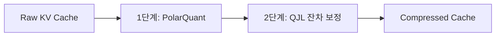

---
aliases:
- 로컬 LLM 실전 가이드
- 온디바이스 LLM
- Ollama
- TurboQuant
- 로컬-LLM-30분-실전-가이드
core: true
created: 2026-06-12
sources:
- raw/Run a Useful Local LLM in 30 Minutes (Coding, RAG, Voice).md
- raw/5배 적은 메모리로 맥에서 32B 모델 실행하기 - 구글 TurboQuant, 애플 실리콘 상륙.md
- 'raw/애플 실리콘을 위한 로컬 AI 스택: 한 차원 진화한 성능과 최적의 구축 가이드.md'
- raw/16GB Mac mini에서 Qwen 3.5 122B LLM 실행하기 - TurboQuant-MLX를 활용한 MoE 전문가 스트리밍.md
- raw/노트북을 망가뜨리지 않으려고 라즈베리 파이에서 AI 에이전트 하네스를 구동한 후기.md
- raw/테일윈드의 고군분투는 무너지는 사상누각의 징조다.md
- raw/지난번 이런 일이 있었을 때, 수많은 평범한 사람들이 백만장자가 되었다.md
- raw/AI가 내 글쓰기 커리어를 죽였다. AI 만세.md
- raw/2026년 Claude Code 설정에 꼭 필요한 8가지 핵심 스킬.md
- raw/AI 네이티브 세컨드 브레인을 구축하는 방법 (2026년 방식).md
- raw/지식 그래프, 진정한 게임 체인저... 그러나 구축과 유지가 극도로 어려운 이유.md
- 'raw/밑바닥부터 만드는 LLM 메모리 #3. 벡터 메모리.md'
- raw/AI는 개발자를 대체하는 것이 아니라 더 심각한 일을 하고 있다.md
- raw/모든 AI 엔지니어가 알아야 할 10가지 LangChain 및 LangGraph 개념.md
- 'raw/밑바닥부터 만드는 LLM 메모리 #5. 계층형 자체 관리 메모리.md'
- 'raw/밑바닥부터 만드는 LLM 메모리 #4. 지식 그래프 메모리.md'
- raw/옵시디언 마스터하기 - 노트를 세컨드 브레인으로 만드는 완벽 가이드.md
- raw/Claude Code 프로젝트 효율을 극대화하는 MEMORY.md 가이드.md
- raw/AI로 몰래 쓴 글을 가려내는 명백한 방법들.md
- raw/AI와 오픈소스로 300개 이상의 팟캐스트를 RPG 게임으로 만든 이야기 - LennyRPG 8시간 개발기.md
- raw/CLAUDE.md 파일 하나가 바이럴을 탔다. 이유는 민망할 정도로 단순하다.md
- raw/Karpathy의 LLM Wiki를 두 번 만들었다. 코드로 한 번, 단일 .md로 한 번.md
- raw/디지털 제품 제작은 잊으세요. 대신 이것에 집중하세요.md
- raw/Anthropic이 Opus 4.8에 대해 말하지 않은 것 - 하네스를 흡수하는 Anthropic.md
- raw/How to Do Hard Things When You Have Zero Motivation.md
- raw/AI Agents. Complete Course.md
- raw/좋은 삶을 만드는 것에 대한 지루한 진실.md
- raw/AI 개발자가 반드시 알아야 할 9가지 RAG 아키텍처 - 실무 예제로 배우는 완전 가이드.md
- raw/Claude Code를 위한 Figma 스킬 완벽 가이드.md
- raw/2026년 AI 보조 코딩은 하나의 기술이다. 실제로 이 기술을 마스터하는 방법.md
- raw/10 Things Every Investor Should Know (but most learn too late).md
- raw/내가 Obsidian을 정리하는 방법 - 다니엘 프린디.md
- raw/Claude Code를 밑바닥부터 직접 구현해 보았다.md
- raw/Claude Code 프로젝트를 위한 MEMORY.md.md
- raw/마이크로서비스 대신 모듈러 모놀리스 — AI 에이전트가 코드를 읽기 시작했을 때 바뀐 것들.md
- raw/40억 달러 대기업이 깨뜨린 오픈소스와 개발자 협박의 역풍.md
- raw/1인 개발자와 소규모 팀을 위한 주말 완성 디자인 시스템 구축법.md
- raw/The S&P 500 Illusion. Why Your “Diversified” Index Is Really a Bet on 10 Stocks.md
- raw/Your Wandering Mind Is Not the Enemy of Focus.md
- raw/How to write a DESIGN.md file Claude can actually use-ko.md
- raw/하네스 엔지니어링 - 65줄 CLAUDE.md가 최고의 스킬인 이유.md
- raw/BofA’s May Survey Says Investors Are Back in Stocks. The 30-Year Is the Risk..md
- raw/내 주의 집중 시간을 되돌려준 11가지 사소한 생활 습관의 변화.md
- 'raw/밑바닥부터 만드는 LLM 메모리 #1. 슬라이딩 윈도우 버퍼.md'
- raw/LLM에게 옵시디언 볼트 열쇠를 주면 일어나는 일.md
- raw/우리가 피그마 없이 제품을 배포하는 방법.md
- raw/2026년을 위한 웹 디자인 및 빌드 워크플로우.md
- raw/RAG 시스템 초보자부터 전문가까지의 완전 가이드 (2026년 에디션).md
- raw/These 3 ETFs Created More Millionaires Than Any Stock.md
- raw/60일간 11번의 기술 인터뷰를 치르며 깨달은 아무도 말해주지 않는 패턴.md
- raw/2026년에 실제로 효과가 있는 나의 AI 디자인 워크플로우.md
- raw/DESIGN.md 워크플로우. Google Stitch와 Claude Code가 디자인-코드 핸드오프를 조용히 바꾼 방법-ko.md
- raw/모든 DESIGN.md에 꼭 들어가야 할 9가지 섹션.md
- raw/만약 단 5편의 AI 논문만 읽어야 한다면 바로 이것입니다.md
- raw/AI 코딩 에이전트와 함께하는 명세 기반 개발 결정판 가이드.md
- raw/Skills Alone Won’t Save You in the AI Economy.md
- raw/DESIGN.md 워크플로 - Google Stitch와 Claude Code가 바꾼 디자인 개발 협업.md
- 'raw/밑바닥부터 만드는 LLM 메모리 #2. 자동 요약 버퍼.md'
- raw/맥북 로컬 AI 에이전트 구동을 위한 oMLX 벤치마크 및 활용기.md
- raw/로컬 AI 구동용 고사양 PC 구매는 돈값할까.md
- raw/I Cancelled ChatGPT, Cursor, and Midjourney This Week — My MacBook Pro M5 Max
  Quietly Replaced All Three-ko.md
- raw/7 Local LLM Families To Replace Claude_Codex (for everyday tasks).md
status: evergreen
tags:
- llm
- local-ai
- coding-assistant
- rag
- tts
- stt
- mlx
- apple-silicon
- local-llm
- hardware
- benchmarks
type: concept
updated: 2026-07-10
---
# 로컬 LLM 30분 실전 가이드

## 한 줄 정의
로컬 LLM 실전 가이드는 외부 API 요금 결제나 인터넷 개인정보 유출 우려 없이 개인 기기(PC/Mac)에서 최신 MLX 엔진 기반 Ollama, KV 캐시 압축 기술([[TurboQuant]]) 및 디스크 스트리밍 기법을 융합하여 고성능 모델을 온디바이스로 초고속 구동하는 실무 기술 명세서다.

## 핵심 요지
- **엔진 진화 (Ollama-MLX)**: Ollama 0.19(2026년 3월 30일 출시)부터 애플 실리콘의 백엔드가 MLX로 교체되면서 M5 Max 환경 기준 Prefill 57%(1,810 tok/s), Decode 93%(112 tok/s) 수준의 비약적인 속도 성능 향상을 달성했다.
- **KV 캐시 메모리 벽 차단 ([[TurboQuant]])**: 32B 이상 모델 구동 시 최대 병목인 KV 캐시를 PolarQuant와 QJL 2단계 파이프라인으로 압축하여 품질 손실 없이 4.6배 이상의 압축률과 디코드 속도 105%를 달성한다.
- **물리 RAM 한계 극복 (Expert Streaming)**: 256개 전문가 MoE 아키텍처의 희소성을 이용하여 매 토큰 연산 시 활성화되는 소수의 전문가 가중치만 Contiguous 바이트 오프셋에서 `pread`(`F_NOCACHE` 설정)로 적재함으로써 16GB Mac mini에서 54GB 크기의 122B 모델 구동에 성공했다.
- **3대 실무 구현 경로**: IDE 코딩 어시스턴트([[Cline]]), 콤팩트 문서 RAG(Ollama+NumPy), 실시간 오프라인 음성 비서(WhisperKit+Kokoro ONNX)의 네이티브 구축 파이프라인을 다룬다.
- Ollama 0.19 벤치마크에 따르면 int4 양자화 Qwen 구동 시 초당 1,851 토큰 프리필(Prefill)과 134 토큰 디코딩(Decode) 속도를 발휘한다. (출처: raw/I Cancelled ChatGPT, Cursor, and Midjourney This Week — My MacBook Pro M5 Max Quietly Replaced All Three-ko.md)
- [[oMLX]]의 2단계 KV 캐시(RAM 핫 캐시 + SSD 콜드 캐시) 설계를 통해 에이전트 구동 시 첫 토큰 생성 시간(TTFT)을 30~90초에서 1~3초로 크게 단축한다. (출처: raw/I Cancelled ChatGPT, Cursor, and Midjourney This Week — My MacBook Pro M5 Max Quietly Replaced All Three-ko.md)
- PyTorch의 MPS 메모리 점유율 한계를 해소하기 위해 `export PYTORCH_MPS_HIGH_WATERMARK_RATIO=0.0` 환경변수를 설정하면, 36GB 통합 메모리 내에서 35B 모델(20GB)과 Z-Image-Turbo(6GB)를 동시 적재할 수 있다. (출처: raw/I Cancelled ChatGPT, Cursor, and Midjourney This Week — My MacBook Pro M5 Max Quietly Replaced All Three-ko.md)
- [[Cline]] v3+ 등의 지능형 에이전트는 복잡한 시스템 프롬프트로 인해 시작 시점에 이미 25K~30K 토큰을 소비하므로, Ollama 기본 num_ctx(40K)를 안전하게 초과해 사용량 오류가 나는 것을 막기 위해 Modelfile 튜닝을 거쳐 65,536(여유가 있을 시 131,072)으로 수동 할당해야 한다. (출처: Run a Useful Local LLM in 30 Minutes (Coding, RAG, Voice).md)
- 오프라인 음성 비서 파이프라인에서 STT 모델로 CoreML 가속을 탑재한 WhisperKit(Whisper-large-v3-turbo, 1시간 음성을 90초 내 전사) 또는 Parakeet 기반 FluidAudio(평균 전사 지연 0.19초)를 기용하여 CPU 기반 whisper.cpp의 성능 지연을 극복한다. (출처: Run a Useful Local LLM in 30 Minutes (Coding, RAG, Voice).md)
- Kokoro ONNX 엔진을 사용한 TTS 합성 시 마크다운 기호(*, - 등)를 만나면 루프 에러가 생기거나 기호 자체를 소리 내 읽는 오류가 발생하므로, 시스템 프롬프트 단에서 특수 마크다운 출력을 철저히 금지하는 가드레일을 둬야 한다. (출처: Run a Useful Local LLM in 30 Minutes (Coding, RAG, Voice).md)
- Whisper STT는 16kHz 오디오 스펙으로 훈련되었으므로, 오프라인 음성 녹음 시 raw 입력 음파를 16kHz 모노 int16 포맷으로 변환(Downsampling)하여 전달해야 전사 환각 텍스트 현상을 피할 수 있다. (출처: Run a Useful Local LLM in 30 Minutes (Coding, RAG, Voice).md)

## 상세

### 1. 하드웨어 스펙별 런타임 및 모델 매핑

| 하드웨어 구분 | 가용 물리 RAM | 추천 모델 | STT / TTS 엔진 | 디코드 성능 및 특징 |
| :--- | :--- | :--- | :--- | :--- |
| **M1 / M1 Pro / Entry** | 8 ~ 16GB | 내장 Apple 파운데이션 (3B)<br>Q4 Qwen3.5-35B-A3B | WhisperKit (base/small)<br>Kokoro ONNX | 스왑 부하 방지용으로 3B~4B 이하 모델 또는 3B active의 MoE(Qwen3.5-35B-A3B Q4) 권장 (예산 $0-300) |
| **M2 / M2 Pro / Mid** | 16 ~ 32GB | Qwen3.5-27B (Dense)<br>GPT-OSS-20B<br>Qwen3-Coder-30B-A3B<br>Devstral Small 2 (24B) | WhisperKit (large-v3-turbo)<br>Kokoro ONNX | 가성비 스윗스팟. 다중 파일 리팩터링 및 프로젝트 구조 분석 가능 (예산 $400-1200) |
| **M3 Pro / M3 Max / Mid-High** | 18 ~ 128GB | Qwen3.5-27B 상주<br>GPT-OSS-120B / Qwen3.5-122B-A10B 병용 | WhisperKit (large-v3-turbo)<br>Kokoro ONNX | 다수의 모델을 메모리에 상주(Resident)시켜 즉시 전환 가능 (1인 개발 스윗스팟) |
| **M4 Pro / M4 Max / High** | 24 ~ 128GB | DeepSeek-V3-Distill-32B<br>GLM-4.7 (32B active MoE)<br>Qwen3-Coder-480B 양자화 | WhisperKit / FluidAudio (Parakeet)<br>Kokoro ONNX | 30B급 모델 디코드 속도 60~90 tok/s 도달, 클라우드 API 수준 체감 (예산 $2000-5000) |
| **M5 / M5 Max / High** | 32 ~ 128GB | Qwen3.5-35B-A3B (최적)<br>GLM-4.7 / Qwen3.5-122B-A10B | FluidAudio (0.19초 전사)<br>Kokoro ONNX | M5 GPU 뉴럴 엑셀러레이터 지원으로 Qwen3.5-35B 디코드 112 tok/s 돌파 |
| **Ultra / Mac Studio Ultra** | 128 ~ 256GB | [[GLM-5]] (744B MoE, 40B active)<br>MiniMax M2.5 (230B MoE, 10B active)<br>Kimi K2.5 (1.04T MoE, 32B active) | FluidAudio (0.19초 전사)<br>Kokoro ONNX | 초고성능 및 뛰어난 속도로 클라우드 API를 거의 대체하는 끝판왕 환경 (예산 $5000+) |

※ 이 하드웨어 매핑 표의 수치와 모델 벤치마크는 [7 Local LLM Families To Replace Claude_Codex (for everyday tasks)](file:///Users/railscraft/Obsidian/raw/7%20Local%20LLM%20Families%20To%20Replace%20Claude_Codex%20%28for%20everyday%20tasks%29.md)를 기준으로 정리함.

- **4대 로컬 런타임 비교**:
  1. *Apple 파운데이션 모델 (Swift)*: macOS/iOS 내장 3B 모델. `@Generable` 매크로 기반 타입 안전 구조화 출력 및 기본 도구 호출 지원.
  2. *Ollama 0.19+ (MLX)*: API 기반 범용 서빙 및 1000개 이상 모델 즉각 pull 지원.
  3. *MLX Direct (Python/Swift)*: 하드웨어 밀착 가속. llama.cpp 대비 20~30% 성능 우수. macMLX 활용 시 OpenAI API 호환 지원.
  4. *LM Studio*: 데스크톱 GUI 환경의 모델 및 API 서버 개설용.

#### NVIDIA GPU vs Apple Silicon 셋업 및 트레이드오프

로컬 LLM 환경을 구축할 때 대표적인 하드웨어 아키텍처 옵션인 NVIDIA 외장 GPU(예: RTX 5060 Ti 16GB, RTX 5090 32GB)와 Apple Silicon 통합 메모리(Unified Memory)는 명확한 성능상·구조상 트레이드오프를 가진다.

- **VRAM 대역폭 및 CUDA 가속 vs 통합 메모리 용량**:
  - **NVIDIA GPU**: 전용 GDDR 메모리의 방대한 대역폭(Bandwidth)과 대다수 LLM 추론 프레임워크에 최적화된 CUDA 코어를 바탕으로, VRAM 범위 내에 온전히 상주하는 모델에 대해 극도로 높은 추론 속도(TPS)와 낮은 레이턴시를 제공한다. 예를 들어 RTX 5060 Ti 16GB는 통합 메모리 용량이 더 큰 MacBook Pro/Air(예: 24GB M4 Air)보다 대역폭 우위를 바탕으로 소형/중형 모델 추론에서 더 빠른 속도를 발휘한다.
  - **Apple Silicon**: CPU와 GPU가 대용량 통합 메모리를 공유하여 단일 소비자용 GPU의 VRAM 한계(16GB~32GB)를 훨씬 초과하는 거대 모델(70B+ 또는 120B~744B MoE)을 64GB~256GB RAM에 통째로 적재할 수 있다. 멀티 GPU 구성 없이 단일 기기에서 대형 모델을 돌릴 수 있는 고용량 메모리 효율성이 뛰어나다.

- **VRAM 오프로딩 한계 및 전력 소모**:
  - **VRAM 오프로딩 한계**: 모델 크기 및 긴 컨텍스트 윈도우(Prompt Pre-prompt 등) 사용으로 인해 메모리 요구량이 GPU VRAM 용량을 초과(예: 16GB VRAM 기기에서 12GB 이상 모델+컨텍스트 구동)할 경우, 초과분 레이어가 시스템 RAM과 CPU로 오프로딩된다. 이 경우 CPU 연산 및 PCIe/RAM 대역폭 병목으로 인해 토큰 생성 속도(TPS)가 급격히 곤두박질치고 프롬프트 전처리 시간이 늘어나 수동 코딩보다 느려지는 한계가 발생한다.
  - **전력 소모 및 발열**: 플래그십 GPU(예: RTX 5090 32GB)는 우수한 추론 속도를 제공하지만 상당한 전력 소모와 열을 발생시킨다. 고효율 파워서플라이(Platinum/Titanium 등급 PSU)를 사용해 전력 변환 손실을 줄일 수 있으나 GPU 자체의 누진세 부하 및 발열은 불가피하다. 반면 Apple Silicon은 고효율 전력 설계로 낮은 전력 소모와 저소음·저발열 운용이 가능하다.

- **출처 레퍼런스**:
  - [7 Local LLM Families To Replace Claude_Codex (for everyday tasks)](file:///Users/railscraft/Obsidian/raw/7%20Local%20LLM%20Families%20To%20Replace%20Claude_Codex%20%28for%20everyday%20tasks%29.md)
  - [로컬 AI 구동용 고사양 PC 구매는 돈값할까](file:///Users/railscraft/Obsidian/raw/%EB%A1%9C%EC%BB%AC%20AI%20%EA%B5%AC%EB%8F%99%EC%9A%A9%20%EA%B3%A0%EC%82%AC%EC%96%91%20PC%20%EA%B5%AC%EB%A7%A4%EB%8A%94%20%EB%8F%88%EA%B0%92%ED%95%A0%EA%B9%8C.md)

---

### 2. KV 캐시 압축 기술 ([[TurboQuant]])

로컬 추론의 크리티컬 병목은 컨텍스트 시퀀스 길이에 비례해 비대해지는 **KV 캐시**다. [[TurboQuant]](arXiv:2504.19874, ICLR 2026 채택)는 재학습 없이 정확도를 보존하며 캐시를 4~6배 압축한다.



1. **폴라퀀트(PolarQuant)**: 무작위 회전(Random Rotation)을 적용하여 특정 차원의 이상치(Outlier)를 가우시안 분포로 골고루 펼친 후, 극좌표계의 '방향(3비트)'과 '크기(8비트)'로 분해 양자화한다. 추가 메타데이터 보존 오버헤드가 제로(effectively zero)에 가깝다.
2. **QJL(Quantised Johnson-Lindenstrauss)**: 폴라퀀트 복원 잔차 오차를 무작위 행렬 투영(JL 변환)을 거쳐 차원당 단 1비트의 부호 비트(+1/-1)로 기록한다. 소프트맥스 연산 직전에 오차를 거의 완벽히 복원한다.
3. **압축 모드 튜닝 전략**:
   - *V2 (속도 최적화)*: `mx.quantized_matmul` 활용 아핀 양자화. Llama3.2 3B 4비트 회전 모드 시 펄플렉시티 FP16 원본 대비 0.8% 역개선 (정규화 필터 효과). 헤드 차원이 클수록(Gemma D=256) 복원력 우수. 8K 토큰 디코드 속도 105% 달성.
   - *V3 (품질 최적화)*: 로이드-맥스 코드북 양자화. 3비트 극저비트에서 V2 대비 높은 정확도를 보이나, 커스텀 Metal 커널 없이는 5~6배 느려 `arozanov/turboquant-mlx` Fused Metal 커널 구현체를 써야만 제 속도를 낸다.

---

### 3. 물리 RAM 한계 해소: 개별 전문가 디스크 스트리밍

3비트 양자화된 Qwen3.5-122B-A10B 모델은 디스크 크기가 54GB에 달해 16GB Mac mini(가용 10~12GB)에서 구동이 불가능하다.

1. **지연 로딩(Lazy Loading)의 덫**: MLX에서 단순히 `lazy=True`로 로딩하면 첫 순방향 연산(forward pass)이 일어나는 순간 256개 전체 전문가 텐서가 물리 버퍼 위로 호출되어 기기가 스왑(Swap) 먹통이 된다.
2. **자율 수동 격리 설계**: 토큰당 256개 중 라우터가 활성화한 8개 전문가 가중치만 SSD에서 수동 적재하고 연산 즉시 해제한다. 자주 호출되는 전문가는 LRU 캐시에 담아둔다.
3. **F_NOCACHE 기반 페이지 캐시 차단**: 14GB가 넘는 전문가 가중치를 mmap 슬라이싱으로 빈번히 읽으면 macOS Unified buffer 캐시가 가용 메모리를 잠식한다. 파일 디스크립터에 fcntl 플래그 **`F_NOCACHE`**를 걸고 `os.pread`로 오프셋 직접 읽기를 하여 실제 물리 RSS를 3.9GB 수준으로 고정한다.
4. **Metal Wired Cap 통제**: 16GB Mac의 물리 장벽은 RAM 크기가 아닌 macOS GPU 커널이 스왑에서 제외하고 영구 고정하는 와이어드 메모리 제한선(약 10.5GB)이다. `mlx_peak ≈ 5GB(백본) + 캐시 용량`이므로 안전한 캐시 크기는 4~5GB로 제한한다. 이 골디락스 지점에서 디스크 대역폭 병목을 타고 **초당 1토큰(1 tok/s)** 속도로 122B 구동에 성공했다.

---

### 4. 3대 실무 구현 가이드

#### ① 경로 A: 로컬 코딩 어시스턴트 (VS Code + [[Cline]])
- **추천 모델**: `qwen3-coder:30b` (30B MoE, 3B 활성화) / 저사양 노트북 `qwen2.5-coder:7b`.
- **Modelfile 튜닝**: [[Cline]]은 시스템 프롬프트만 25K 토큰을 초과하므로 num_ctx 65536으로 튜닝하여 diff 서식 유실 및 환각을 차단한다.
  ```dockerfile
  FROM qwen3-coder:30b
  PARAMETER num_ctx 65536
  PARAMETER temperature 0.2
  PARAMETER stop "<|im_end|>"
  ```
- **빌드 및 연동**:
  ```bash
  ollama create qwen3-coder-cline -f ./Modelfile
  # VS Code Cline 설정에서 Ollama 프로바이더 및 포트 11434 지정
  ```

#### ② 경로 B: 내 문서 기반 RAG (Ollama Embedding + NumPy)
- **임베딩 모델**: `nomic-embed-text` (137M 파라미터, 8,192 컨텍스트 창 지원).
- **NumPy 코사인 유사도**: 두 벡터가 정규화(Norm = 1)되어 있으면 벡터 내적이 곧 코사인 유사도가 된다. 루프 없이 행렬 곱 `scores = doc_matrix @ query_vector` 한 번으로 고속 검색을 처리한다.
  ```python
  q = query_vec / (np.linalg.norm(query_vec) + 1e-8)
  d = doc_matrix / (np.linalg.norm(doc_matrix, axis=1, keepdims=True) + 1e-8)
  scores = d @ q
  top_indices = np.argsort(scores)[::-1][:k]
  ```
- **가드레일**: 로컬 모델의 임의 창작을 억제하기 위해 프롬프트에 *"Answer using ONLY the context below. If the context does not contain the answer, say so plainly."*를 강제 주입한다. 코퍼스가 5000개 이상으로 커지면 `sqlite-vec`을 연동한다.

#### ③ 경로 C: 오프라인 음성 비서 (STT + LLM + TTS)
- **STT (Speech-to-Text)**: CoreML로 애플 뉴럴 엔진(ANE) 가속을 받는 **WhisperKit** (Whisper-large-v3-turbo 사용 시 1시간 분량을 90초 내 전사) 또는 Parakeet 기반의 **FluidAudio** (평균 전사 속도 0.19초)를 채택한다 (단순 CPU 연산인 whisper.cpp는 속도 저하로 배제).
- **TTS (Text-to-Speech)**: CPU 실시간 음성 합성이 가능한 **Kokoro ONNX** 엔진 활용.
- **2대 주의사항**:
  1. *16kHz 모노 녹음*: Whisper는 16kHz 규격으로 훈련되었으므로, 입력 녹음을 반드시 다운샘플링하여 mono int16 포맷으로 전달해야 한다 (그렇지 않으면 환각 텍스트 유발).
  2. *마크다운 및 기호 금지*: Kokoro TTS 엔진이 별표(`*`)나 하이픈(`-`) 기호 자체를 소리 내어 읽어 루프가 파괴되는 것을 방지하기 위해 시스템 프롬프트 단에서 마크다운을 금지한다.

---

### 5. 최적의 3계층 하이브리드 아키텍처

로컬 컴퓨팅 자원과 개인정보 보호, 그리고 클라우드 초고성능 모델을 결합하는 최선의 배포 전략이다.

```text
┌────────────────────────────────────────────────────────┐
│ 1계층: 상시 활성화, 초저지연 (Tier 1)                      │
│ → Apple 파운데이션 모델 (3B, Swift 네이티브, 비용 무료)       │
│ - 역할: 실시간 분류, 요청 라우팅, 간단한 필드 추출, 요약     │
├────────────────────────────────────────────────────────┤
│ 2계층: 필요 시 무거운 작업 처리 (Tier 2)                    │
│ → Qwen 3 8B / Qwen 3.5 35B (Ollama-MLX / TurboQuant)    │
│ - 역할: 복잡한 논리 분석, 다단계 추론, 오프라인 정밀 질의    │
├────────────────────────────────────────────────────────┤
│ 3계층: 필요 시 클라우드 확장 (Tier 3, 선택 동의)             │
│ → Claude Opus 4.7 / GPT-5.5                             │
│ - 역할: 프라이버시 동의 기반 최상위 난이도 추론               │
└────────────────────────────────────────────────────────┘
```

- **안티 패턴**: 
  - `mlx-lm` 패키지를 이용해 프로덕션 제품의 전체 비즈니스 로직을 Python으로만 구동하는 방식 (메모리 오버헤드가 크고 네이티브 Swift/macMLX 대비 하드웨어 가속 미흡).
  - Q2/Q3 수준으로 극단적 양자화 적용 (정확도 붕괴 유발. Q4 8B가 Q2 14B보다 대부분의 작업에서 우수).
  - 로컬 모델에 클라우드급 Opus 추론 능력을 맹신하고 라우터 설계 없이 작업을 넘기는 태도.

### 6. 애플 실리콘 맥북 [[oMLX]] 실전 가속 벤치마크 데이터
- **롱 컨텍스트 프리필 병목과 [[oMLX]] 개선 성능**:
  - 64GB 통합 메모리를 활용해 Qwen3.6-35B MoE 모델(21GB)을 구동하고 8,700토큰의 코드베이스를 읽는 프리필 실험에서, 순수 MLX는 M1 Max에서 20.35초(초당 579토큰)가 걸리는 중대한 지연 병목이 존재했습니다.
  - 이를 continuous batching 및 계층형 KV 캐싱을 탑재한 [[oMLX]] 서버로 전환하여 구동한 결과, 프리필 지연 시간이 **M1 Max에서 2.95초(초당 2,975토큰, 5.1배 성능 향상)**, **M4 Max에서 1.01초(초당 8,664토큰, 5.7배 성능 향상)**로 획기적으로 개선되었습니다.
- **실시간 로컬 AI 에이전트 하이하이브리드 결합**:
  - 32GB 이상 통합 메모리를 가진 맥북에 [[oMLX]] 추론 백엔드와 OpenAI 호환 API(`http://localhost:8000/v1`)를 조합하면, Claude Code 등의 AI 에이전트가 롱 컨텍스트 코드베이스를 RAM(Hot) 및 SSD(Cold) 계층에 캐싱해두며 오프라인 환경에서 비용 및 지연 오버헤드 없이 프로덕션 실무를 수행할 수 있게 됩니다. (출처: [맥북 로컬 AI 에이전트 구동을 위한 [[oMLX]] 벤치마크 및 활용기.md](file:///Users/railscraft/Obsidian/raw/%EB%A7%A5%EB%B6%81%20%EB%A1%9C%EC%BB%AC%20AI%20%EC%97%90%EC%9D%B4%EC%A0%84%ED%8A%B8%20%EA%B5%AC%EB%8F%99%EC%9D%84%20%EC%9C%84%ED%95%9C%20[[oMLX]]%20%EB%B2%A4%EC%B9%98%EB%A7%88%ED%81%AC%20%EB%B0%8F%20%ED%99%9C%EC%9A%A9%EA%B8%B0.md))

### 7. 로컬 구동을 위한 x86/윈도우 조립 PC 하드웨어 분석
로컬 AI 구동을 위해서는 Apple Silicon 통합 메모리 외에도 CUDA 코어 기반 외장 GPU의 특성을 명확히 이해해야 한다.
- **외장 GPU 대역폭 성능 우위**: MSI GeForce RTX 5060 Ti 16GB(약 800달러)는 24GB MacBook M4 Air를 상회하는 추론 속도를 낸다. M시리즈의 통합 메모리는 시스템 전체가 공유하므로 외장 카드가 제공하는 고속 VRAM 대역폭의 일부만 사용 가능하며, 대부분의 프레임워크가 CUDA 코어에 극도로 최적화되어 있기 때문이다.
- **VRAM 초과 시 오프로딩 병목**: 컨텍스트를 포함한 모델 용량이 그래픽 카드의 물리 VRAM 크기(예: 12GB)를 초과하면, 초과분이 시스템 RAM으로 오프로딩되어 CPU가 계산을 맡는다. CPU의 대역폭은 그래픽 VRAM에 비해 극도로 느리므로 초당 토큰 처리 속도(TPS)가 급락하고 사전 처리 시간이 길어져 실용성이 파괴된다.
- **기기 간 질의 전달**: 다수의 기기를 연결하거나 외부에서 로컬 AI에 접속해 질의를 전달할 경우, 단순 테스트용인 Ollama를 넘어 API 서버 형태의 **LM Studio**를 활용하는 것이 연동 및 라우팅 관점에서 더 효율적이다.
- **기타 하드웨어 대안 비교**:
  - *RTX 5090 (32GB)*: 약 4,000달러의 비용이 소요되는 끝판왕급 선택지로 대규모 모델 및 이미지/비디오 생성에 압도적이나, 전력 소모(Platinum/Titanium 등급 PSU 필수)와 누진세 리스크가 존재한다.
  - *Mac Studio 쇠사슬 풀링*: 4대의 기기를 풀링하여 초대형 모델을 올릴 수 있으나 대당 약 5,000달러의 초고비용이 발생하므로 조립 PC를 통한 수동 업그레이드 경로 제어 대비 비효율적이다.
  - *중고 구형 서버*: 저렴하고 메모리가 많아 보이지만, 서버용 RAM 속도가 느리고 CPU 추론에 크게 의존해 연산 속도가 기어가는 흉물이 될 수 있으므로 배제해야 한다. (출처: [로컬 AI 구동용 고사양 PC 구매는 돈값할까.md](file:///Users/railscraft/Obsidian/raw/%EB%A1%9C%EC%BB%AC%20AI%20%EA%B5%AC%EB%8F%99%EC%9A%A9%20%EA%B3%A0%EC%82%AC%EC%96%91%20PC%20%EA%B5%AC%EB%A7%A4%EB%8A%94%20%EB%8F%88%EA%B0%92%ED%95%A0%EA%B9%8C.md))

### M5 Max 로컬 가속 셋업 및 메모리 분할 (2026년 3월 출시)
- **M5 Max 칩셋**: GPU 32코어 전체에 Neural Accelerator가 탑재되어, 이전 세대 대비 LLM 프롬프트 처리는 최대 4배, 이미지 생성은 8배 가속함.
- **[[oMLX]] SSD KV 캐시 단축**: [[oMLX]]의 2단계 KV 캐시(RAM 핫 캐시 + SSD 콜드 캐시)를 활성화하면 프로젝트 컨텍스트를 디바이스 디스크에서 즉시 복구하여 TTFT를 30~90초에서 1~3초 수준으로 줄임.
- **Ollama MLX 백엔드 속도**: Ollama 0.19 버전 이상에서 int4 Qwen 구동 시 프리필 1,851 tok/s, 디코드 134 tok/s 속도를 기록함.
- **High Watermark Ratio 설정**: PyTorch가 사용하지 않는 유휴 메모리를 움켜쥐지 않도록 `export PYTORCH_MPS_HIGH_WATERMARK_RATIO=0.0`을 설정하면, 36GB 가용 RAM 중 Qwen 3.6-35B-A3B-4bit(약 20GB)와 이미지 생성 모델 Z-Image-Turbo(약 6GB)를 안정적으로 동시 유지할 수 있음.

### 8. 로컬 코딩 모델 컨텍스트 최적화 및 STT/TTS 음성 규격
- **Ollama 컨텍스트 파라미터 튜닝**: Ollama에서 제공하는 Qwen 3/2.5 Coder 모델의 기본 컨텍스트 창 크기는 40K로 설정되어 있으나, [[Cline]] 에이전트의 자체 시스템 프롬프트 부하(25K~30K)와 사용자 소스 파일이 결합되면 즉시 범위를 초과한다. 안전한 작업 수행을 위한 하한선은 65,536이며, RAM 용량이 64GB 이상으로 충분하다면 131,072까지 확장하여 프리필 병목을 피하도록 커스텀 Modelfile을 빌드해야 한다.
- **음성 인터페이스 전사 규격**: Whisper STT 모델의 음성 신호 전처리는 반드시 16kHz 모노 int16 포맷으로 정규화해야 한다. 포맷 불일치 상태로 입력이 들어가면 음성 비서가 정적 상황에서 무한한 환각(Hallucinations) 텍스트를 연쇄 생성한다.
- **TTS 텍스트 기호 필터링**: Kokoro ONNX 등 경량 TTS 서버는 마크다운 스타일의 별표(`*`)나 하이픈(`-`), 샵(`#`) 기호를 필터링하지 못하고 소리로 발음하려는 경향을 보인다. 따라서 로컬 LLM의 출력을 음성 합성 엔진에 넘겨주기 전 정규식으로 마크다운 특수문자를 제거하거나, 모델에 Plain text 출력을 지시해야 한다. (출처: Run a Useful Local LLM in 30 Minutes (Coding, RAG, Voice).md)

### M5 Max 로컬 가속 셋업 및 메모리 분할 (2026년 3월 출시)
- **M5 Max 칩셋**: GPU 32코어 전체에 Neural Accelerator가 탑재되어, 이전 세대 대비 LLM 프롬프트 처리는 최대 4배, 이미지 생성은 8배 가속함.
- **[[oMLX]] SSD KV 캐시 단축**: [[oMLX]]의 2단계 KV 캐시(RAM 핫 캐시 + SSD 콜드 캐시)를 활성화하면 프로젝트 컨텍스트를 디바이스 디스크에서 즉시 복구하여 TTFT를 30~90초에서 1~3초 수준으로 줄임.
- **Ollama MLX 백엔드 속도**: Ollama 0.19 버전 이상에서 int4 Qwen 구동 시 프리필 1,851 tok/s, 디코드 134 tok/s 속도를 기록함.
- **High Watermark Ratio 설정**: PyTorch가 사용하지 않는 유휴 메모리를 움켜쥐지 않도록 `export PYTORCH_MPS_HIGH_WATERMARK_RATIO=0.0`을 설정하면, 36GB 가용 RAM 중 Qwen 3.6-35B-A3B-4bit(약 20GB)와 이미지 생성 모델 Z-Image-Turbo(약 6GB)를 안정적으로 동시 유지할 수 있음.

### 8. 로컬 코딩 모델 컨텍스트 최적화 및 STT/TTS 음성 규격
- **Ollama 컨텍스트 파라미터 튜닝**: Ollama에서 제공하는 Qwen 3/2.5 Coder 모델의 기본 컨텍스트 창 크기는 40K로 설정되어 있으나, [[Cline]] 에이전트의 자체 시스템 프롬프트 부하(25K~30K)와 사용자 소스 파일이 결합되면 즉시 범위를 초과한다. 안전한 작업 수행을 위한 하한선은 65,536이며, RAM 용량이 64GB 이상으로 충분하다면 131,072까지 확장하여 프리필 병목을 피하도록 커스텀 Modelfile을 빌드해야 한다.
- **음성 인터페이스 전사 규격**: Whisper STT 모델의 음성 신호 전처리는 반드시 16kHz 모노 int16 포맷으로 정규화해야 한다. 포맷 불일치 상태로 입력이 들어가면 음성 비서가 정적 상황에서 무한한 환각(Hallucinations) 텍스트를 연쇄 생성한다.
- **TTS 텍스트 기호 필터링**: Kokoro ONNX 등 경량 TTS 서버는 마크다운 스타일의 별표(`*`)나 하이픈(`-`), 샵(`#`) 기호를 필터링하지 못하고 소리로 발음하려는 경향을 보인다. 따라서 로컬 LLM의 출력을 음성 합성 엔진에 넘겨주기 전 정규식으로 마크다운 특수문자를 제거하거나, 모델에 Plain text 출력을 지시해야 한다. (출처: Run a Useful Local LLM in 30 Minutes (Coding, RAG, Voice).md)

### M5 Max 로컬 가속 셋업 및 메모리 분할 (2026년 3월 출시)
- **M5 Max 칩셋**: GPU 32코어 전체에 Neural Accelerator가 탑재되어, 이전 세대 대비 LLM 프롬프트 처리는 최대 4배, 이미지 생성은 8배 가속함.
- **[[oMLX]] SSD KV 캐시 단축**: [[oMLX]]의 2단계 KV 캐시(RAM 핫 캐시 + SSD 콜드 캐시)를 활성화하면 프로젝트 컨텍스트를 디바이스 디스크에서 즉시 복구하여 TTFT를 30~90초에서 1~3초 수준으로 줄임.
- **Ollama MLX 백엔드 속도**: Ollama 0.19 버전 이상에서 int4 Qwen 구동 시 프리필 1,851 tok/s, 디코드 134 tok/s 속도를 기록함.
- **High Watermark Ratio 설정**: PyTorch가 사용하지 않는 유휴 메모리를 움켜쥐지 않도록 `export PYTORCH_MPS_HIGH_WATERMARK_RATIO=0.0`을 설정하면, 36GB 가용 RAM 중 Qwen 3.6-35B-A3B-4bit(약 20GB)와 이미지 생성 모델 Z-Image-Turbo(약 6GB)를 안정적으로 동시 유지할 수 있음.

### 8. 로컬 코딩 모델 컨텍스트 최적화 및 STT/TTS 음성 규격
- **Ollama 컨텍스트 파라미터 튜닝**: Ollama에서 제공하는 Qwen 3/2.5 Coder 모델의 기본 컨텍스트 창 크기는 40K로 설정되어 있으나, [[Cline]] 에이전트의 자체 시스템 프롬프트 부하(25K~30K)와 사용자 소스 파일이 결합되면 즉시 범위를 초과한다. 안전한 작업 수행을 위한 하한선은 65,536이며, RAM 용량이 64GB 이상으로 충분하다면 131,072까지 확장하여 프리필 병목을 피하도록 커스텀 Modelfile을 빌드해야 한다.
- **음성 인터페이스 전사 규격**: Whisper STT 모델의 음성 신호 전처리는 반드시 16kHz 모노 int16 포맷으로 정규화해야 한다. 포맷 불일치 상태로 입력이 들어가면 음성 비서가 정적 상황에서 무한한 환각(Hallucinations) 텍스트를 연쇄 생성한다.
- **TTS 텍스트 기호 필터링**: Kokoro ONNX 등 경량 TTS 서버는 마크다운 스타일의 별표(`*`)나 하이픈(`-`), 샵(`#`) 기호를 필터링하지 못하고 소리로 발음하려는 경향을 보인다. 따라서 로컬 LLM의 출력을 음성 합성 엔진에 넘겨주기 전 정규식으로 마크다운 특수문자를 제거하거나, 모델에 Plain text 출력을 지시해야 한다. (출처: Run a Useful Local LLM in 30 Minutes (Coding, RAG, Voice).md)

## 예시

- **보안 격리 코딩**: 회사 코드 노출 우려 없이 `qwen3-coder-cline` 모델을 VS Code 로컬 백엔드로 연동하여 리팩터링 diff를 로컬 환경 내에서 안전하게 생성한다.
- **오프라인 회의록 질의**: SQLite에 sqlite-vec을 얹어 회의록 임베딩을 저장하고, 비행기나 격리망 오프라인 환경에서 NumPy Cosine Similarity 내적으로 관련 내용을 검색한 뒤 답변을 추출한다.

### Whisper.cpp 및 mlx-lm LoRA 파인튜닝 로컬 실행 명령어
- **Whisper.cpp (오프라인 STT)**:
  ```bash
  brew install whisper-cpp
  whisper-cpp -m models/ggml-large-v3.bin -f meeting.wav
  ```
  Metal 가속 백엔드를 활용해 1시간 분량의 녹음을 1분 미만으로 받아쓰기 완료함.
- **mlx-lm LoRA 파인튜닝**:
  ```bash
  mlx_lm.lora \
    --model mlx-community/Qwen2.5-7B-Instruct-4bit \
    --train \
    --data ./my_data \
    --iters 1000 \
    --batch-size 2
  ```
  M5 Max 단일 노트북 기기에서 7~9B급 소형 모델을 1~2시간 만에 사용자 도메인 지식으로 미세 조정 가능.

### [[Cline]] 전용 로컬 Qwen 모델 튜닝을 위한 Modelfile 설정
```dockerfile
# Modelfile — cline-tuned qwen3-coder
FROM qwen3-coder:30b

# 컨텍스트 창 크기 64K 확장
PARAMETER num_ctx 65536

# 코딩 일관성을 위한 저온도 설정
PARAMETER temperature 0.2

# 대화 턴 종결 제어 토큰
PARAMETER stop "<|im_end|>"
```
이 파일을 작성한 뒤 로컬에서 아래 셸 명령어를 실행하여 빌드하고 검증한다:
```bash
# 커스텀 모델 생성
ollama create qwen3-coder-cline -f ./Modelfile

# 컨텍스트 크기 설정값 정상 반영 여부 자가진단
ollama show qwen3-coder-cline --parameters | grep num_ctx
# 예상 출력: PARAMETER num_ctx 65536
```
(출처: Run a Useful Local LLM in 30 Minutes (Coding, RAG, Voice).md)

### Whisper.cpp 및 mlx-lm LoRA 파인튜닝 로컬 실행 명령어
- **Whisper.cpp (오프라인 STT)**:
  ```bash
  brew install whisper-cpp
  whisper-cpp -m models/ggml-large-v3.bin -f meeting.wav
  ```
  Metal 가속 백엔드를 활용해 1시간 분량의 녹음을 1분 미만으로 받아쓰기 완료함.
- **mlx-lm LoRA 파인튜닝**:
  ```bash
  mlx_lm.lora \
    --model mlx-community/Qwen2.5-7B-Instruct-4bit \
    --train \
    --data ./my_data \
    --iters 1000 \
    --batch-size 2
  ```
  M5 Max 단일 노트북 기기에서 7~9B급 소형 모델을 1~2시간 만에 사용자 도메인 지식으로 미세 조정 가능.

### [[Cline]] 전용 로컬 Qwen 모델 튜닝을 위한 Modelfile 설정
```dockerfile
# Modelfile — cline-tuned qwen3-coder
FROM qwen3-coder:30b

# 컨텍스트 창 크기 64K 확장
PARAMETER num_ctx 65536

# 코딩 일관성을 위한 저온도 설정
PARAMETER temperature 0.2

# 대화 턴 종결 제어 토큰
PARAMETER stop "<|im_end|>"
```
이 파일을 작성한 뒤 로컬에서 아래 셸 명령어를 실행하여 빌드하고 검증한다:
```bash
# 커스텀 모델 생성
ollama create qwen3-coder-cline -f ./Modelfile

# 컨텍스트 크기 설정값 정상 반영 여부 자가진단
ollama show qwen3-coder-cline --parameters | grep num_ctx
# 예상 출력: PARAMETER num_ctx 65536
```
(출처: Run a Useful Local LLM in 30 Minutes (Coding, RAG, Voice).md)

### Whisper.cpp 및 mlx-lm LoRA 파인튜닝 로컬 실행 명령어
- **Whisper.cpp (오프라인 STT)**:
  ```bash
  brew install whisper-cpp
  whisper-cpp -m models/ggml-large-v3.bin -f meeting.wav
  ```
  Metal 가속 백엔드를 활용해 1시간 분량의 녹음을 1분 미만으로 받아쓰기 완료함.
- **mlx-lm LoRA 파인튜닝**:
  ```bash
  mlx_lm.lora \
    --model mlx-community/Qwen2.5-7B-Instruct-4bit \
    --train \
    --data ./my_data \
    --iters 1000 \
    --batch-size 2
  ```
  M5 Max 단일 노트북 기기에서 7~9B급 소형 모델을 1~2시간 만에 사용자 도메인 지식으로 미세 조정 가능.

### [[Cline]] 전용 로컬 Qwen 모델 튜닝을 위한 Modelfile 설정
```dockerfile
# Modelfile — cline-tuned qwen3-coder
FROM qwen3-coder:30b

# 컨텍스트 창 크기 64K 확장
PARAMETER num_ctx 65536

# 코딩 일관성을 위한 저온도 설정
PARAMETER temperature 0.2

# 대화 턴 종결 제어 토큰
PARAMETER stop "<|im_end|>"
```
이 파일을 작성한 뒤 로컬에서 아래 셸 명령어를 실행하여 빌드하고 검증한다:
```bash
# 커스텀 모델 생성
ollama create qwen3-coder-cline -f ./Modelfile

# 컨텍스트 크기 설정값 정상 반영 여부 자가진단
ollama show qwen3-coder-cline --parameters | grep num_ctx
# 예상 출력: PARAMETER num_ctx 65536
```
(출처: Run a Useful Local LLM in 30 Minutes (Coding, RAG, Voice).md)

## 충돌
- **지연 로딩(Lazy Loading)의 한계와 pread**: mmap을 사용한 지연 로딩이 메모리를 절약해 줄 것이라는 일반적인 오해는 MLX 런타임에서 첫 forward pass 시에 OOM으로 이어진다. 반드시 fcntl의 `F_NOCACHE` 플래그를 통한 OS 캐시 억제 및 `os.pread`로 활성 전문가 8개만 로드하는 수동 격리 적재가 수반되어야 한다.

## 관련 노트
- [[온디바이스 TTS]]
- [[AI 오픈소스 작업대]]
- [[오픈소스 LLM 경제성과 벤더 종속성 해지]]
- [[AI 세컨드 브레인]]
- [[GStack]]
- [[Claude Code 스킬 관리]]
- [[oMLX]]
- [[Claude Code 오케스트레이션]]
- [[Agent Harness]]
- [[RAG 아키텍처 선택]]
- [[AI 코딩 에이전트 검증 전략]]

## 출처
- raw/Run a Useful Local LLM in 30 Minutes (Coding, RAG, Voice).md
- raw/5배 적은 메모리로 맥에서 32B 모델 실행하기 - 구글 [[TurboQuant]], 애플 실리콘 상륙.md
- raw/애플 실리콘을 위한 로컬 AI 스택: 한 차원 진화한 성능과 최적의 구축 가이드.md
- raw/16GB Mac mini에서 [[Qwen 3.5]] 122B LLM 실행하기 - [[TurboQuant]]-MLX를 활용한 MoE 전문가 스트리밍.md
- [맥북 로컬 AI 에이전트 구동을 위한 [[oMLX]] 벤치마크 및 활용기](file:///Users/railscraft/Obsidian/raw/%EB%A7%A5%EB%B6%81%20%EB%A1%9C%EC%BB%AC%20AI%20%EC%97%90%EC%9D%B4%EC%A0%84%ED%8A%B8%20%EA%B5%AC%EB%8F%99%EC%9D%84%20%EC%9C%84%ED%95%9C%20[[oMLX]]%20%EB%B2%A4%EC%B9%98%EB%A7%88%ED%81%AC%20%EB%B0%8F%20%ED%99%9C%EC%9A%A9%EA%B8%B0.md)
- [로컬 AI 구동용 고사양 PC 구매는 돈값할까](file:///Users/railscraft/Obsidian/raw/%EB%A1%9C%EC%BB%AC%20AI%20%EA%B5%AC%EB%8F%99%EC%9A%A9%20%EA%B3%A0%EC%82%AC%EC%96%91%20PC%20%EA%B5%AC%EB%A7%A4%EB%8A%94%20%EB%8F%88%EA%B0%92%ED%95%A0%EA%B9%8C.md)
- [노트북을 망가뜨리지 않으려고 라즈베리 파이에서 AI 에이전트 하네스를 구동한 후기](file:///Users/railscraft/Obsidian/raw/%EB%85%B8%ED%8A%B8%EB%B6%81%EC%9D%84%20%EB%A7%9D%EA%B0%80%EB%9C%A8%EB%A6%AC%EC%A7%80%20%EC%95%8A%EC%9C%BC%EB%A0%A4%EA%B3%A0%20%EB%9D%BC%EC%A6%88%EB%B2%A0%EB%A6%AC%20%ED%8C%8C%EC%9D%B4%EC%97%90%EC%84%9C%20AI%20%EC%97%90%EC%9D%B4%EC%A0%84%ED%8A%B8%20%ED%95%98%EB%84%A4%EC%8A%A4%EB%A5%BC%20%EA%B5%AC%EB%8F%99%ED%95%9C%20%ED%9B%84%EA%B8%B0.md)
- [테일윈드의 고군분투는 무너지는 사상누각의 징조다](file:///Users/railscraft/Obsidian/raw/%ED%85%8C%EC%9D%BC%EC%9C%88%EB%93%9C%EC%9D%98%20%EA%B3%A0%EA%B5%B0%EB%B6%84%ED%88%AC%EB%8A%94%20%EB%AC%B4%EB%84%88%EC%A7%80%EB%8A%94%20%EC%82%AC%EC%83%81%EB%88%84%EA%B0%81%EC%9D%98%20%EC%A7%95%EC%A1%B0%EB%8B%A4.md)
- [지난번 이런 일이 있었을 때, 수많은 평범한 사람들이 백만장자가 되었다](file:///Users/railscraft/Obsidian/raw/%EC%A7%80%EB%82%9C%EB%B2%88%20%EC%9D%B4%EB%9F%B0%20%EC%9D%BC%EC%9D%B4%20%EC%9E%88%EC%97%88%EC%9D%84%20%EB%95%8C%2C%20%EC%88%98%EB%A7%8E%EC%9D%80%20%ED%8F%89%EB%B2%94%ED%95%9C%20%EC%82%AC%EB%9E%8C%EB%93%A4%EC%9D%B4%20%EB%B0%B1%EB%A7%8C%EC%9E%A5%EC%9E%90%EA%B0%80%20%EB%90%98%EC%97%88%EB%8B%A4.md)
- [AI가 내 글쓰기 커리어를 죽였다. AI 만세](file:///Users/railscraft/Obsidian/raw/AI%EA%B0%80%20%EB%82%B4%20%EA%B8%80%EC%93%B0%EA%B8%B0%20%EC%BB%A4%EB%A6%AC%EC%96%B4%EB%A5%BC%20%EC%A3%BD%EC%98%80%EB%8B%A4.%20AI%20%EB%A7%8C%EC%84%B8.md)
- [2026년 Claude Code 설정에 꼭 필요한 8가지 핵심 스킬](file:///Users/railscraft/Obsidian/raw/2026%EB%85%84%20Claude%20Code%20%EC%84%A4%EC%A0%95%EC%97%90%20%EA%BC%AD%20%ED%95%84%EC%9A%94%ED%95%9C%208%EA%B0%80%EC%A7%80%20%ED%95%B5%EC%8B%AC%20%EC%8A%A4%ED%82%AC.md)
- [AI 네이티브 세컨드 브레인을 구축하는 방법 (2026년 방식)](file:///Users/railscraft/Obsidian/raw/AI%20%EB%84%A4%EC%9D%B4%ED%8B%B0%EB%B8%8C%20%EC%84%B8%EC%BB%A8%EB%93%9C%20%EB%B8%8C%EB%A0%88%EC%9D%B8%EC%9D%84%20%EA%B5%AC%EC%B6%95%ED%95%98%EB%8A%94%20%EB%B0%A9%EB%B2%95%20%282026%EB%85%84%20%EB%B0%A9%EC%8B%9D%29.md)
- [지식 그래프, 진정한 게임 체인저... 그러나 구축과 유지가 극도로 어려운 이유](file:///Users/railscraft/Obsidian/raw/%EC%A7%80%EC%8B%9D%20%EA%B7%B8%EB%9E%98%ED%94%84%2C%20%EC%A7%84%EC%A0%95%ED%95%9C%20%EA%B2%8C%EC%9E%84%20%EC%B2%B4%EC%9D%B8%EC%A0%80...%20%EA%B7%B8%EB%9F%AC%EB%82%98%20%EA%B5%AC%EC%B6%95%EA%B3%BC%20%EC%9C%A0%EC%A7%80%EA%B0%80%20%EA%B7%B9%EB%8F%84%EB%A1%9C%20%EC%96%B4%EB%A0%A4%EC%9A%B4%20%EC%9D%B4%EC%9C%A0.md)
- [밑바닥부터 만드는 LLM 메모리 #3. 벡터 메모리](file:///Users/railscraft/Obsidian/raw/%EB%B0%91%EB%B0%94%EB%8B%A5%EB%B6%80%ED%84%B0%20%EB%A7%8C%EB%93%9C%EB%8A%94%20LLM%20%EB%A9%94%EB%AA%A8%EB%A6%AC%20%233.%20%EB%B2%A1%ED%84%B0%20%EB%A9%94%EB%AA%A8%EB%A6%AC.md)
- [AI는 개발자를 대체하는 것이 아니라 더 심각한 일을 하고 있다](file:///Users/railscraft/Obsidian/raw/AI%EB%8A%94%20%EA%B0%9C%EB%B0%9C%EC%9E%90%EB%A5%BC%20%EB%8C%80%EC%B2%B4%ED%95%98%EB%8A%94%20%EA%B2%83%EC%9D%B4%20%EC%95%84%EB%8B%88%EB%9D%BC%20%EB%8D%94%20%EC%8B%AC%EA%B0%81%ED%95%9C%20%EC%9D%BC%EC%9D%84%20%ED%95%98%EA%B3%A0%20%EC%9E%88%EB%8B%A4.md)
- [모든 AI 엔지니어가 알아야 할 10가지 LangChain 및 LangGraph 개념](file:///Users/railscraft/Obsidian/raw/%EB%AA%A8%EB%93%A0%20AI%20%EC%97%94%EC%A7%80%EB%8B%88%EC%96%B4%EA%B0%80%20%EC%95%8C%EC%95%84%EC%95%BC%20%ED%95%A0%2010%EA%B0%80%EC%A7%80%20LangChain%20%EB%B0%8F%20LangGraph%20%EA%B0%9C%EB%85%90.md)
- [밑바닥부터 만드는 LLM 메모리 #5. 계층형 자체 관리 메모리](file:///Users/railscraft/Obsidian/raw/%EB%B0%91%EB%B0%94%EB%8B%A5%EB%B6%80%ED%84%B0%20%EB%A7%8C%EB%93%9C%EB%8A%94%20LLM%20%EB%A9%94%EB%AA%A8%EB%A6%AC%20%235.%20%EA%B3%84%EC%B8%B5%ED%98%95%20%EC%9E%90%EC%B2%B4%20%EA%B4%80%EB%A6%AC%20%EB%A9%94%EB%AA%A8%EB%A6%AC.md)
- [밑바닥부터 만드는 LLM 메모리 #4. 지식 그래프 메모리](file:///Users/railscraft/Obsidian/raw/%EB%B0%91%EB%B0%94%EB%8B%A5%EB%B6%80%ED%84%B0%20%EB%A7%8C%EB%93%9C%EB%8A%94%20LLM%20%EB%A9%94%EB%AA%A8%EB%A6%AC%20%234.%20%EC%A7%80%EC%8B%9D%20%EA%B7%B8%EB%9E%98%ED%94%84%20%EB%A9%94%EB%AA%A8%EB%A6%AC.md)
- [옵시디언 마스터하기 - 노트를 세컨드 브레인으로 만드는 완벽 가이드](file:///Users/railscraft/Obsidian/raw/%EC%98%B5%EC%8B%9C%EB%94%94%EC%96%B8%20%EB%A7%88%EC%8A%A4%ED%84%B0%ED%95%98%EA%B8%B0%20-%20%EB%85%B8%ED%8A%B8%EB%A5%BC%20%EC%84%B8%EC%BB%A8%EB%93%9C%20%EB%B8%8C%EB%A0%88%EC%9D%B8%EC%9C%BC%EB%A1%9C%20%EB%A7%8C%EB%93%9C%EB%8A%94%20%EC%99%84%EB%B2%BD%20%EA%B0%80%EC%9D%B4%EB%93%9C.md)
- [Claude Code 프로젝트 효율을 극대화하는 MEMORY.md 가이드](file:///Users/railscraft/Obsidian/raw/Claude%20Code%20%ED%94%84%EB%A1%9C%EC%A0%9D%ED%8A%B8%20%ED%9A%A8%EC%9C%A8%EC%9D%84%20%EA%B7%B9%EB%8C%80%ED%99%94%ED%95%98%EB%8A%94%20MEMORY.md%20%EA%B0%80%EC%9D%B4%EB%93%9C.md)
- [AI로 몰래 쓴 글을 가려내는 명백한 방법들](file:///Users/railscraft/Obsidian/raw/AI%EB%A1%9C%20%EB%AA%B0%EB%9E%98%20%EC%93%B4%20%EA%B8%80%EC%9D%84%20%EA%B0%80%EB%A0%A4%EB%82%B4%EB%8A%94%20%EB%AA%85%EB%B0%B1%ED%95%9C%20%EB%B0%A9%EB%B2%95%EB%93%A4.md)
- [AI와 오픈소스로 300개 이상의 팟캐스트를 RPG 게임으로 만든 이야기 - LennyRPG 8시간 개발기](file:///Users/railscraft/Obsidian/raw/AI%EC%99%80%20%EC%98%A4%ED%94%88%EC%86%8C%EC%8A%A4%EB%A1%9C%20300%EA%B0%9C%20%EC%9D%B4%EC%83%81%EC%9D%98%20%ED%8C%9F%EC%BA%90%EC%8A%A4%ED%8A%B8%EB%A5%BC%20RPG%20%EA%B2%8C%EC%9E%84%EC%9C%BC%EB%A1%9C%20%EB%A7%8C%EB%93%A0%20%EC%9D%B4%EC%95%BC%EA%B8%B0%20-%20LennyRPG%208%EC%8B%9C%EA%B0%84%20%EA%B0%9C%EB%B0%9C%EA%B8%B0.md)
- [CLAUDE.md 파일 하나가 바이럴을 탔다. 이유는 민망할 정도로 단순하다](file:///Users/railscraft/Obsidian/raw/CLAUDE.md%20%ED%8C%8C%EC%9D%BC%20%ED%95%98%EB%82%98%EA%B0%80%20%EB%B0%94%EC%9D%B4%EB%9F%B4%EC%9D%84%20%ED%83%94%EB%8B%A4.%20%EC%9D%B4%EC%9C%A0%EB%8A%94%20%EB%AF%BC%EB%A7%9D%ED%95%A0%20%EC%A0%95%EB%8F%84%EB%A1%9C%20%EB%8B%A8%EC%88%9C%ED%95%98%EB%8B%A4.md)
- [Karpathy의 LLM Wiki를 두 번 만들었다. 코드로 한 번, 단일 .md로 한 번](file:///Users/railscraft/Obsidian/raw/Karpathy%EC%9D%98%20LLM%20Wiki%EB%A5%BC%20%EB%91%90%20%EB%B2%88%20%EB%A7%8C%EB%93%A4%EC%97%88%EB%8B%A4.%20%EC%BD%94%EB%93%9C%EB%A1%9C%20%ED%95%9C%20%EB%B2%88%2C%20%EB%8B%A8%EC%9D%BC%20.md%EB%A1%9C%20%ED%95%9C%20%EB%B2%88.md)
- [디지털 제품 제작은 잊으세요. 대신 이것에 집중하세요](file:///Users/railscraft/Obsidian/raw/%EB%94%94%EC%A7%80%ED%84%B8%20%EC%A0%9C%ED%92%88%20%EC%A0%9C%EC%9E%91%EC%9D%80%20%EC%9E%8A%EC%9C%BC%EC%84%B8%EC%9A%94.%20%EB%8C%80%EC%8B%A0%20%EC%9D%B4%EA%B2%83%EC%97%90%20%EC%A7%91%EC%A4%91%ED%95%98%EC%84%B8%EC%9A%94.md)
- [Anthropic이 Opus 4.8에 대해 말하지 않은 것 - 하네스를 흡수하는 Anthropic](file:///Users/railscraft/Obsidian/raw/Anthropic%EC%9D%B4%20Opus%204.8%EC%97%90%20%EB%8C%80%ED%95%B4%20%EB%A7%90%ED%95%98%EC%A7%80%20%EC%95%8A%EC%9D%80%20%EA%B2%83%20-%20%ED%95%98%EB%84%A4%EC%8A%A4%EB%A5%BC%20%ED%9D%A1%EC%88%98%ED%95%98%EB%8A%94%20Anthropic.md)
- [How to Do Hard Things When You Have Zero Motivation](file:///Users/railscraft/Obsidian/raw/How%20to%20Do%20Hard%20Things%20When%20You%20Have%20Zero%20Motivation.md)
- [AI Agents. Complete Course](file:///Users/railscraft/Obsidian/raw/AI%20Agents.%20Complete%20Course.md)
- [좋은 삶을 만드는 것에 대한 지루한 진실](file:///Users/railscraft/Obsidian/raw/%EC%A2%8B%EC%9D%80%20%EC%82%B6%EC%9D%84%20%EB%A7%8C%EB%93%9C%EB%8A%94%20%EA%B2%83%EC%97%90%20%EB%8C%80%ED%95%9C%20%EC%A7%80%EB%A3%A8%ED%95%9C%20%EC%A7%84%EC%8B%A4.md)
- [AI 개발자가 반드시 알아야 할 9가지 RAG 아키텍처 - 실무 예제로 배우는 완전 가이드](file:///Users/railscraft/Obsidian/raw/AI%20%EA%B0%9C%EB%B0%9C%EC%9E%90%EA%B0%80%20%EB%B0%98%EB%93%9C%EC%8B%9C%20%EC%95%8C%EC%95%84%EC%95%BC%20%ED%95%A0%209%EA%B0%80%EC%A7%80%20RAG%20%EC%95%84%ED%82%A4%ED%85%8D%EC%B2%98%20-%20%EC%8B%A4%EB%AC%B4%20%EC%98%88%EC%A0%9C%EB%A1%9C%20%EB%B0%B0%EC%9A%B0%EB%8A%94%20%EC%99%84%EC%A0%84%20%EA%B0%80%EC%9D%B4%EB%93%9C.md)
- [Claude Code를 위한 Figma 스킬 완벽 가이드](file:///Users/railscraft/Obsidian/raw/Claude%20Code%EB%A5%BC%20%EC%9C%84%ED%95%9C%20Figma%20%EC%8A%A4%ED%82%AC%20%EC%99%84%EB%B2%BD%20%EA%B0%80%EC%9D%B4%EB%93%9C.md)
- [2026년 AI 보조 코딩은 하나의 기술이다. 실제로 이 기술을 마스터하는 방법](file:///Users/railscraft/Obsidian/raw/2026%EB%85%84%20AI%20%EB%B3%B4%EC%A1%B0%20%EC%BD%94%EB%94%A9%EC%9D%80%20%ED%95%98%EB%82%98%EC%9D%98%20%EA%B8%B0%EC%88%A0%EC%9D%B4%EB%8B%A4.%20%EC%8B%A4%EC%A0%9C%EB%A1%9C%20%EC%9D%B4%20%EA%B8%B0%EC%88%A0%EC%9D%84%20%EB%A7%88%EC%8A%A4%ED%84%B0%ED%95%98%EB%8A%94%20%EB%B0%A9%EB%B2%95.md)
- [10 Things Every Investor Should Know (but most learn too late)](file:///Users/railscraft/Obsidian/raw/10%20Things%20Every%20Investor%20Should%20Know%20%28but%20most%20learn%20too%20late%29.md)
- [내가 Obsidian을 정리하는 방법 - 다니엘 프린디](file:///Users/railscraft/Obsidian/raw/%EB%82%B4%EA%B0%80%20Obsidian%EC%9D%84%20%EC%A0%95%EB%A6%AC%ED%95%98%EB%8A%94%20%EB%B0%A9%EB%B2%95%20-%20%EB%8B%A4%EB%8B%88%EC%97%98%20%ED%94%84%EB%A6%B0%EB%94%94.md)
- [Claude Code를 밑바닥부터 직접 구현해 보았다](file:///Users/railscraft/Obsidian/raw/Claude%20Code%EB%A5%BC%20%EB%B0%91%EB%B0%94%EB%8B%A5%EB%B6%80%ED%84%B0%20%EC%A7%81%EC%A0%91%20%EA%B5%AC%ED%98%84%ED%95%B4%20%EB%B3%B4%EC%95%98%EB%8B%A4.md)
- [Claude Code 프로젝트를 위한 MEMORY.md](file:///Users/railscraft/Obsidian/raw/Claude%20Code%20%ED%94%84%EB%A1%9C%EC%A0%9D%ED%8A%B8%EB%A5%BC%20%EC%9C%84%ED%95%9C%20MEMORY.md.md)
- [마이크로서비스 대신 [[모듈러 모놀리스]] — AI 에이전트가 코드를 읽기 시작했을 때 바뀐 것들](file:///Users/railscraft/Obsidian/raw/%EB%A7%88%EC%9D%B4%ED%81%AC%EB%A1%9C%EC%84%9C%EB%B9%84%EC%8A%A4%20%EB%8C%80%EC%8B%A0%20%EB%AA%A8%EB%93%88%EB%9F%AC%20%EB%AA%A8%EB%86%80%EB%A6%AC%EC%8A%A4%20%E2%80%94%20AI%20%EC%97%90%EC%9D%B4%EC%A0%84%ED%8A%B8%EA%B0%80%20%EC%BD%94%EB%93%9C%EB%A5%BC%20%EC%9D%BD%EA%B8%B0%20%EC%8B%9C%EC%9E%91%ED%96%88%EC%9D%84%20%EB%95%8C%20%EB%B0%94%EB%80%90%20%EA%B2%83%EB%93%A4.md)
- [40억 달러 대기업이 깨뜨린 오픈소스와 개발자 협박의 역풍](file:///Users/railscraft/Obsidian/raw/40%EC%96%B5%20%EB%8B%AC%EB%9F%AC%20%EB%8C%80%EA%B8%B0%EC%97%85%EC%9D%B4%20%EA%B9%A8%EB%9C%A8%EB%A6%B0%20%EC%98%A4%ED%94%88%EC%86%8C%EC%8A%A4%EC%99%80%20%EA%B0%9C%EB%B0%9C%EC%9E%90%20%ED%98%91%EB%B0%95%EC%9D%98%20%EC%97%AD%ED%92%8D.md)
- [1인 개발자와 소규모 팀을 위한 주말 완성 디자인 시스템 구축법](file:///Users/railscraft/Obsidian/raw/1%EC%9D%B8%20%EA%B0%9C%EB%B0%9C%EC%9E%90%EC%99%80%20%EC%86%8C%EA%B7%9C%EB%AA%A8%20%ED%8C%80%EC%9D%84%20%EC%9C%84%ED%95%9C%20%EC%A3%BC%EB%A7%90%20%EC%99%84%EC%84%B1%20%EB%94%94%EC%9E%90%EC%9D%B8%20%EC%8B%9C%EC%8A%A4%ED%85%9C%20%EA%B5%AC%EC%B6%95%EB%B2%95.md)
- [The S&P 500 Illusion. Why Your “Diversified” Index Is Really a Bet on 10 Stocks](file:///Users/railscraft/Obsidian/raw/The%20S%26P%20500%20Illusion.%20Why%20Your%20%E2%80%9CDiversified%E2%80%9D%20Index%20Is%20Really%20a%20Bet%20on%2010%20Stocks.md)
- [Your Wandering Mind Is Not the Enemy of Focus](file:///Users/railscraft/Obsidian/raw/Your%20Wandering%20Mind%20Is%20Not%20the%20Enemy%20of%20Focus.md)
- [How to write a DESIGN.md file Claude can actually use-ko](file:///Users/railscraft/Obsidian/raw/How%20to%20write%20a%20DESIGN.md%20file%20Claude%20can%20actually%20use-ko.md)
- [하네스 엔지니어링 - 65줄 CLAUDE.md가 최고의 스킬인 이유](file:///Users/railscraft/Obsidian/raw/%ED%95%98%EB%84%A4%EC%8A%A4%20%EC%97%94%EC%A7%80%EB%8B%88%EC%96%B4%EB%A7%81%20-%2065%EC%A4%84%20CLAUDE.md%EA%B0%80%20%EC%B5%9C%EA%B3%A0%EC%9D%98%20%EC%8A%A4%ED%82%AC%EC%9D%B8%20%EC%9D%B4%EC%9C%A0.md)
- [BofA’s May Survey Says Investors Are Back in Stocks. The 30-Year Is the Risk.](file:///Users/railscraft/Obsidian/raw/BofA%E2%80%99s%20May%20Survey%20Says%20Investors%20Are%20Back%20in%20Stocks.%20The%2030-Year%20Is%20the%20Risk..md)
- [내 주의 집중 시간을 되돌려준 11가지 사소한 생활 습관의 변화](file:///Users/railscraft/Obsidian/raw/%EB%82%B4%20%EC%A3%BC%EC%9D%98%20%EC%A7%91%EC%A4%91%20%EC%8B%9C%EA%B0%84%EC%9D%84%20%EB%90%98%EB%8F%8C%EB%A0%A4%EC%A4%80%2011%EA%B0%80%EC%A7%80%20%EC%82%AC%EC%86%8C%ED%95%9C%20%EC%83%9D%ED%99%9C%20%EC%8A%B5%EA%B4%80%EC%9D%98%20%EB%B3%80%ED%99%94.md)
- [밑바닥부터 만드는 LLM 메모리 #1. 슬라이딩 윈도우 버퍼](file:///Users/railscraft/Obsidian/raw/%EB%B0%91%EB%B0%94%EB%8B%A5%EB%B6%80%ED%84%B0%20%EB%A7%8C%EB%93%9C%EB%8A%94%20LLM%20%EB%A9%94%EB%AA%A8%EB%A6%AC%20%231.%20%EC%8A%AC%EB%9D%BC%EC%9D%B4%EB%94%A9%20%EC%9C%88%EB%8F%84%EC%9A%B0%20%EB%B2%84%ED%8D%BC.md)
- [LLM에게 옵시디언 볼트 열쇠를 주면 일어나는 일](file:///Users/railscraft/Obsidian/raw/LLM%EC%97%90%EA%B2%8C%20%EC%98%B5%EC%8B%9C%EB%94%94%EC%96%B8%20%EB%B3%BC%ED%8A%B8%20%EC%97%B4%EC%87%A0%EB%A5%BC%20%EC%A3%BC%EB%A9%B4%20%EC%9D%BC%EC%96%B4%EB%82%98%EB%8A%94%20%EC%9D%BC.md)
- [우리가 피그마 없이 제품을 배포하는 방법](file:///Users/railscraft/Obsidian/raw/%EC%9A%B0%EB%A6%AC%EA%B0%80%20%ED%94%BC%EA%B7%B8%EB%A7%88%20%EC%97%86%EC%9D%B4%20%EC%A0%9C%ED%92%88%EC%9D%84%20%EB%B0%B0%ED%8F%AC%ED%95%98%EB%8A%94%20%EB%B0%A9%EB%B2%95.md)
- [2026년을 위한 웹 디자인 및 빌드 워크플로우](file:///Users/railscraft/Obsidian/raw/2026%EB%85%84%EC%9D%84%20%EC%9C%84%ED%95%9C%20%EC%9B%B9%20%EB%94%94%EC%9E%90%EC%9D%B8%20%EB%B0%8F%20%EB%B9%8C%EB%93%9C%20%EC%9B%8C%ED%81%AC%ED%94%8C%EB%A1%9C%EC%9A%B0.md)
- [RAG 시스템 초보자부터 전문가까지의 완전 가이드 (2026년 에디션)](file:///Users/railscraft/Obsidian/raw/RAG%20%EC%8B%9C%EC%8A%A4%ED%85%9C%20%EC%B4%88%EB%B3%B4%EC%9E%90%EB%B6%80%ED%84%B0%20%EC%A0%84%EB%AC%B8%EA%B0%80%EA%B9%8C%EC%A7%80%EC%9D%98%20%EC%99%84%EC%A0%84%20%EA%B0%80%EC%9D%B4%EB%93%9C%20%282026%EB%85%84%20%EC%97%90%EB%94%94%EC%85%98%29.md)
- [These 3 ETFs Created More Millionaires Than Any Stock](file:///Users/railscraft/Obsidian/raw/These%203%20ETFs%20Created%20More%20Millionaires%20Than%20Any%20Stock.md)
- [60일간 11번의 기술 인터뷰를 치르며 깨달은 아무도 말해주지 않는 패턴](file:///Users/railscraft/Obsidian/raw/60%EC%9D%BC%EA%B0%84%2011%EB%B2%88%EC%9D%98%20%EA%B8%B0%EC%88%A0%20%EC%9D%B8%ED%84%B0%EB%B7%B0%EB%A5%BC%20%EC%B9%98%EB%A5%B4%EB%A9%B0%20%EA%B9%A8%EB%8B%AC%EC%9D%80%20%EC%95%84%EB%AC%B4%EB%8F%84%20%EB%A7%90%ED%95%B4%EC%A3%BC%EC%A7%80%20%EC%95%8A%EB%8A%94%20%ED%8C%A8%ED%84%B4.md)
- [2026년에 실제로 효과가 있는 나의 AI 디자인 워크플로우](file:///Users/railscraft/Obsidian/raw/2026%EB%85%84%EC%97%90%20%EC%8B%A4%EC%A0%9C%EB%A1%9C%20%ED%9A%A8%EA%B3%BC%EA%B0%80%20%EC%9E%88%EB%8A%94%20%EB%82%98%EC%9D%98%20AI%20%EB%94%94%EC%9E%90%EC%9D%B8%20%EC%9B%8C%ED%81%AC%ED%94%8C%EB%A1%9C%EC%9A%B0.md)
- [DESIGN.md 워크플로우. [[Google Stitch]]와 Claude Code가 디자인-코드 핸드오프를 조용히 바꾼 방법-ko](file:///Users/railscraft/Obsidian/raw/DESIGN.md%20%EC%9B%8C%ED%81%AC%ED%94%8C%EB%A1%9C%EC%9A%B0.%20Google%20Stitch%EC%99%80%20Claude%20Code%EA%B0%80%20%EB%94%94%EC%9E%90%EC%9D%B8-%EC%BD%94%EB%93%9C%20%ED%95%B8%EB%93%9C%EC%98%A4%ED%94%84%EB%A5%BC%20%EC%A1%B0%EC%9A%A9%ED%9E%88%20%EB%B0%94%EA%BE%BC%20%EB%B0%A9%EB%B2%95-ko.md)
- [모든 DESIGN.md에 꼭 들어가야 할 9가지 섹션](file:///Users/railscraft/Obsidian/raw/%EB%AA%A8%EB%93%A0%20DESIGN.md%EC%97%90%20%EA%BC%AD%20%EB%93%A4%EC%96%B4%EA%B0%80%EC%95%BC%20%ED%95%A0%209%EA%B0%80%EC%A7%80%20%EC%84%B9%EC%85%98.md)
- [만약 단 5편의 AI 논문만 읽어야 한다면 바로 이것입니다](file:///Users/railscraft/Obsidian/raw/%EB%A7%8C%EC%95%BD%20%EB%8B%A8%205%ED%8E%B8%EC%9D%98%20AI%20%EB%85%BC%EB%AC%B8%EB%A7%8C%20%EC%9D%BD%EC%96%B4%EC%95%BC%20%ED%95%9C%EB%8B%A4%EB%A9%B4%20%EB%B0%94%EB%A1%9C%20%EC%9D%B4%EA%B2%83%EC%9E%85%EB%8B%88%EB%8B%A4.md)
- [AI 코딩 에이전트와 함께하는 명세 기반 개발 결정판 가이드](file:///Users/railscraft/Obsidian/raw/AI%20%EC%BD%94%EB%94%A9%20%EC%97%90%EC%9D%B4%EC%A0%84%ED%8A%B8%EC%99%80%20%ED%95%A8%EA%BB%98%ED%95%98%EB%8A%94%20%EB%AA%85%EC%84%B8%20%EA%B8%B0%EB%B0%98%20%EA%B0%9C%EB%B0%9C%20%EA%B2%B0%EC%A0%95%ED%8C%90%20%EA%B0%80%EC%9D%B4%EB%93%9C.md)
- [Skills Alone Won’t Save You in the AI Economy](file:///Users/railscraft/Obsidian/raw/Skills%20Alone%20Won%E2%80%99t%20Save%20You%20in%20the%20AI%20Economy.md)
- [DESIGN.md 워크플로 - [[Google Stitch]]와 Claude Code가 바꾼 디자인 개발 협업](file:///Users/railscraft/Obsidian/raw/DESIGN.md%20%EC%9B%8C%ED%81%AC%ED%94%8C%EB%A1%9C%20-%20Google%20Stitch%EC%99%80%20Claude%20Code%EA%B0%80%20%EB%B0%94%EA%BE%BC%20%EB%94%94%EC%9E%90%EC%9D%B8%20%EA%B0%9C%EB%B0%9C%20%ED%98%91%EC%97%85.md)
- [밑바닥부터 만드는 LLM 메모리 #2. 자동 요약 버퍼](file:///Users/railscraft/Obsidian/raw/%EB%B0%91%EB%B0%94%EB%8B%A5%EB%B6%80%ED%84%B0%20%EB%A7%8C%EB%93%9C%EB%8A%94%20LLM%20%EB%A9%94%EB%AA%A8%EB%A6%AC%20%232.%20%EC%9E%90%EB%8F%99%20%EC%9A%94%EC%95%BD%20%EB%B2%84%ED%8D%BC.md)
- [I Cancelled ChatGPT, Cursor, and Midjourney This Week — My MacBook Pro M5 Max Quietly Replaced All Three-ko](file:///Users/railscraft/Obsidian/raw/I%20Cancelled%20ChatGPT%2C%20Cursor%2C%20and%20Midjourney%20This%20Week%20%E2%80%94%20My%20MacBook%20Pro%20M5%20Max%20Quietly%20Replaced%20All%20Three-ko.md)
- [7 Local LLM Families To Replace Claude_Codex (for everyday tasks)](file:///Users/railscraft/Obsidian/raw/7%20Local%20LLM%20Families%20To%20Replace%20Claude_Codex%20%28for%20everyday%20tasks%29.md)

