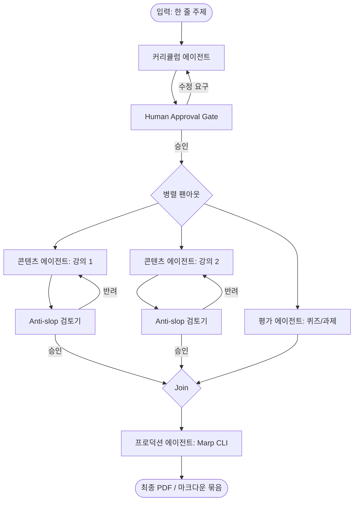

---
aliases:
- Multi-Agent Course Builder
- 멀티 에이전트 온라인 코스 빌더
- 멀티-에이전트-코스-빌더
core: false
created: 2026-06-10
sources:
- Building a Multi-Agent System That Turns One Sentence Into a $500 Online Course
- raw/클로드 디자인은 과연 디자이너를 대체할까.md
- raw/2026년 AI 에이전트 워크플로우 핵심 패턴 분석.md
- raw/완벽하게 기계 가독성을 갖춘 디자인 시스템.md
- raw/What Is MCP? Build a Custom MCP Server in Python-ko.md
- raw/2026년 오픈소스 LLM 플랫폼 비교 가이드 - Ollama, OpenRouter, Groq, NVIDIA NIM.md
- raw/파이썬 AI 에이전트 프레임워크 6종 비교 분석.md
- raw/AI가 생성한 UI 디자인은 이제 인간 디자이너의 80퍼센트보다 우수하다.md
- raw/UI 디자인을 위한 최고의 AI 도구 10가지와 워크플로우.md
- raw/Hermes Agent와 Ollama 로컬 설치 초고속 가이드.md
- raw/원시인 모드로 토큰 아끼려다 6만 스타 오픈소스에 PR 보낸 이야기.md
- raw/Building a Multi-Agent System That Turns One Sentence Into a $500 Online Course-ko.md
- raw/느낌 코딩의 시대는 끝났다 - GitHub Spec Kit과 명세 기반 개발.md
- raw/SpaceX의 파격적인 AI 인프라 전략 - 순수 C 언어로 22만 대 GPU를 제어하다.md
- raw/Claude를 사용하기 전에 반드시 이 마크다운 파일을 만드세요.md
- raw/지루한 업무를 자동화하는 클로드 코워크 프롬프트 7가지.md
- raw/당신의 고양이가 챗GPT보다 세상을 더 잘 이해하는 이유.md
- raw/옵시디언 AI 제2의 뇌는 기억이 아니다.md
- raw/인생의 성공을 결정하는 5가지 핵심 자질.md
- raw/Claude Code와 Obsidian으로 AI 세컨드 브레인 구축하기.md
- raw/Hermes 에이전트와 함께 사용하기 좋은 오픈소스 내부 도구 5가지.md
- raw/DESIGN.md 워크플로 - Google Stitch와 Claude Code가 바꾼 디자인 개발 협업.md
status: evergreen
tags:
- agent
- multi-agent
- workflow
- langgraph
type: workflow
updated: 2026-07-10
---
# 멀티 에이전트 코스 빌더

## 한 줄 정의
멀티 에이전트 코스 빌더는 실라버스 설계, 본문 집필, 평가 문항 출제, 슬라이드 덱 생성 단계를 개별 에이전트와 휴먼 검토 루프(Revision Loop)로 구성하여, 비결정론적 모델의 맥락 분산 문제를 극복하는 프로덕션급 콘텐츠 생성 파이프라인 아키텍처다.

## 핵심 요지
- **단일 프롬프트의 한계 극복**: 긴 콘텐츠(예: 12개 강의가 포함된 전체 코스)를 단일 컨텍스트와 하나의 거대한 프롬프트로 처리할 때 나타나는 글의 산포(drift), 문체 일관성 상실, 학습 목표 모순 등의 실패 패턴을 차단한다.
- **역할 분할 및 모델 최적화**: ADDIE 교수 설계 프레임워크와 유사하게 기획(실라버스), 집필(본문), 설계(평가), 빌드(프로덕션) 단계를 나누고, 각 단계에 맞는 모델(기획 단계에는 고성능 Reasoning 모델, 본문 작성에는 저렴하고 빠른 모델 등)을 차등 매칭한다.
- **공유 상태 기반 데이터 규약**: 모든 에이전트가 LangGraph 내에서 하나의 Pydantic 상태 스키마(State Schema)를 함께 읽고 쓰며, API 계약 구조(Data Contract)를 명확히 유지한다.
- **병렬 팬아웃(Parallel Fan-out) 실행**: 실라버스 확정 이후 개별 강의 본문 및 퀴즈 출제 작업을 독립된 세션으로 병렬 처리함으로써, 실행 시간을 대폭 단축(예: 15분에서 90초로 단축)하고 에이전트 대화 맥락 간의 상호 오염을 원천 제거한다.
- **적대적 검증(Anti-slop Reviewer)**: 작업 에이전트가 완성한 결과물을 받아 regex 프리체크와 평가 가이드를 기반으로 상투적 미사여구([[AI Slop]]), 코드 결여 등을 교차 검증하고 반려(Verdict) 시 구체적 방향을 제공하는 특화 노드를 둔다.
- **결정론적 최종 빌드 (Deterministic Production)**: 디자인이나 레이아웃이 붕괴하기 쉬운 영역(슬라이드 덱, PDF 등)은 [[LLM]]의 임의 생성에 맡기지 않고, 마크다운(Marp CLI 등) 컴파일러를 실행하는 규칙 기반 코드로 처리한다.
- iSpring의 2026 가격 가이드에 의하면 이러닝 1시간 모듈 제작 비용은 250~500달러 선이나, 멀티 에이전트 파이프라인은 API 비용 0.26달러 및 14분 만에 초고를 빌드한다.
- 애리조나 주립대학교 연구진의 [Instructional Agents](https://arxiv.org/abs/2508.19611) (EACL 2026, Yao et al.) 논문은 대학 수준의 컴퓨터 과학 5개 과목에서 인간과 협업하는 Full Co-Pilot 모드가 에이전트 단독보다 일관되게 우수함을 입증했다.
- 기획(커리큘럼), 작성(콘텐츠), 설계(평가), 빌드(프로덕션)의 다단 분할은 교육학의 유서 깊은 ADDIE(분석, 설계, 개발, 실행, 평가) 프레임워크와 직접적으로 연계된다.

## 상세

### 1. 4단계 멀티 에이전트 역할 구조
1. **커리큘럼 에이전트 (Curriculum Agent)**: 한 줄의 자연어 입력으로부터 대주제, 모듈 구분, 모듈별 학습 목표(Learning Objectives), 강의 아웃라인이 담긴 실라버스를 기획한다.
2. **콘텐츠 에이전트 (Content Agent)**: 확정된 아웃라인을 바탕으로 실제 본문 텍스트를 채운다. 이 단계는 각 강의별로 독립적으로 병렬 구동된다.
3. **평가 에이전트 (Evaluation Agent)**: 각 모듈의 본문과 학습 목표를 읽고 이에 부합하는 객관식 퀴즈(JSON 규격)와 실무 과제 가이드를 제작한다.
4. **프로덕션 에이전트 (Production Agent)**: 최종 본문과 퀴즈, 과제를 취합하여 규칙 기반 컴파일러 코드를 구동하고 정적 슬라이드 PDF를 컴파일한다.

### 2. 제어 흐름과 개입 게이트
- **휴먼 승인 게이트 (Human Approval Gate)**: 비결정론적 기획 단계인 커리큘럼 에이전트 작동 완료 직후, 파이프라인은 상태를 보존한 채 실행을 정지(`interrupt`)한다. 사용자는 실라버스를 확인하여 필요시 방향성 수정을 지시할 수 있으며, 이 Revision Loop를 거쳐 최종 승인한 경우에만 대규모 집필 작업(Content/Evaluation)으로 진입한다.
- **안티 슬롭 검토기 (Anti-slop Reviewer)**: 콘텐츠 에이전트가 본문을 작성할 때마다 호출되어 "AI slop" 필터를 적용한다. 이 노드는 주 기획 노드 대비 저렴한 모델을 활용하며, 통과 실패 시 에이전트에게 반려 피드백을 전달하여 재생성을 유도한다.

### 아키텍처 및 제어 원칙
- **Marp CLI를 통한 결정론적 빌드**: 디자인과 레이아웃 붕괴를 예방하기 위해, PDF 슬라이드 생성을 [[LLM]]에 위임하지 않고 Marp 컴파일러를 구동하는 파이썬 코드로 레이아웃을 고정(deterministic assembly)한다.
- **Anti-slop Reviewer의 제약 규칙**: 생성 본문을 regex 및 슬롭 패턴 사전을 사용해 1차 필터링하고, `MAX_REWRITES` 리밋(최대 2회)을 두어 무한 루프 비용 폭주를 차단하는 fallback 경로를 적용한다.
- **Pydantic 데이터 규약(Data Contracts)**: 커리큘럼에서 생성한 flat list 구조의 Lesson ID를 콘텐츠 작성 및 퀴즈 출제 단계에서 동적 병렬 팬아웃(`Send` 구조) 매개변수로 직접 역참조하여 데이터 무결성을 보장한다.

## 예시

### LangGraph 상태 스키마 정의 (Pydantic 규약)
```python
from typing import Annotated, Literal
from pydantic import BaseModel, Field

BloomLevel = Literal[
    "remember", "understand", "apply", "analyze", "evaluate", "create"
]

class LearningObjective(BaseModel):
    id: str = Field(description="안정적인 식별자 (예: 'lo-1-2')")
    text: str = Field(description="측정 가능하며 학습자 중심적인 동사구 목표")
    bloom: BloomLevel
    module_id: str

class Lesson(BaseModel):
    id: str
    module_id: str
    title: str
    objectives: list[str] = Field(description="이 강의에서 다루는 LearningObjective ID 목록")

class CourseState(BaseModel):
    topic: str
    syllabus_approved: bool = False
    objectives: list[LearningObjective] = []
    lessons: list[Lesson] = []
    content: dict[str, str] = {} # lesson_id -> markdown content
    quizzes: list[dict] = []
```

### 아키텍처 제어 흐름


### 퀴즈 출제 난이도 비율 제약
- 평가 에이전트가 퀴즈를 출제할 때 Bloom Level에 맞춰 난이도 비율을 다음과 같이 강제한다:
  - 기억/이해: 20%
  - 적용: 40%
  - 분석: 30%
  - 평가/창조: 10%
- 각 문제는 실라버스 objectives 리스트에 존재하는 ID에 1대1 매핑하여 연계성(alignment) 검증을 충족한다.

## 충돌
현재 확인된 충돌 없음.

## 관련 노트
- [[병렬 에이전트 세션 운영]]
- [[Agent Harness]]
- [[Context Engineering]]
- [[Plan Mode 기반 AI 작업]]

## 출처
- Building a Multi-Agent System That Turns One Sentence Into a $500 Online Course
- [클로드 디자인은 과연 디자이너를 대체할까](file:///Users/railscraft/Obsidian/raw/%ED%81%B4%EB%A1%9C%EB%93%9C%20%EB%94%94%EC%9E%90%EC%9D%B8%EC%9D%80%20%EA%B3%BC%EC%97%B0%20%EB%94%94%EC%9E%90%EC%9D%B4%EB%84%88%EB%A5%BC%20%EB%8C%80%EC%B2%B4%ED%95%A0%EA%B9%8C.md)
- [2026년 AI 에이전트 워크플로우 핵심 패턴 분석](file:///Users/railscraft/Obsidian/raw/2026%EB%85%84%20AI%20%EC%97%90%EC%9D%B4%EC%A0%84%ED%8A%B8%20%EC%9B%8C%ED%81%AC%ED%94%8C%EB%A1%9C%EC%9A%B0%20%ED%95%B5%EC%8B%AC%20%ED%8C%A8%ED%84%B4%20%EB%B6%84%EC%84%9D.md)
- [완벽하게 기계 가독성을 갖춘 디자인 시스템](file:///Users/railscraft/Obsidian/raw/%EC%99%84%EB%B2%BD%ED%95%98%EA%B2%8C%20%EA%B8%B0%EA%B3%84%20%EA%B0%80%EB%8F%85%EC%84%B1%EC%9D%84%20%EA%B0%96%EC%B6%98%20%EB%94%94%EC%9E%90%EC%9D%B8%20%EC%8B%9C%EC%8A%A4%ED%85%9C.md)
- [What Is MCP? Build a Custom MCP Server in Python-ko](file:///Users/railscraft/Obsidian/raw/What%20Is%20MCP%3F%20Build%20a%20Custom%20MCP%20Server%20in%20Python-ko.md)
- [2026년 오픈소스 [[LLM]] 플랫폼 비교 가이드 - Ollama, OpenRouter, Groq, NVIDIA NIM](file:///Users/railscraft/Obsidian/raw/2026%EB%85%84%20%EC%98%A4%ED%94%88%EC%86%8C%EC%8A%A4%20[[LLM]]%20%ED%94%8C%EB%9E%AB%ED%8F%BC%20%EB%B9%84%EA%B5%90%20%EA%B0%80%EC%9D%B4%EB%93%9C%20-%20Ollama%2C%20OpenRouter%2C%20Groq%2C%20NVIDIA%20NIM.md)
- [파이썬 AI 에이전트 프레임워크 6종 비교 분석](file:///Users/railscraft/Obsidian/raw/%ED%8C%8C%EC%9D%B4%EC%8D%AC%20AI%20%EC%97%90%EC%9D%B4%EC%A0%84%ED%8A%B8%20%ED%94%84%EB%A0%88%EC%9E%84%EC%9B%8C%ED%81%AC%206%EC%A2%85%20%EB%B9%84%EA%B5%90%20%EB%B6%84%EC%84%9D.md)
- [AI가 생성한 UI 디자인은 이제 인간 디자이너의 80퍼센트보다 우수하다](file:///Users/railscraft/Obsidian/raw/AI%EA%B0%80%20%EC%83%9D%EC%84%B1%ED%95%9C%20UI%20%EB%94%94%EC%9E%90%EC%9D%B8%EC%9D%80%20%EC%9D%B4%EC%A0%9C%20%EC%9D%B8%EA%B0%84%20%EB%94%94%EC%9E%90%EC%9D%B4%EB%84%88%EC%9D%98%2080%ED%8D%BC%EC%84%BC%ED%8A%B8%EB%B3%B4%EB%8B%A4%20%EC%9A%B0%EC%88%98%ED%95%98%EB%8B%A4.md)
- [UI 디자인을 위한 최고의 AI 도구 10가지와 워크플로우](file:///Users/railscraft/Obsidian/raw/UI%20%EB%94%94%EC%9E%90%EC%9D%B8%EC%9D%84%20%EC%9C%84%ED%95%9C%20%EC%B5%9C%EA%B3%A0%EC%9D%98%20AI%20%EB%8F%84%EA%B5%AC%2010%EA%B0%80%EC%A7%80%EC%99%80%20%EC%9B%8C%ED%81%AC%ED%94%8C%EB%A1%9C%EC%9A%B0.md)
- [Hermes Agent와 Ollama 로컬 설치 초고속 가이드](file:///Users/railscraft/Obsidian/raw/Hermes%20Agent%EC%99%80%20Ollama%20%EB%A1%9C%EC%BB%AC%20%EC%84%A4%EC%B9%98%20%EC%B4%88%EA%B3%A0%EC%86%8D%20%EA%B0%80%EC%9D%B4%EB%93%9C.md)
- [원시인 모드로 토큰 아끼려다 6만 스타 오픈소스에 PR 보낸 이야기](file:///Users/railscraft/Obsidian/raw/%EC%9B%90%EC%8B%9C%EC%9D%B8%20%EB%AA%A8%EB%93%9C%EB%A1%9C%20%ED%86%A0%ED%81%B0%20%EC%95%84%EB%81%BC%EB%A0%A4%EB%8B%A4%206%EB%A7%8C%20%EC%8A%A4%ED%83%80%20%EC%98%A4%ED%94%88%EC%86%8C%EC%8A%A4%EC%97%90%20PR%20%EB%B3%B4%EB%82%B8%20%EC%9D%B4%EC%95%BC%EA%B8%B0.md)
- [Building a Multi-Agent System That Turns One Sentence Into a $500 Online Course-ko](file:///Users/railscraft/Obsidian/raw/Building%20a%20Multi-Agent%20System%20That%20Turns%20One%20Sentence%20Into%20a%20%24500%20Online%20Course-ko.md)
- [느낌 코딩의 시대는 끝났다 - GitHub [[Spec Kit]]과 명세 기반 개발](file:///Users/railscraft/Obsidian/raw/%EB%8A%90%EB%82%8C%20%EC%BD%94%EB%94%A9%EC%9D%98%20%EC%8B%9C%EB%8C%80%EB%8A%94%20%EB%81%9D%EB%82%AC%EB%8B%A4%20-%20GitHub%20Spec%20Kit%EA%B3%BC%20%EB%AA%85%EC%84%B8%20%EA%B8%B0%EB%B0%98%20%EA%B0%9C%EB%B0%9C.md)
- [SpaceX의 파격적인 AI 인프라 전략 - 순수 C 언어로 22만 대 GPU를 제어하다](file:///Users/railscraft/Obsidian/raw/SpaceX%EC%9D%98%20%ED%8C%8C%EA%B2%A9%EC%A0%81%EC%9D%B8%20AI%20%EC%9D%B8%ED%94%84%EB%9D%BC%20%EC%A0%84%EB%9E%B5%20-%20%EC%88%9C%EC%88%98%20C%20%EC%96%B8%EC%96%B4%EB%A1%9C%2022%EB%A7%8C%20%EB%8C%80%20GPU%EB%A5%BC%20%EC%A0%9C%EC%96%B4%ED%95%98%EB%8B%A4.md)
- [Claude를 사용하기 전에 반드시 이 마크다운 파일을 만드세요](file:///Users/railscraft/Obsidian/raw/Claude%EB%A5%BC%20%EC%82%AC%EC%9A%A9%ED%95%98%EA%B8%B0%20%EC%A0%84%EC%97%90%20%EB%B0%98%EB%93%9C%EC%8B%9C%20%EC%9D%B4%20%EB%A7%88%ED%81%AC%EB%8B%A4%EC%9A%B4%20%ED%8C%8C%EC%9D%BC%EC%9D%84%20%EB%A7%8C%EB%93%9C%EC%84%B8%EC%9A%94.md)
- [지루한 업무를 자동화하는 [[클로드 코워크]] 프롬프트 7가지](file:///Users/railscraft/Obsidian/raw/%EC%A7%80%EB%A3%A8%ED%95%9C%20%EC%97%85%EB%AC%B4%EB%A5%BC%20%EC%9E%90%EB%8F%99%ED%99%94%ED%95%98%EB%8A%94%20%ED%81%B4%EB%A1%9C%EB%93%9C%20%EC%BD%94%EC%9B%8C%ED%81%AC%20%ED%94%84%EB%A1%AC%ED%94%84%ED%8A%B8%207%EA%B0%80%EC%A7%80.md)
- [당신의 고양이가 챗GPT보다 세상을 더 잘 이해하는 이유](file:///Users/railscraft/Obsidian/raw/%EB%8B%B9%EC%8B%A0%EC%9D%98%20%EA%B3%A0%EC%96%91%EC%9D%B4%EA%B0%80%20%EC%B1%97GPT%EB%B3%B4%EB%8B%A4%20%EC%84%B8%EC%83%81%EC%9D%84%20%EB%8D%94%20%EC%9E%98%20%EC%9D%B4%ED%95%B4%ED%95%98%EB%8A%94%20%EC%9D%B4%EC%9C%A0.md)
- [옵시디언 AI 제2의 뇌는 기억이 아니다](file:///Users/railscraft/Obsidian/raw/%EC%98%B5%EC%8B%9C%EB%94%94%EC%96%B8%20AI%20%EC%A0%9C2%EC%9D%98%20%EB%87%8C%EB%8A%94%20%EA%B8%B0%EC%96%B5%EC%9D%B4%20%EC%95%84%EB%8B%88%EB%8B%A4.md)
- [인생의 성공을 결정하는 5가지 핵심 자질](file:///Users/railscraft/Obsidian/raw/%EC%9D%B8%EC%83%9D%EC%9D%98%20%EC%84%B1%EA%B3%B5%EC%9D%84%20%EA%B2%B0%EC%A0%95%ED%95%98%EB%8A%94%205%EA%B0%80%EC%A7%80%20%ED%95%B5%EC%8B%AC%20%EC%9E%90%EC%A7%88.md)
- [Claude Code와 Obsidian으로 [[AI 세컨드 브레인]] 구축하기](file:///Users/railscraft/Obsidian/raw/Claude%20Code%EC%99%80%20Obsidian%EC%9C%BC%EB%A1%9C%20AI%20%EC%84%B8%EC%BB%A8%EB%93%9C%20%EB%B8%8C%EB%A0%88%EC%9D%B8%20%EA%B5%AC%EC%B6%95%ED%95%98%EA%B8%B0.md)
- [Hermes 에이전트와 함께 사용하기 좋은 오픈소스 내부 도구 5가지](file:///Users/railscraft/Obsidian/raw/Hermes%20%EC%97%90%EC%9D%B4%EC%A0%84%ED%8A%B8%EC%99%80%20%ED%95%A8%EA%BB%98%20%EC%82%AC%EC%9A%A9%ED%95%98%EA%B8%B0%20%EC%A2%8B%EC%9D%80%20%EC%98%A4%ED%94%88%EC%86%8C%EC%8A%A4%20%EB%82%B4%EB%B6%80%20%EB%8F%84%EA%B5%AC%205%EA%B0%80%EC%A7%80.md)
- [DESIGN.md 워크플로 - [[Google Stitch]]와 Claude Code가 바꾼 디자인 개발 협업](file:///Users/railscraft/Obsidian/raw/DESIGN.md%20%EC%9B%8C%ED%81%AC%ED%94%8C%EB%A1%9C%20-%20Google%20Stitch%EC%99%80%20Claude%20Code%EA%B0%80%20%EB%B0%94%EA%BE%BC%20%EB%94%94%EC%9E%90%EC%9D%B8%20%EA%B0%9C%EB%B0%9C%20%ED%98%91%EC%97%85.md)

