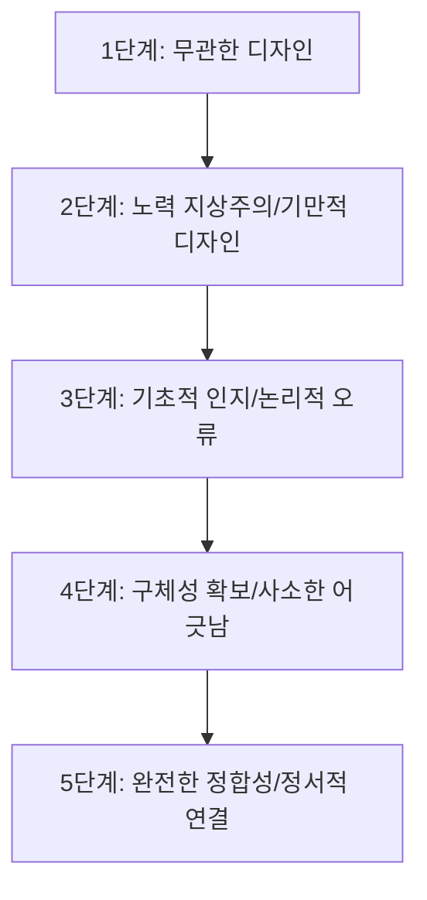

# 미적 사용성 효과

## 한 줄 정의
사용자가 제품이나 서비스의 외관(시각적 아름다움)이 우수할 때, 실제 기능이나 작동 편의성 역시 뛰어날 것이라고 무의식적으로 신뢰하고 판단하는 인지적 편향.

## 핵심 요지
- **심리적 편향의 이용**: 미적 사용성 효과(Aesthetic Usability Effect)는 사용자의 긍정적인 첫인상을 유도하고 시스템의 사소한 기능적 결함을 묵인하도록 돕는 강력한 도구다.
- **연관성(Relevance)의 중요성**: 디자인의 추상성과 화려함이 제품 본연의 가치 제안 및 카피라이팅과 연결되지 못하면, 사용자에게 과도한 [[인지적 비용]]을 유발하여 이탈을 초래한다.
- **[[기만적인 디자인]](Dishonest Design)**: 제작자나 인공지능 모델이 기획적 타당성 없이 단순히 공간을 채우기 위해 얹어놓은 무의미한 3D 도형(Blob)이나 복잡한 아이소메트릭 그래픽은 비즈니스 전환율을 심각하게 파괴한다.
- **텍스트 및 논리 우선주의**: 진정으로 강력한 웹페이지는 화려한 이미지 없이 텍스트 카피, 서체, 정보 계층, 여백, 대비만으로 설득력을 지녀야 하며, 시각 자료는 메시지를 강화하는 보조적 수단이어야 한다.

## 상세
사용자는 랜딩 페이지를 방문했을 때 **2초 이내**에 계속 머무를지 이탈할지를 결정한다 (`raw/Popular design trends that destroy conversion.md`). 이 짧은 시간 동안 미적 사용성 효과는 사용자가 긍정적 감정을 느끼게 만들지만, 비주얼과 메시지의 정합성이 어긋나면 곧바로 인지 과부하(Cognitive Overload)를 일으켜 이탈을 유발한다.

비주얼의 정합성과 관련성은 아래와 같이 5단계의 인지 및 설계 수준으로 분석할 수 있다 (`raw/Popular design trends that destroy conversion.md`).



1. **1단계: 연관성이 전혀 없는 디자인**
   - 세포 분열이나 용암 램프를 연상시키는 무의미한 그래픽 블롭(Blob)이나 제품 성격과 맞지 않는 풍경 이미지를 남용하는 단계 (`raw/Popular design trends that destroy conversion.md`). 미적 편향에만 기댄 무책임한 설계로, 사용자의 뇌에 불필요한 추론을 강요한다.
2. **2단계: 노력 지상주의(Effectionism)와 [[기만적인 디자인]]**
   - 마우스 움직임에 반응하는 화려한 3D 버블 인터랙션이나 테크 업계에서 유행하는 아이소메트릭 격자 그래픽을 사용하는 단계 (`raw/Popular design trends that destroy conversion.md`). 시각적 완성도는 높아 보이지만 실질적인 정보 전달이 없어 사용자의 [[주의력 배터리]]만 고갈시킨다.
3. **3단계: 정보 인지의 기초 단계**
   - 파편을 막는 방어막 비유 등 사용자가 비유적 의미를 직관적으로 이해할 수 있는 단계. 그러나 중요한 알림까지 완전히 차단해 버리는 등 서비스의 핵심 약속과 시각적 묘사가 충돌하는 논리적 오류가 자주 발생한다.
4. **4단계: 설득력과 구체성의 확보**
   - 깔때기(Funnel) 구조를 활용해 알림이 걸러지는 구조를 묘사하거나, 3D 스마트폰 그래픽을 사용하는 등 목적지에 가까워진 단계. 다만, 카피에서는 '5개의 핵심 알림'을 말하면서 비주얼로는 3개의 알림만 띄우는 등 미세한 어긋남(Disassociation)이 잔존하여 사용자의 무의식적인 신뢰도를 저해한다 (`raw/Popular design trends that destroy conversion.md`).
5. **5단계: 정점에 도달한 정합성**
   - 비주얼과 카피의 완전한 싱크로율을 이루는 단계. 필터 장벽을 통해 유효한 정보와 걸러진 정보를 명확히 구분하거나, 제품의 기능적 가치를 넘어 사용자가 얻게 될 [[감정적 보상 시각화를 통한 모방 심리 자극|감정적 보상]]을 시각화하여 [[감정적 보상 시각화를 통한 모방 심리 자극#상세|모방 심리]]를 자극한다.

### 인지 과학적 심리 트리거: [[숫자 기반 설득 패턴]] (Number-driven Pattern)
인간의 뇌는 시각적 패턴과 함께 제시되는 숫자의 논리적 흐름에 민감하게 반응한다. 예를 들어, 하루에 수신되는 알림이 **17,308개에서 636개로, 그리고 최종적으로 5개로** 줄어든다는 내림차순 수치 흐름을 텍스트와 비주얼에서 동일하게 정밀히 구현할 때 사용자는 이 논리적 주장에 강력하게 동조하게 된다 (`raw/Popular design trends that destroy conversion.md`).

## 예시
### AI 프론트엔드 에이전트의 오용 시나리오
[[코딩 에이전트]](예: `Claude 3.5 Sonnet` 또는 `GPT-4o` 기반의 자동 UI 생성 엔진)를 활용하여 SaaS 랜딩 페이지를 빌드할 때, 프롬프트 지시어에 "현대적이고 트렌디하며 시각적으로 수려하게 만들어줘"라고만 입력하면, 에이전트는 흔히 Three.js나 Framer Motion을 사용한 세포 모양의 3D Blob 배경을 배치한다. 
이는 미적 사용성 효과의 극대화를 노린 것이나, 실질적인 비즈니스 가치(Relevance)와 무관한 '[[기만적인 디자인]]' 컴포넌트를 만들어내어 결과적으로 사용자 이탈률을 높인다.

### React 컴포넌트 구현 비교

#### Bad Case: 미적 사용성 효과에만 기댄 [[기만적인 디자인]] (Blob 남용)
```tsx
import React from 'react';
import { motion } from 'framer-motion';

// 시각적으로는 아름답지만, 제품의 실제 작동 원리(알림 필터링)와 무관한 Blob 컴포넌트
export const IneffectiveHero = () => {
  return (
    <div className="relative flex h-[500px] w-full flex-col items-center justify-center overflow-hidden bg-slate-950 text-white">
      {/* 무의미하지만 예쁜 3D-like Blob 애니메이션 */}
      <motion.div
        animate={{
          scale: [1, 1.2, 0.9, 1],
          rotate: [0, 90, 180, 270, 360],
          borderRadius: ["40% 60% 70% 30%", "50% 50% 30% 70%", "60% 40% 50% 50%"]
        }}
        transition={{ duration: 10, repeat: Infinity, ease: "linear" }}
        className="absolute h-72 w-72 bg-gradient-to-tr from-pink-500 to-violet-600 opacity-30 blur-2xl"
      />
      
      <div className="relative z-10 text-center px-6">
        <span className="text-sm font-semibold tracking-wider text-pink-400">GOLD STANDARD</span>
        <h1 className="mt-4 text-4xl font-extrabold">알림을 직접 제어하세요</h1>
        <p className="mt-3 max-w-md text-slate-400">
          우리가 제공하는 최첨단 혁신 알고리즘을 통해 사용자의 일상과 업무 효율성을 유기적으로 극대화합니다.
        </p>
        <button className="mt-8 rounded-full bg-white px-8 py-3 font-bold text-slate-950 transition hover:bg-slate-200">
          시작하기
        </button>
      </div>
    </div>
  );
};
```

#### Good Case: 텍스트 카피와의 정합성 및 수치 논리를 동기화한 디자인 (5단계 도달)
```tsx
import React from 'react';

// 메시지와 비주얼의 싱크를 맞춘 인지적 최적화 컴포넌트
export const EffectiveHero = () => {
  return (
    <div className="flex min-h-[500px] w-full flex-col lg:flex-row items-center justify-between bg-slate-900 px-8 py-16 text-white gap-12">
      {/* 좌측: 명확한 정보 계층과 혜택 위주의 카피라이팅 */}
      <div className="flex-1 max-w-xl">
        <span className="inline-flex items-center gap-1.5 rounded-full bg-slate-800 px-3 py-1 text-xs text-slate-300">
          ⭐ 17,308명의 누적 사용자가 경험한 소음 차단
        </span>
        <h1 className="mt-6 text-4xl lg:text-5xl font-extrabold leading-tight">
          매일 636개의 알림 소음,<br />
          <span className="text-indigo-400">단 5개의 핵심 메시지</span>로 압축
        </h1>
        <p className="mt-4 text-lg text-slate-400 leading-relaxed">
          스마트 필터링이 불필요한 알림은 백그라운드에 조용히 묻어두고, 귀하가 지금 당장 확인해야 할 핵심 알림 5개만 화면에 띄웁니다.
        </p>
        <div className="mt-8 flex flex-col sm:flex-row items-start gap-4">
          <button className="rounded-lg bg-indigo-500 px-8 py-4 font-bold text-white transition hover:bg-indigo-600 shadow-lg shadow-indigo-500/20">
            신용카드 없이 무료로 시작하기
          </button>
          <p className="text-xs text-slate-500 sm:self-center">
            약정 없음 • 1분 만에 설치 완료
          </p>
        </div>
      </div>

      {/* 우측: 핵심 기능 및 정서적 가치(평온함)를 명확히 묘사하는 키 비주얼 */}
      <div className="flex-1 flex justify-center relative">
        <div className="relative w-80 h-[450px] bg-slate-800 rounded-3xl border-4 border-slate-700 shadow-2xl p-6 overflow-hidden">
          {/* 백그라운드 필터 장벽 (무채색 알림들이 투명 필터를 거침) */}
          <div className="absolute inset-0 bg-gradient-to-b from-slate-800/10 via-slate-800/80 to-slate-900 z-10 pointer-events-none" />
          
          <div className="text-xs text-slate-500 mb-4 border-b border-slate-700 pb-2">Hushy 스마트 필터링 활성화됨</div>
          
          {/* 정확히 5개의 선명한 핵심 알림 말풍선 배치 (카피와의 완벽한 싱크) */}
          <div className="space-y-3 relative z-20">
            {[
              { sender: "서버 모니터링", text: "⚠️ 실시간 에러율 3% 초과", color: "border-l-red-500" },
              { sender: "영업 팀", text: "💰 신규 결제 완료: ₩1,200,000", color: "border-l-emerald-500" },
              { sender: "프로덕트 매니저", text: "💬 배포 승인 요청 건이 도착했습니다", color: "border-l-indigo-500" },
              { sender: "보안 알림", text: "🔒 새로운 기기에서 로그인 시도 감지", color: "border-l-amber-500" },
              { sender: "패밀리 케어", text: "❤️ [가족] 오늘 저녁 식사 약속 확인", color: "border-l-pink-500" }
            ].map((noti, idx) => (
              <div key={idx} className={`bg-slate-900 border-l-4 ${noti.color} p-3 rounded-lg text-sm shadow-md`}>
                <div className="font-semibold text-slate-300 text-xs">{noti.sender}</div>
                <div className="text-slate-400 mt-1 text-xs">{noti.text}</div>
              </div>
            ))}
          </div>
        </div>
        {/* 사용자가 동경하게 될 감정적 보상(평온함)의 은유적 모델 이미지 */}
        <div className="absolute -bottom-4 -right-4 bg-slate-950 p-3 rounded-xl border border-slate-800 shadow-lg text-center z-30">
          <div className="text-lg">🧘‍♂️</div>
          <div className="text-[10px] text-slate-400 mt-1">오늘 하루 소음 0%</div>
        </div>
      </div>
    </div>
  );
};
```

## 충돌
- **미적 최우선 설계 vs 텍스트/카피 최우선 설계**
  - 기존의 그래픽 디자이너 중심 [[워크플로]]우에서는 시각적 프레임워크나 3D 그래픽을 먼저 제작한 뒤 그 빈 공간에 텍스트 카피를 채워 넣는 방식을 선호한다.
  - 그러나 전환율 최적화(CRO) 관점에서는 텍스트 카피와 정보 계층을 먼저 확립하고, 시각 자료는 오직 텍스트를 정확하게 보좌할 때만 추가되어야 한다는 입장을 견지하며 기존 디자인 패러다임과 명확히 상충한다 (`raw/Popular design trends that destroy conversion.md`).

## 관련 노트
- [[감정적 보상 시각화를 통한 모방 심리 자극]]: 정서적인 최종 가치와 감정 상태 시각화를 통해 사용자 모방 심리를 자극하는 최상위 UX 기법.
- [[인지적 비용]]: 미적 요소를 해석하는 과정에서 수반되는 두뇌의 에너지 자원 낭비.
- [[어포던스]]: 디자인이 사용자에게 직관적으로 행동 방식과 유용성을 지각하게 만드는 원리.
- [[주의력 배터리]]: 랜딩 페이지 진입 후 2초 이내의 빠른 판단에 영향을 주는 집중 자원의 한계.
- [[코딩 에이전트]]: 시각적 편향에 치우치지 않는 논리적 UI/UX를 자동 설계하기 위한 프롬프트 가이드라인의 필요성.

## 출처
- `raw/Popular design trends that destroy conversion.md`
