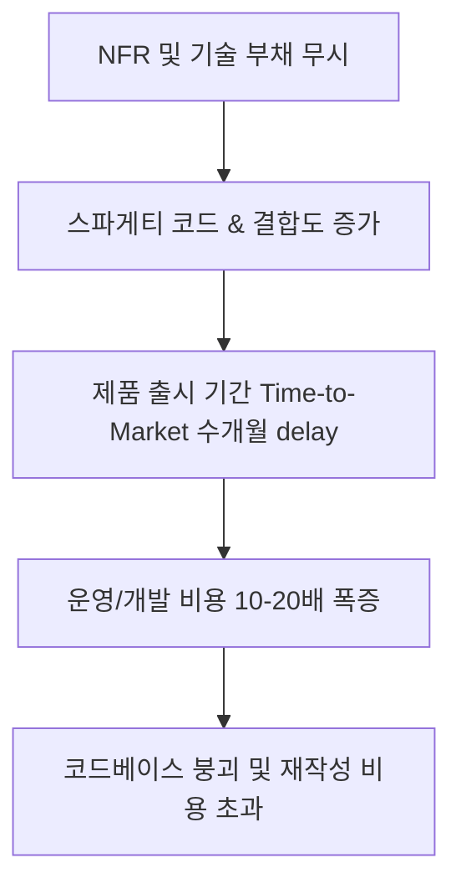

# 비기술 관리자의 종료

## 한 줄 정의
비기술 관리자의 종료는 소프트웨어 공학에 대한 깊은 기술적 지식, 무형 제품의 R&D 불확실성, 비기능적 요구사항(NFR) 이해 없이 팽창했던 비기술자 관리자와 행정 지원 직군 중심의 조직 관리 모델이 소멸하고 기술 실무 기반의 지휘 체계로 회귀한다는 주장이다.

## 핵심 요지
- **지원 직군의 범람과 본질의 망각**: 2000년대 기술 열풍 이후 프로젝트 매니저, 스크럼 마스터, 프로덕트 오너 등 비기술 지원 인력이 실제 소프트웨어 엔지니어 수를 넘어서며 관료주의적 오버헤드를 유발했다.
- **소프트웨어 경제학 및 ISO 분류의 오해**: ISO 18245 가맹점 코드 5045(순수 기술/소프트웨어)와 4121(운송), 4899(유료 방송/엔터테인먼트)의 구분을 간과하고, 자체 소프트웨어의 유일한 고객인 플랫폼 서비스(넷플릭스 등)의 특성을 무분별하게 일반 관리 체계에 이식했다.
- **비기능적 요구사항(NFR)과 부채 폭발**: 보안성, 확장성, 신뢰성 등 NFR에 전체 리소스의 20~30%를 할당하지 않음으로써 스파게티 아키텍처가 발생하고, 유지관리 및 운영 비용이 10~20배 폭증하는 치명적 결과에 직면한다.
- **프로토타이핑 방법론의 혼동**: 기술적 타당성을 검증하는 버리는 실험실 프로토타입(Lab Prototype)과 파일럿 시스템(MVP)을 구분하지 못해 막대한 재작성 비용을 초과 지출한다.
- **AI 시대와 기술 관리에로의 회귀**: AI로 인해 인당 생산성이 극대화되고 코딩 및 아키텍처 직접 제어가 가능해짐에 따라, 기술을 모르는 관리자의 설 자리는 소멸하고 1998~2005년경의 엔지니어링 중심 조직으로 돌아간다.

## 상세

### 지원 직군 팽창과 경제적 분류 오류
1990년대 개발자 중심 조직에서 2000년대 이후 '기술 기업' 열풍으로 전환되면서, 기술적 깊이보다 승진에 집착하는 비기술 관리자 및 지원 인력이 대거 유입되었다 [raw/Fake It Until You Break It. The End Of Non-Technical Managers In Software Engineering Dawns.md#L21-L32].

금융 기관의 가맹점 업종 코드(ISO 18245)에 따르면 순수 기술 기업(MCC 5045)과 우버(MCC 4121), 넷플릭스(MCC 4899) 같은 서비스 비즈니스는 엄연히 다르다 [raw/Fake It Until You Break It. The End Of Non-Technical Managers In Software Engineering Dawns.md#L45-L53]. 넷플릭스 창업자 리드 헤이스팅스가 "넷플릭스는 기술이 아닌 엔터테인먼트 기업"이라 밝힌 것처럼 [raw/Fake It Until You Break It. The End Of Non-Technical Managers In Software Engineering Dawns.md#L67], 자체 서버만 관리하고 외부 라이선스 마이그레이션 리스크가 없는 서비스를 일반 기술 R&D 제품 관리에 그대로 대입하는 오판이 반복되었다.

### 비기능적 요구사항(NFR) 부실과 비용 산출

성공적인 엔지니어링 조직은 개발 리소스의 20~30%를 NFR(보안, 성능, 신뢰성, 확장성)과 배포 후 안정화 기간(cool-off period)에 할당한다 [raw/Fake It Until You Break It. The End Of Non-Technical Managers In Software Engineering Dawns.md#L75-L95]. 이를 생략하고 신규 기능 출시만 몰아붙일 경우 스파게티 아키텍처로 인해 운영 및 유지보수 비용이 10~20배 폭증하며 [raw/Fake It Until You Break It. The End Of Non-Technical Managers In Software Engineering Dawns.md#L119], 코드베이스를 수정하는 비용이 새로 쓰는 비용보다 커지는 순간 제품의 수명은 종료된다.

### 소프트웨어 vs 기계공학 및 프로토타이핑 차이
소프트웨어는 물리적 기어박스(Gearbox)와 달리 복제 비용이 0에 가깝고 무선(OTA) R&D 업데이트가 연속으로 일어나는 가상 자산이다 [raw/Fake It Until You Break It. The End Of Non-Technical Managers In Software Engineering Dawns.md#L141-L150].

또한 1984년 Floyd & Budde 학술 연구에서 정리된 '실험실 프로토타입(Lab Prototype)'과 '파일럿 시스템(MVP)'의 차이를 이해하지 못해 [raw/Fake It Until You Break It. The End Of Non-Technical Managers In Software Engineering Dawns.md#L120-L125], 초기 1세대 iPod 개발 시 수십 개의 연구용 파기 프로토타입을 거쳤던 애플과 같은 위험 관리 기법을 전혀 적용하지 못한다.

## 예시
- **애플 1세대 iPod 개발 시 실험실 프로토타입**: 실제 제품보다 훨씬 커다란 상자 크기의 기술 검증용 throw-away 실험실 프로토타입을 만들어 인터페이스와 컴포넌트 리스크를 미리 검증한 후 제작에 들어간 사례 [raw/Fake It Until You Break It. The End Of Non-Technical Managers In Software Engineering Dawns.md#L129-L131].
- **금요일 NFR 관리 및 20% 배포 후 안정화 규칙**: 노련한 기술 관리자가 초기 개발 시간의 약 20%를 배포 후 버그 수정, 조율, 리팩토링에 고정 할당하는 오퍼레이션 [raw/Fake It Until You Break It. The End Of Non-Technical Managers In Software Engineering Dawns.md#L95].

## 충돌
- **비기술 관리자의 필요성 주장 vs 기술 관리의 필수화**: 조직 조율, 행정, 인간관계 관리를 담당하는 전문 관리자의 가치가 높다는 과거 비즈니스 스쿨 관점과, 하루 종일 엔지니어가 무엇을 하는지 검증조차 못하고 코드를 평가할 수 없는 관리자는 AI 시대에 완전히 도태된다는 시각이 상충함 [raw/Fake It Until You Break It. The End Of Non-Technical Managers In Software Engineering Dawns.md#L179, L204-L208].

## 관련 노트
- [[AI 네이티브 엔지니어링 조직]]
- [[Competence Debt]]
- [[사양 기반 개발 (Spec Driven Development)]]
- [[Vibe Coding과 Agentic Engineering]]

