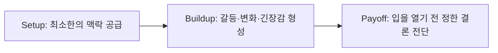

# 소통과 영향력의 기술

## 한 줄 정의
소통과 영향력의 기술은 타고난 말재주에 의존하지 않고 3단계 서사 구조(도입-전개-결말)와 조용한 실행 프레임워크를 활용하여 자신의 생각과 프로젝트를 타인에게 정확히 전달하고 실질적인 설득과 변화를 이끌어내는 역량이다.

## 핵심 요지
- **3단계 서사 공식(Setup-Buildup-Payoff)**: 장황한 배경 설명이나 결론 없는 횡설수설을 방지하기 위해 최소한의 맥락 설정(도입), 긴장감과 의미 형성(전개), 명확한 메시지 각인(결말) 구조를 철저히 준수한다.
- **뇌의 서사 수용성(Narrative Transportation)**: 인간의 뇌는 건조한 단편적 사실보다 스토리에 더욱 강하게 반응하므로, 비즈니스 회의, 협상, 관계 개선에서 스토리텔러의 접근법이 설득력을 극대화한다.
- **조용한 시작(Quiet Start)의 실행력**: 남들에게 거창하게 대대적으로 선언하거나 주변의 동의·허락을 구할 필요 없이, 조용하게 2시간의 스케줄을 확보해 비밀리에 내실을 다져나간다.
- **에너지의 본질과 세네카의 통찰**: 피로감은 단지 수면 부족의 문제가 아니라 의의와 열정이 부재한 일에 낭비되기 때문이며, 도전을 주저하지 않고 본질적 질문에 답할 때 에너지가 생겨난다.

## 상세

### 3단계 스토리텔링 구조와 치명적 실수

1. **도입 (Setup)**: 이야기를 시작하는 문으로, 누가, 어디서, 무엇을 하려는지 최소한의 기초 정보만 간결히 제시한다 [raw/How to Express Yourself So People Actually Listen.md#L59-L63].
2. **전개 (Buildup)**: 결정, 갈등, 혹은 깨달음의 순간을 배치하여 듣는 이가 몰입할 긴장감을 쌓는다 [raw/How to Express Yourself So People Actually Listen.md#L65-L69].
3. **결말 (Payoff)**: 입을 열기 전 이미 확정해 둔 핵심 결론, 교훈, 인사이트를 던진다. 결말을 모르면 이야기를 시작하지 말아야 한다 [raw/How to Express Yourself So People Actually Listen.md#L71-L73].

이야기를 망치는 5대 실수는 다음과 같다 [raw/How to Express Yourself So People Actually Listen.md#L94-L99]:
- 시간 순서 뒤죽박죽 섞기
- 핵심과 무관한 불필요한 인물 등장시키기
- 엔딩을 정하지 않고 일단 입부터 열기
- 완벽한 정당화를 위한 과도한 세부 설명
- 자신을 항상 결점 없는 영웅으로 포장하기

### 조용한 실행과 마음가짐 프레임워크
타인의 믿음이나 지지가 부족할 때 시작을 망설이는 까닭은 전략 부족이 아니라 거절과 실패에 대한 두려움 때문이다 [raw/How to Start Something When No One Believes in You.md#L45-L58].

요한 크루이프의 명언 "슛을 쏘지 않으면 결코 골을 넣을 수 없다"처럼 [raw/How to Start Something When No One Believes in You.md#L10], 주변에 떠벌리거나 지지를 구하지 않고 화요일 밤에 혼자 조용히 시작하는 것이 핵심이다 [raw/How to Start Something When No One Believes in You.md#L29]. 고대 철학자 세네카가 지적했듯, "어려워서 도전하지 못하는 것이 아니라 도전하지 않기 때문에 어렵게 느껴지는 것이다" [raw/How to Start Something When No One Believes in You.md#L87].

## 예시
- **회의/저녁 식사 자리의 30초 대화 프레임**: 오늘 일어난 일을 무작위로 나열하지 않고, 단 하나의 핵심 사건을 2초간 멈춰 고른 뒤 30초 안에 도입-전개-결말로 전달해 경청을 이끌어냄 [raw/How to Express Yourself So People Actually Listen.md#L85-L89, L103-L105].
- **6단계 조용한 실행 강령**: (1) 왜·누구를 위해 하는지 3문장 작성, (2) 가장 가벼운 첫 단계 실행, (3) 주 2시간 캘린더 고정, (4) 주변에 일절 비밀 유지, (5) 관련 온라인 커뮤니티 1곳 가입 및 관찰, (6) 매주 묵묵히 반복 [raw/How to Start Something When No One Believes in You.md#L129-L138].

## 충돌
- **대대적 공식 선포 vs 조용한 비밀 축적**: 인스타그램 프로필 변경, 홈페이지 제작, 주변 자랑을 통해 배수의 진을 쳐야 동기부여가 된다는 시각과, 공식 선포는 불필요한 해명 의무와 타인의 참견을 유발하므로 실체가 나타날 때까지 비밀로 묵묵히 축적해야 한다는 시각이 충돌함 [raw/How to Start Something When No One Believes in You.md#L95-L105].

## 관련 노트
- [[기록으로 성장하는 법]]
- [[성공을 결정하는 5가지 핵심 자질]]
- [[동기부여 없을 때 어려운 일 해내는 법]]
- [[시니어 기술 인터뷰 소통 프레임워크]]

