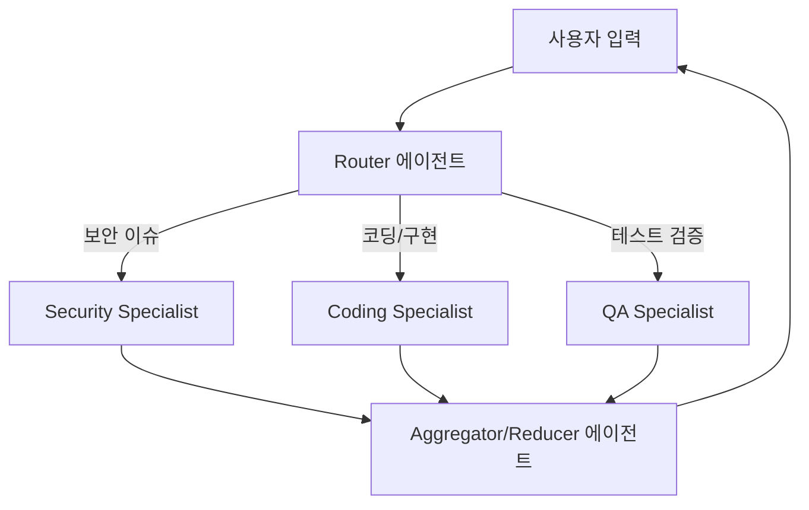

---type: concept
status: draft
core: false
tags:
  - llm
  - agentic
aliases:
  - 에이전트-디자인-패턴
sources:
  - "raw/30 Core Agentic Engineering Concepts Every Developer Should Know.md"
created: 2026-07-11
updated: 2026-07-11
---
# 에이전트 디자인 패턴

## 한 줄 정의
단일 에이전트의 컨텍스트 용량 한계와 작동 불확실성을 극복하기 위해, 다중 에이전트 간의 역할 분담, 협업 및 정보 흐름을 정형화한 아키텍처 설계 패턴.

## 핵심 요지
* **단일 비대성 타파**: 모든 도구와 지침을 욱여넣은 단일 에이전트는 추론 실패를 유발하므로, 범위가 좁고 프롬프트가 가벼운 여러 전문 에이전트들을 디자인 패턴으로 엮는 것이 시스템 안정성에 필수적이다.
* **핵심 아키텍처 유형**: 기획과 행동을 쪼개는 Planner/Executor, 도메인 분배를 관장하는 Router/Specialist, 병렬 분산 처리를 수행하는 Map-Reduce 패턴이 대표적이다.
* **컨텍스트 인수인계(Handoff) 최적화**: 에이전트 간 정보를 주고받을 때 컨텍스트가 너무 적으면 목표 상실을 일으키고 너무 많으면 주의력 부패(Context rot)를 초래하므로, 명확하게 조율된 인터페이스를 갖춰야 한다.
* **비용과 지연 시간의 트레이드오프**: 병렬 처리를 통해 지연을 단축하고 저비용 경량 모델 스페셜리스트를 도입하여 총 비용을 제어할 수 있지만, 취합 단계의 완성도에 전체 품질이 귀속되는 제약이 존재한다.

## 상세
### 1. Planner/Executor (기획자/수행자) 패턴
* **동작 원리**: 플래너(Planner) 에이전트가 상위 수준의 목표를 전달받아 실행 가능한 마이크로 태스크 로드맵으로 쪼개고, 익스큐터(Executor) 에이전트가 이를 순차적으로 위임받아 파일 수정 및 빌드 작업을 이행한다.
* **이점**: 무작정 코드를 타이핑하기 시작해 길을 잃는 에이전트의 성급함을 통제하고, 실행 전 인간 사용자에게 계획안 승인을 받는 게이트(Human-in-the-Loop)를 연결하기 용이하다.

### 2. Router/Specialist (라우터/전문가) 패턴
* **동작 원리**: 입구를 지키는 라우터(Router) 에이전트가 유저 요청서의 의도를 분석한 뒤, 해당 작업에 가장 특화된 소수의 도구와 규칙만 갖춘 스페셜리스트(Specialist) 에이전트에게 바톤을 넘긴다.
* **이점**: 보안 검사, 문서화, 테스트 디버깅 등 각 전문 영역의 프롬프트 오염을 분리하고, 사소한 번역이나 가벼운 포맷 정리에는 저렴하고 빠른 소형 모델 스페셜리스트를 기용함으로써 효율성을 극대화한다.

### 3. Map-Reduce (맵리듀스) 병렬 처리 패턴
* **동작 원리**: 단일 컨텍스트에 담을 수 없을 정도로 대량인 파일이나 데이터를 분할하여 여러 서브에이전트에게 분배해 동시에 분석(Map)을 가하고, 결과 취합기(Reducer) 에이전트가 이를 모아 단일 요약본으로 결합한다.
* **이점**: 코드베이스 일괄 리팩토링 검토, 다수 로그 병렬 파싱 등 읽기 중심 고부하 태스크의 실시간 처리 성능을 높인다.

## 예시
* **다중 파일 일괄 코드 리뷰 시스템**: 대규모 PR이 접수되었을 때, 변경 대상인 10개의 소스코드 파일을 10개의 하위 스페셜리스트 에이전트에게 각각 병렬 매핑해 스타일 준수 여부를 검토하게 만들고, 최종 취합 리듀서 에이전트가 각 검토 결과를 취합하여 단일 PR 코멘트 보고서를 작성해 올리는 구현 사례.

## 충돌
* **레이스 컨디션과 격리 실패**: 다중 에이전트가 분산 환경에서 파일 시스템을 향해 동시에 수정(Write)을 시도할 때 작업이 상호 유실되거나 덮어씌워지는 충돌이 생긴다. 이를 방지하기 위해 각 에이전트가 독립된 작업 영역(e.g., Git worktree)을 보유하도록 하네스 레벨에서 물리 격리를 구현해야 한다.

## 관련 노트
* `[[Andrew Ng 4 에이전틱 디자인 패턴]]`
* `[[Agentic 패턴 진화]]`

