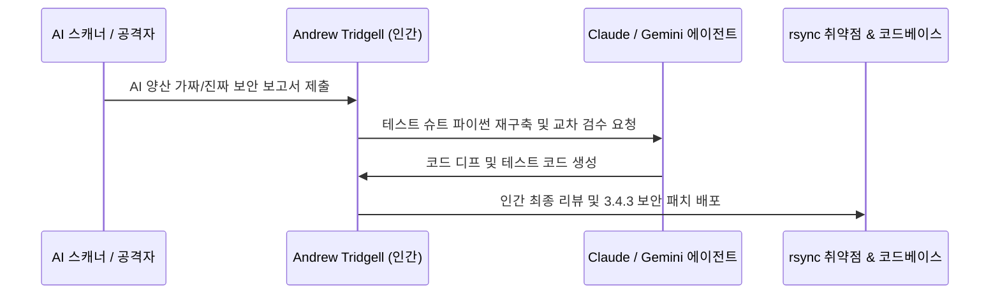

---type: claim
status: draft
core: false
tags:
  - open-source
  - security
  - engineering
  - infrastructure
aliases:
  - 오픈소스 유지관리자의 가치와 위험
  - Open Source Maintainer Value and Risk
  - 오픈소스-유지관리자의-가치와-위험
sources:
  - raw/His Code Backs Up the World. Now the Internet Wants Him Flogged..md
created: 2026-07-20
updated: 2026-07-20
---
# 오픈소스 유지관리자의 가치와 위험

## 한 줄 정의
오픈소스 유지관리자의 가치와 위험은 전 세계 주요 서버와 백업 시스템을 지탱하는 핵심 인프라 코드가 단 한 두 명의 은퇴한 자원봉사자 노고에 의존하는 구조적 취약성과, AI 기반 자동화 보고서 폭주 속에서 메인테이너가 AI 보조 도구를 활용해 보안을 방어할 때 직면하는 커뮤니티적 가치 갈등을 다루는 주장이다.

## 핵심 요지
- **지구적 인프라의 개인 종속성**: 전 세계 리눅스 백업과 macOS 핵심 동기화를 담당하는 rsync(1996년 Andrew Tridgell 고안) 사례처럼, 조 단위 자본이 흘러 다니는 글로벌 디지털 기반이 소수 관리자의 개인적 희생과 약속에 매달려 있다.
- **AI 기반 가짜 취약점 보고서([[AI Slop]] Reports)의 공습**: LLM 스캐너로 무차별 생성된 그럴듯한 가짜 보안 보고서가 메일함에 폭주함에 따라, 관리자는 진짜 치명적 오류(예: 심각도 9.8 힙 오버플로우)를 가려내기 위해 극심한 피로와 시간 낭비에 노출된다.
- **AI 보조 기반의 심층 방어(Defence-in-depth)**: 메인테이너는 Claude를 주 개발도구로, Codex와 Gemini를 교차 검증용으로 활용하여 파이썬 기반의 엄격한 CI 및 테스트 슈트를 신속하게 재구축함으로써 방어벽을 세운다.
- **순혈주의적 역풍과 현실적 대안의 한계**: "Co-authored-by: Claude" 커밋 태그에 대한 성난 민심과 포크 대안(openrsync 등)의 부상은 거세지만, 정작 대안 도구가 신규 종합 테스트 98개 중 85개에서 실패하는 등 현실 인프라의 완성도 격차가 뚜렷하다.

## 상세

### rsync 역사와 Git 탄생의 비화
호주 국립 대학교(ANU)의 Andrew Tridgell(tridge)은 1996년 Paul Mackerras와 함께 변경된 바이트 조각(chunk)의 핑거프린트만 송수신하는 rsync 알고리즘을 고안했다 [raw/His Code Backs Up the World. Now the Internet Wants Him Flogged..md#L20-L32].

Tridgell은 2005년 리눅스 커널 소스 관리 도구인 BitKeeper 서버 프로토콜을 분석("help" 명령 입력)했다가 라이선스 위반 논란을 빚었고 [raw/His Code Backs Up the World. Now the Internet Wants Him Flogged..md#L40-L45], 이 사건으로 리눅스 커널 팀의 무료 이용권이 박탈되자 리누스 토르발스(Linus Torvalds)가 직접 며칠 만에 만든 대체재가 오늘날의 Git이다 [raw/His Code Backs Up the World. Now the Internet Wants Him Flogged..md#L46].

### 보안 취약점 대처와 AI 에이전트 동원
2002년 Wayne Davison에게 넘겼던 rsync 관리를, 2024년 4월 Davison의 도움 요청으로 22년 만에 복귀한 Tridgell이 다루게 되었다 [raw/His Code Backs Up the World. Now the Internet Wants Him Flogged..md#L52-L62]. Google Cloud 연구진이 접수한 심각도 9.8/10 점의 힙 버퍼 오버플로우 등 6개 취약점을 메우기 위해 2025년 1월 14일 3.4.0 버전을 출시했고 다음날 3.4.1 패치를 잇따라 배포했다 [raw/His Code Backs Up the World. Now the Internet Wants Him Flogged..md#L63-L68].

자동화 스캐너와 LLM으로 양산된 가짜 취약점 보고서가 쏟아지자 Tridgell은 Claude(메인 코딩), Codex & Gemini(교차 검증)를 결합하여 파이썬 CI 테스트 시스템을 전면 재구축하고 2026년 5월 20일 3.4.3 버전을 배포했다 [raw/His Code Backs Up the World. Now the Internet Wants Him Flogged..md#L74-L104].

### 순혈주의 비난 vs openrsync 실전 검증
커밋 이력에 `Co-authored-by: Claude` 태그가 박히자 개발자 커뮤니티는 "감성 코딩으로 소프트웨어를 망치지 말라"며 격렬히 반발했다 [raw/His Code Backs Up the World. Now the Internet Wants Him Flogged..md#L114-L116].

macOS Sequoia 및 Alpine Linux 등이 BSD 라이선스의 대체재인 openrsync로 전환을 검토했으나, Tridgell이 구축한 98개 파이썬 테스트 슈트를 openrsync에 적용한 결과 무려 85개 항목에서 실패를 기록했다 [raw/His Code Backs Up the World. Now the Internet Wants Him Flogged..md#L121-L127]. 이는 순수 인간 작성 대안이라 할지라도 수십 년간 누적된 엣지 케이스와 완전성을 바로 대체할 수 없음을 증명한다.

## 예시
- **rsync 핑거프린트 알고리즘**: 수 GB 파일에서 단 1바이트만 변경되어도 파일 전체 전송 없이 해당 바이트 조각의 short fingerprint 대조를 통해 몇 초 만에 백업을 마치는 동기화 메커니즘 [raw/His Code Backs Up the World. Now the Internet Wants Him Flogged..md#L22-L24].
- **openrsync 호환성 호환 테스트 결과**: 98개 파이썬 커버리지 테스트 스위트 중 openrsync가 13개만 통과하고 85개에서 에러를 뱉어 사양 커버리지의 현격한 격차가 드러남 [raw/His Code Backs Up the World. Now the Internet Wants Him Flogged..md#L124-L126].

## 충돌
- **AI 도구 활용의 실용성 vs 코드 순혈주의**: 긴급 보안 패치와 테스트 구축을 위해 AI 보조 도구를 도입하는 것이 실용적이고 불가피하다는 메인테이너의 확고한 입장과 [raw/His Code Backs Up the World. Now the Internet Wants Him Flogged..md#L131-L135], AI가 생성한 디프 커밋이 레거시 코드베이스의 품질을 저해한다는 개발자 커뮤니티의 비난이 정면 충돌함.

## 관련 노트
- [[오픈소스 라이선스 갈등과 커뮤니티 역풍]]
- [[오픈소스 LLM 경제성과 벤더 종속성 해지]]
- [[AI Slop]]
- [[에이전틱 보안 파이프라인]]

