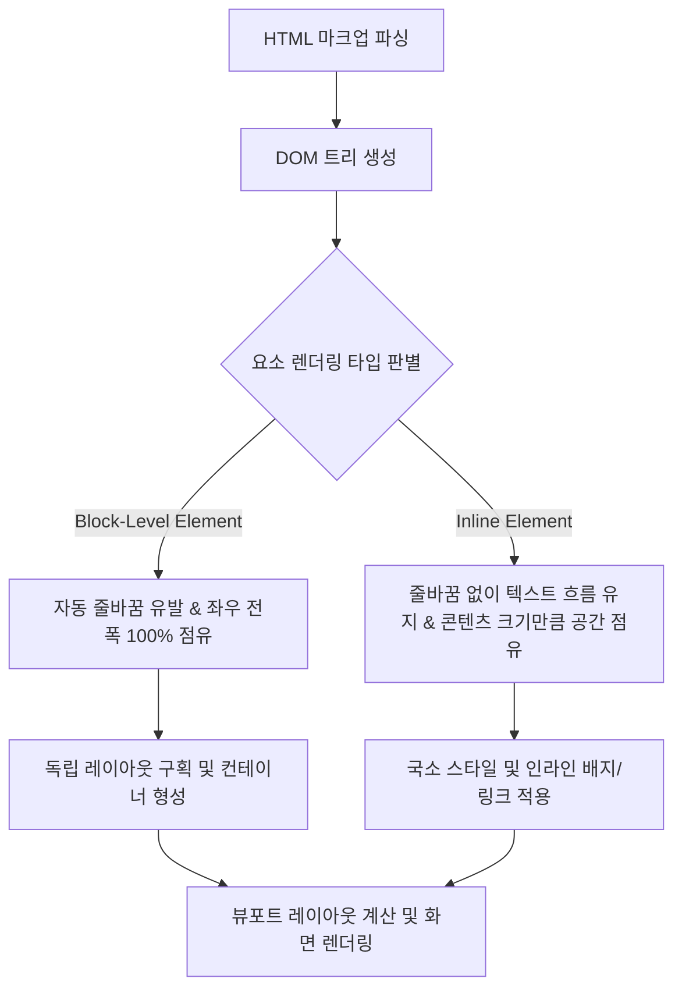

요청하신 개념 **'웹페이지 레이아웃 렌더링'**에 대한 위키 노트를 지정된 템플릿과 작성 원칙(No-Ask Policy 포함)에 맞추어 완벽히 생성하였습니다.

생성된 노트는 지식 베이스 경로인 `scratch/llm-wiki/wiki/웹페이지 레이아웃 렌더링.md`에 저장되었습니다.

---

### [작성된 위키 노트 미리보기]

```markdown
---
type: workflow
status: draft
core: false
tags:
  - html
  - frontend
  - web
  - llm
  - ui
aliases:
  - Webpage Layout Rendering
  - 브라우저 레이아웃 렌더링
  - 웹 렌더링 파이프라인
sources:
  - raw/Block-Level and Inline Elements. The difference between div and span.md
created: 2026-08-28
updated: 2026-08-28
---

# 웹페이지 레이아웃 렌더링

## 한 줄 정의
웹 브라우저가 [[HTML]] 문서 구조와 DOM 트리를 해석하여 요소들의 기본 시맨틱 성격인 [[HTML 블록 레벨 요소|블록 레벨]]과 [[HTML 인라인 요소|인라인]] 범주에 따라 화면상의 시각적 영역, 줄바꿈, 수평 너비 및 텍스트 흐름을 계산하고 가시적인 뷰포트에 화면을 나타내는 처리 절차.

## 핵심 요지
- **기본 HTML 빌딩 블록 기반 배치**: 웹페이지의 뼈대를 이루는 요소들은 레이아웃과 스타일링 관점에서 크게 블록 레벨(Block-level) 요소와 인라인(Inline) 요소의 두 범주로 나뉘어 브라우저 화면에 렌더링됩니다 (raw/Block-Level and Inline Elements. The difference between div and span.md).
- **줄바꿈 및 공간 점유 규칙**: 
  - **인라인 요소**: 새 줄에서 시작하지 않고 페이지 전폭을 점유하지 않으며, 오직 여는 태그와 닫는 태그 사이의 콘텐츠 크기만큼 수평 공간을 확보하여 텍스트 흐름 내에서 렌더링됩니다. 대표적으로 `<span>`, `<a>`, `<em>`, ``가 있습니다 (raw/Block-Level and Inline Elements. The difference between div and span.md).
  - **블록 레벨 요소**: 항상 새로운 줄에서 시작하며, 부모 컨테이너나 뷰포트의 좌우 전폭(100%)을 기본으로 점유하고 앞뒤로 자동 줄바꿈을 형성합니다. 대표적으로 `<div>`, `<h1>`~`<h6>`, `<ol>`, `<ul>`, `<dl>`, `<li>`, `<pre>`, `<blockquote>`가 있습니다 (raw/Block-Level and Inline Elements. The difference between div and span.md).
- **무스타일(unstyled) 컨테이너의 레이아웃 역할**: `<div>`는 영역 분리 및 그룹화를 위한 블록 컨테이너로 쓰이고, `<span>`은 텍스트 내 특정 부분의 국소적 스타일 부여를 위한 인라인 컨테이너로 쓰입니다. 두 태그 모두 기본 스타일이나 필수 속성(Attribute)이 요구되지 않는 무스타일 태그로서 렌더링 구조의 기초 뼈대를 담당합니다 (raw/Block-Level and Inline Elements. The difference between div and span.md).
- **LLM / AI 에이전트 생성 UI에서의 중요성**: [[Generative UI]], HTML Artifact, Web Canvas를 생성하는 AI 에이전트(Claude 3.5 Sonnet, GPT-4o 등)는 시각적 UI를 깨뜨리지 않기 위해 브라우저의 레이아웃 렌더링 규칙에 맞춰 블록 요소와 인라인 요소를 올바르게 구획하고 중첩해야 합니다.

## 상세

### 1. 웹 브라우저의 레이아웃 렌더링 프로세스
웹 브라우저 엔진(Blink, Gecko, WebKit 등)이 HTML 문서를 수신하면 DOM(Document Object Model) 트리를 구축하고 CSSOM과 결합하여 렌더 트리(Render Tree)를 생성합니다. 이때 웹페이지 레이아웃 렌더링 단계에서는 아래와 같은 물리적 화면 배치 규칙이 적용됩니다:



1. **블록 레벨 요소 배치 (Block Layout)**:
   - 요소의 전후에 자동 줄바꿈(Line Break)이 삽입됩니다 (raw/Block-Level and Inline Elements. The difference between div and span.md).
   - 별도의 `width` 설정이 없으면 부모 컨테이너의 가용 수평 공간 100%를 자동으로 채웁니다 (raw/Block-Level and Inline Elements. The difference between div and span.md).
   - 수직(Vertical) 방향으로 위에서 아래로 누적 배치됩니다.
2. **인라인 요소 배치 (Inline Layout)**:
   - 수평(Horizontal) 방향으로 텍스트 및 이전 요소 바로 옆으로 연속해서 배치됩니다 (raw/Block-Level and Inline Elements. The difference between div and span.md).
   - 줄바꿈을 유발하지 않으며 오직 내부 콘텐츠 영역의 물리적 크기만큼만 공간을 확보합니다 (raw/Block-Level and Inline Elements. The difference between div and span.md).
   - 주로 다른 블록 요소 내부나 문단(`<p>`) 안에서 특정 단어를 감싸는 용도로 작동합니다 (raw/Block-Level and Inline Elements. The difference between div and span.md).

### 2. 블록 요소 vs 인라인 요소 렌더링 특성 비교

| 구분 | [[HTML 블록 레벨 요소]] (`<div>` 등) | [[HTML 인라인 요소]] (`<span>` 등) |
| :--- | :--- | :--- |
| **줄바꿈 (Line Break)** | 항상 새로운 줄에서 시작하며 앞뒤 자동 줄바꿈 발생 | 줄바꿈 없이 기존 라인 흐름 내 수평 배치 (raw/Block-Level and Inline Elements. The difference between div and span.md) |
| **수평 너비 점유** | 부모 컨테이너/페이지 전체 너비(100%) 차지 | 태그 내 콘텐츠가 차지하는 수평 공간만큼만 점유 (raw/Block-Level and Inline Elements. The difference between div and span.md) |
| **주요 태그** | `<div>`, `<h1>`~`<h6>`, `<ol>`, `<ul>`, `<li>`, `<pre>`, `<blockquote>` | `<span>`, `<a>`, `<em>`, `` (raw/Block-Level and Inline Elements. The difference between div and span.md) |
| **기본 스타일 및 속성** | 기본 스타일 없음(Unstyled), 필수 속성 없음, 영역 분리 컨테이너 | 기본 스타일 없음(Unstyled), 필수 속성 없음, 텍스트 스타일 지정용 (raw/Block-Level and Inline Elements. The difference between div and span.md) |
| **주요 활용 목적** | 레이아웃 구획 나누기, 다른 HTML 요소 그룹화 | 문단 내 특정 단어/문구 색상 부여, 배지 표시, 앵커 링크 연결 (raw/Block-Level and Inline Elements. The difference between div and span.md) |

## 예시

### 1. 블록과 인라인 요소가 혼합된 웹 레이아웃 렌더링 코드
아래 예시는 브라우저가 `<div>`와 `<h1>` 등의 블록 요소에 의해 상하 구획을 형성하고, 문단 내부의 `<span>`과 `<a>`를 수평 라인 내에 정교하게 배치하는 구조를 보여줍니다.

```html
<!DOCTYPE html>
<html lang="ko">
<head>
  <meta charset="UTF-8">
  <title>웹페이지 레이아웃 렌더링 예시</title>
  <style>
    /* 블록 컨테이너 카드 스타일 */
    .card-block {
      background-color: #f8fafc;
      border: 1px solid #e2e8f0;
      padding: 16px;
      margin-bottom: 12px; /* 블록 간 수직 간격 */
    }
    /* 인라인 강조 태그 스타일 */
    .status-tag {
      background-color: #10b981;
      color: white;
      padding: 2px 8px;
      border-radius: 12px;
      font-size: 0.85rem;
    }
    .text-highlight {
      color: #2563eb;
      font-weight: bold;
    }
  </style>
</head>
<body>
  <!-- 블록 레벨 컨테이너 1: 새 줄에서 시작하여 100% 너비 점유 -->
  <div class="card-block">
    <h1>에이전트 실행 상태 <span class="status-tag">ACTIVE</span></h1>
    <p>
      현재 파이프라인이 <span class="text-highlight">정상 가동</span> 중이며, 
      자세한 로그는 <a href="#logs">실시간 로그 뷰어</a>에서 확인 가능합니다.
    </p>
  </div>

  <!-- 블록 레벨 컨테이너 2: 블록 1 하단에 자동 줄바꿈 후 수직 배치 -->
  <blockquote class="card-block">
    "블록 레벨 요소와 인라인 요소의 렌더링 원리를 이해하는 것은 
    고품질 웹 UI 구축의 첫걸음이다."
  </blockquote>
</body>
</html>
```

### 2. AI 에이전트(Claude Code / GPT-4o)의 시각적 컴포넌트 렌더링 시나리오
AI 에이전트가 프론트엔드 대시보드 아티팩트를 자율 생성할 때, 렌더링 엔진의 레이아웃 흐름을 준수하도록 HTML 코드를 조합하는 패턴입니다:

```javascript
// AI 에이전트가 생성하는 시각적 아티팩트 HTML 파이프라인 코드
function renderMetricsWidget(data) {
  return `
    <!-- 블록 레벨 영역으로 독립적인 대시보드 카드 구획 선언 -->
    <div class="widget-card" style="display: block; width: 100%;">
      <h3>${data.title}</h3>
      <p>
        최종 업데이트: <span>${data.timestamp}</span> <!-- 인라인 영역으로 수평 흐름 유통 -->
      </p>
      <ul>
        ${data.metrics.map(m => `<li>${m.name}: <strong>${m.value}</strong></li>`).join('')}
      </ul>
    </div>
  `;
}
```

## 충돌
- **Divitis(div 남용) vs 시맨틱 레이아웃 렌더링**:
  - `<div>` 태그는 스타일이 없고 제약이 없어 수많은 웹 UI 개발에서 모든 구획을 `<div>`로 지연 생성하는 Divitis(div 남용) 현상이 빈번하게 일어났습니다 (raw/Block-Level and Inline Elements. The difference between div and span.md).
  - 이에 대해 웹 표준 사양에서는 `<main>`, `<section>`, `<article>`, `<header>`, `<footer>` 등 시맨틱 블록 요소를 이용해 브라우저 렌더링 엔진과 검색 엔진(SEO), 접근성(a11y) 트리(`DOM 접근성 트리`)에 정확한 구획 정보가 전달되도록 요구합니다.
- **CSS `display` 속성에 의한 본래 시맨틱 동작 왜곡**:
  - HTML 태그 본래의 성격이 인라인이나 블록이더라도, CSS `display: inline-block`, `display: flex`, `display: grid`, `display: block` 속성에 의해 브라우저의 레이아웃 렌더링 방식이 완전히 재정의됩니다.
  - 마크업 구조상의 시맨틱 분류와 CSS 박스 모델(Box Model)상의 실제 화면 렌더링 배치 간의 차이점으로 인해 개발자/디자이너 간 개념 혼선이 발생할 수 있습니다.

## 관련 노트
- [[HTML 블록 레벨 요소]]
- [[HTML 인라인 요소]]
- [[DOM 접근성 트리]]
- [[The Unreasonable Effectiveness of HTML]]
- [[Markdown Source HTML Artifact 패턴]]
- [[HTML 단일 파일 기반 최소 문서화]]
- [[7단계 UI 컴포넌트 제작 파이프라인]]
- [[Generative UI]]

## 출처
- raw/Block-Level and Inline Elements. The difference between div and span.md
```