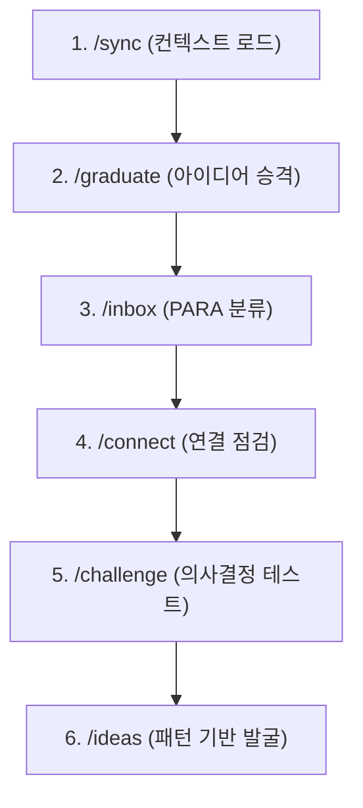

지정해주신 소스 문서(`raw/Claude Code + Obsidian으로 AI 기반 세컨드 브레인을 만든 방법.md`)를 바탕으로 `workflow` 유형의 개념인 **주간 리뷰 워크플로우**에 대한 위키 노트를 작성하여 완료했습니다.

해당 위키 노트는 `/Users/railscraft/.gemini/antigravity-cli/scratch/llm-wiki/wiki/주간 리뷰 워크플로우.md` 경로에 저장되었습니다.

---

### 작성된 노트 미리보기

```markdown
---
type: workflow
status: draft
core: false
tags:
  - llm
  - agent
  - obsidian
  - second-brain
  - para
  - workflow
aliases:
  - 주간 리뷰
  - Weekly Review Workflow
sources:
  - raw/Claude Code + Obsidian으로 AI 기반 세컨드 브레인을 만든 방법.md
created: 2026-08-28
updated: 2026-08-28
---

# 주간 리뷰 워크플로우

## 한 줄 정의
[[PARA 메쏘드]] 기반의 개인 지식 관리 시스템([[Obsidian]])에서 주간 단위로 지식 컨텍스트를 동기화하고 파편화된 아이디어를 수집·정리·검증·확장하는 단계별 AI 협업 절차.

## 핵심 요지
[[Claude Code]]와 같은 AI CLI 에이전트 도구를 개인 지식 저장소(Vault)에 연동하여 주간 단위 회고 및 정리 작업을 자동화/반자동화하는 워크플로우다. 

1. **상태 동기화**: 최근 활동 내역, 활성 프로젝트, 마스터 태스크 등을 통합 로드.
2. **아이디어 승격 (Graduation)**: 주간 노트에 남겨진 씨앗 아이디어를 독립 노트로 추출.
3. **인박스 정리 (Inbox Processing)**: PARA 구조(Projects, Areas, Resources, Archive)에 기반한 분류 및 검토.
4. **지식 연결 및 고립 점검**: 지식 그래프를 탐색하여 고립 노드(Orphan Note)를 찾고 연관 관계 생성.
5. **신념 및 의사결정 스트레스 테스트**: 내재된 가정을 발굴하고 논리적 모순을 검증.
6. **패턴 기반 아이디어 추출**: 개인 관심사 기반의 미해결 주제 및 신규 프로젝트 방향 도출.

## 상세

주간 리뷰 워크플로우는 단순한 기존 주간 회고(Weekly Review)를 넘어 [[LLM Agent]] 및 커스텀 slash command를 활용해 지식 관리 시스템을 **프로그래머블(Programmable)**하게 활용하는 방식이다. `CLAUDE.md` 운영 매뉴얼을 통해 Vault의 폴더 구조(`0. Inbox/`, `1. Projects/`, `2. Areas/`, `3. Resources/`, `4. Archive/`, `_Weekly/` 등)와 Obsidian Tasks 등의 플러그인 문법을 사전 학습시킨 후, 주 단위로 아래 6단계 시퀀스를 수행한다 (raw/Claude Code + Obsidian으로 AI 기반 세컨드 브레인을 만든 방법.md).



### 주간 리뷰 단계별 시퀀스
1. **`/sync` (컨텍스트 동기화)**
   - 최근 7일간 수정된 노트, 주간 노트(`_Weekly/`), 활성 프로젝트(`1. Projects/`), Master Task List(`0.1 Tasks_List/`), 최근 인박스 항목을 스캔하여 구조화된 요약을 생성한다.
2. **`/graduate` (아이디어 추출 및 승격)**
   - 주간 노트(`YYYY-WXX`)에 흩어져 있는 미완성 메모, 답이 없는 질문, 회고, 끝맺지 못한 생각을 스캔해 Seedling 상태의 독립 마크다운 노트로 전환(`0. Inbox/Graduates/`로 저장)한다.
3. **`/inbox` (PARA 분류 및 이동)**
   - `0. Inbox/`에 축적된 노트를 분석하여 PARA 구조에 따른 최적 목적지를 제안받고, 대안 확인 후 승인 절차를 거쳐 파일 시스템 위치를 이동시킨다.
4. **`/connect` (지식 그래프 점검)**
   - 백링크 및 Obsidian `[[wikilinks]]` 그래프를 분석하여 고립된 노트(Orphan Notes)나 무단절 클러스터를 발견하고, 1-hop / 2-hop 연관 경로 기반 브리지 노드를 제안한다.
5. **`/challenge` (신념 및 방침 검증)**
   - 검토 중인 중요 결정사항에 대해 노트 간 직접 모순(Contradictions), 숨은 가정(Hidden Assumptions), 추론 약점을 찾아내어 악마의 대변인(Devil's Advocate) 역할을 수행한다.
6. **`/ideas` (월간/주간 창의적 패턴 발굴)**
   - 지난 30일간의 활동 패턴을 채굴하여 개인 맞춤형 도구 개발 아이디어, 연락할 인물, 탐구 주제, 작성할 글감 목록을 생성한다.

## 예시

### Slash Command 지시문 구상 예시 (Obsidian 내 `.claude/commands/graduate.md`)
```markdown
# Instructions for /graduate command

1. Scan weekly notes in `_Weekly/` for the specified timeframe (default: last 4 weeks).
2. Identify non-task observations, unaddressed questions, reflection excerpts, and incomplete thoughts.
3. Extract each idea into a new Markdown note in `0. Inbox/Graduates/` with standard frontmatter:
   - **Graduated from**: [[2026-W11]]
   - **Status**: Seedling
   - **Core Claim**: Clear 1-sentence summary
   - **Context**: Why this thought originated
   - **Original Excerpt**: Quoted text
4. Recommend wikilink connections to existing notes in `1. Projects/` or `3. Resources/`.
```

### 시나리오 실행 환경
- **실행 도구**: Anthropic Claude Code (CLI)
- **작업 환경**: Obsidian Vault 루트 디렉터리 (raw/Claude Code + Obsidian으로 AI 기반 세컨드 브레인을 만든 방법.md)
- **실행 명령**: `.claude/commands/` 하위 커스텀 마크다운 명령 파일 기반 (`sync.md`, `graduate.md`, `inbox.md`, `connect.md`, `challenge.md`, `ideas.md`)

## 충돌
- 해당 없음.

## 관련 노트
- [[PARA 메쏘드]]
- [[Claude Code]]
- [[Obsidian]]
- [[LLM Agent]]
- [[세컨드 브레인]]

## 출처
- raw/Claude Code + Obsidian으로 AI 기반 세컨드 브레인을 만든 방법.md
```