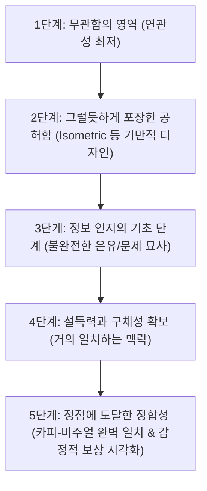

# 키 비주얼 연관성 분석 그래프

## 한 줄 정의
웹사이트의 첫인상을 결정짓는 키 비주얼(Key Visual)을 추상성(Abstraction)과 연관성(Relevance)이라는 두 가지 축을 기준으로 분류 및 매핑하여 전환율과의 정합성을 평가하고 개선하는 분석 [[워크플로]]우 모델.

## 핵심 요지
- 웹사이트 방문자가 이탈 여부를 판단하는 시간은 약 2초 이내이다 (raw/Popular design trends that destroy conversion.md).
- 보기 좋은 디자인이 쓰기에도 좋다는 [[미적 사용성 효과]]에 지나치게 빠지면, 비즈니스의 본질과 무관한 추상적인 그래픽(예: Blob)을 남용하여 오히려 사용자에게 [[인지적 비용]]과 과부하를 가중하고 전환율 저하를 야기한다 (raw/Popular design trends that destroy conversion.md).
- 이 그래프는 시각적 요소를 '추상적 표현 경로'와 '직관적(Literal) 표현 경로'로 나누고, 최종적으로 텍스트 카피와의 정합성 및 메시지 연관성(Relevance)을 극대화하여 비즈니스 전환을 이끌어내는 정점에 도달하는 것을 목표로 한다.

## 상세
키 비주얼 연관성 분석 그래프는 X축을 **추상성(Abstraction)**, Y축을 **연관성(Relevance)**으로 정의한다. 이를 통해 시각적 요소가 랜딩 페이지의 메시지와 어떻게 상호작용하는지 5단계 스펙트럼으로 추적한다 (raw/Popular design trends that destroy conversion.md).



### 5단계 분석 프로세스
1. **1단계: 연관성이 전혀 없는 디자인 (Low Relevance)**
   - **추상 경로**: 단순 광원 효과나 무의미한 세포 모양 도형(Blob) 등 미적 편향에만 기댄 영역 (raw/Popular design trends that destroy conversion.md).
   - **직관 경로**: 평화로운 자연경관이나 안개 낀 산맥처럼 객체는 명확하나 서비스 맥락과 완전히 동떨어진 영역.
2. **2단계: 그럴듯하게 포장한 공허함 (Pretend Effort / [[기만적인 디자인]])**
   - **추상 경로**: 흩뿌려진 3D 버블 인터랙션 등 화려하지만 알림의 본질적 여과 방식을 생략한 장식.
   - **직관 경로**: 모노톤 격자에 색상을 얹은 아이소메트릭(Isometric) 다이어그램. 상세 시스템 흐름도에는 유용하나 히어로 섹션에서는 상투적 어구("streamlined", "seamless")를 가리기 위한 가짜 디자인에 불과하여 '[[기만적인 디자인]]'으로 분류된다 (raw/Popular design trends that destroy conversion.md).
3. **3단계: 정보 인지의 기초 단계 (Basic Understanding)**
   - **추상 경로**: 사용자(중앙)를 향해 쏟아지는 파편을 투명한 돔으로 '완전 차단'하는 비유. 서비스의 핵심인 '일부 여과'와 모순되어 논리적 불일치를 발생시킴.
   - **직관 경로**: 가득 찬 수신함 등 단순히 '문제 상황'만 과장하여 보여줄 뿐 해결책의 혜택을 제시하지 못함 (raw/Popular design trends that destroy conversion.md).
4. **4단계: 설득력과 구체성의 확보 (Near Match)**
   - **추상 경로**: 깔때기(Funnel)를 통해 구체가 걸러지는 맥락을 제공하나, 통과 전후 구체의 디자인 변별력이 떨어져 여전히 미비함.
   - **직관 경로**: 3D 스마트폰 화면을 보여주나 카피(예: '단 5개 알림')와 그래픽 개수(예: 3개 말풍선)가 미세하게 불일치하여 신뢰도를 떨어뜨림 (raw/Popular design trends that destroy conversion.md).
5. **5단계: 정점에 도달한 정합성 (Peak Relevance)**
   - **추상 경로**: 뚜렷한 색상 구분의 3D 구체(핵심 알림)와 무채색 구체(불필요한 알림) 사이에 반투명 필터 장벽을 배치해 여과의 논리를 정밀하게 형상화 (raw/Popular design trends that destroy conversion.md).
   - **직관 경로**: 정확히 5개의 알림만 노출되는 스마트폰과 이를 방치한 채 평온하게 휴식을 취하는 인물을 묘사하여 최종 [[감정적 보상 시각화를 통한 모방 심리 자극|감정적 보상]] 및 [[감정적 보상 시각화를 통한 모방 심리 자극#상세|모방 심리]]를 자극 (raw/Popular design trends that destroy conversion.md).

## 예시
### 1. 카피 및 비주얼 개선 시나리오 (가상의 알림 필터링 서비스 *Hushy*)
- **AS-IS (나쁜 설계)**:
  - 카피: *"알림을 직접 제어하세요 (Take control of notifications)"* (사용자에게 필터링 작업을 떠넘기는 인상을 주는 부정적 설계)
  - 비주얼: 세포 분열 모양의 형형색색 Blob 그래픽 (연관성 1단계).
- **TO-BE (5단계 개선안)**:
  - 카피: *"수천 명이 매일 수백 개의 알림을 받지만, 결국 도달하는 것은 단 5개뿐입니다."* (내림차순 [[숫자 기반 설득 패턴]]: 17,308개 $\rightarrow$ 636개 $\rightarrow$ 5개로 숫자가 직관적으로 줄어들며 뇌의 논리적 흐름을 유도) (raw/Popular design trends that destroy conversion.md).
  - 비주얼: 카드 등록 없이 시작 가능한 CTA 버튼과 함께, 스마트폰 너머로 평온한 휴식을 취하는 실제 촬영 인물 이미지 배치 (연관성 5단계 직관 경로).

### 2. [[LLM]] 에이전트를 활용한 키 비주얼 연관성 자동 평가 코드 예시
웹사이트 히어로 섹션의 카피(H1, Subtitle)와 키 비주얼(이미지 메타데이터 및 분석 결과)을 비교하여, 해당 페이지가 '키 비주얼 연관성 분석 그래프' 상에서 몇 단계에 속하는지 평가하는 Python 스크립트 예제이다. 이 예제에서는 [[LLM]] API(예: Gemini 1.5 Pro)를 활용하여 정합성을 정량적으로 분석한다.

```python
import google.generativeai as genai

# API 키 및 모델 설정
genai.configure(api_key="YOUR_GEMINI_API_KEY")
model = genai.GenerativeModel('gemini-1.5-pro')

def evaluate_key_visual_relevance(hero_copy: str, image_description: str):
    prompt = f"""
    당신은 전문 위키 에디터이자 UX 분석가입니다.
    '키 비주얼 연관성 분석 그래프' 이론에 따라 아래 웹사이트 히어로 섹션의
    텍스트 카피와 시각적 이미지의 정합성 단계를 평가해 주십시오.

    [웹사이트 카피]
    {hero_copy}

    [키 비주얼 설명]
    {image_description}

    [평가 가이드라인]
    - 1단계: 연관성이 전혀 없음 (Blob 그래픽, 무관한 풍경화)
    - 2단계: 그럴듯하게 포장한 공허함 (단순 다이어그램, 복잡한 Isometric)
    - 3단계: 기초 인지 (모순이 있는 비유, 혹은 단순 문제 상황만 나열)
    - 4단계: 구체성 확보 (거의 근접하나 세부 수치 불일치 등의 어긋남 존재)
    - 5단계: 정점에 도달한 정합성 (수치/개수 일치 및 최종 감정적 보상/모방 심리 유도)

    출력 결과는 아래 JSON 형식으로 작성해 주십시오.
    {{
        "abstraction_level": "High/Medium/Low",
        "relevance_stage": 1 ~ 5,
        "reason": "평가 근거 및 논리적 정합성 분석",
        "improvement_suggestion": "5단계 도달을 위한 카피 혹은 이미지 개선 방향 제안"
    }}
    """
    
    response = model.generate_content(prompt)
    return response.text

# 테스트 시나리오 실행
copy_sample = "수천 개의 알림에서 해방되세요. 단 5개의 필수 알림만 엄선하여 전송합니다."
visual_sample = "화면 뒤쪽으로 수많은 알림 팝업들이 날아가고 있으며, 스마트폰 화면에는 선명하게 3개의 메시지 알림창이 떠 있다."

analysis_result = evaluate_key_visual_relevance(copy_sample, visual_sample)
print(analysis_result)
```

## 충돌
- **미적 편향 대 비즈니스 전환**: 디자이너와 클라이언트는 [[미적 사용성 효과]](Aesthetic usability effect)에 따라 세포 분열 형태의 형형색색 Blob 그래픽이나 3D 버블 인터랙션을 선호한다. 하지만 이는 비즈니스 전환율(Conversion Rate) 관점에서는 '예쁜 쓰레기'에 불과하며 오히려 사용자의 인지 과부하로 이탈을 부추긴다 (raw/Popular design trends that destroy conversion.md).
- **다이어그램의 다중성**: 복잡한 격자 구조의 아이소메트릭(Isometric) 그래픽은 상세 설명 페이지 하단에서는 시스템 흐름을 명확하게 해주는 훌륭한 도구이지만, 랜딩 페이지의 가장 핵심인 히어로 섹션에 쓰였을 경우에는 실체가 모호하여 오히려 신뢰도를 깎아먹는 '[[기만적인 디자인]]'으로 변모한다 (raw/Popular design trends that destroy conversion.md).

## 관련 노트
- [[감정적 보상 시각화를 통한 모방 심리 자극]]: 5단계 극치의 정합성에서 활용되는 최종 사용자 감정 상태 시각화 전략.
- [[미적 사용성 효과]]: 외관이 아름다운 디자인이 기능적으로도 우수하다고 인지하는 심리 편향에 대한 상세 개념.
- [[어포던스]]: 사용자가 사물을 대할 때 어떻게 행동할지를 물리적/시각적으로 안내하는 [[행동 유도성]] 개념.
- [[인지적 비용]]: 무의미한 시각 장식을 해석하느라 뇌의 에너지를 소모하는 사용자 행동학적 부하 분석.

## 출처
- [raw/Popular design trends that destroy conversion.md](file:///Users/railscraft/.gemini/antigravity-cli/scratch/llm-wiki/raw/Popular%20design%20trends%20that%20destroy%20conversion.md)
