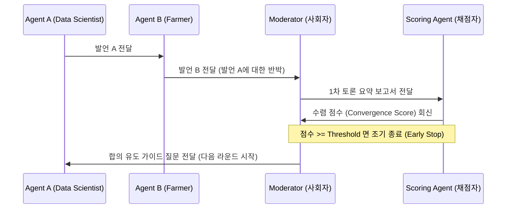

# 토론 수렴 스코어링 메커니즘

## 한 줄 정의
멀티 에이전트의 토론 워크플로에서 대립하는 에이전트들의 지엽적인 논박이나 평행선 논쟁을 방지하기 위해 중립적 사회자(Moderator)와 채점 에이전트(Scoring Agent)를 배치해 매 라운드 합치도 점수를 매기고 조기 종료(Early stopping)를 유도하는 구조화된 조율 기법이다.

## 핵심 요지
- 페르소나와 RAG 메모리가 탑재된 다중 에이전트 간의 자율 토론 루프는 조율 장치(컨트롤 타워)가 없으면 극단적 주장만 반복하거나 주제를 이탈할 우려가 크다.
- **중립적 사회자(Moderator)**를 도입하여 매 라운드 종료 시 두 에이전트의 공통분모(Agreements)와 쟁점(Disagreements)을 요약하고 타협을 유도하는 가이드 질문을 다시 전달한다.
- **채점 에이전트(Scoring Agent)**를 결합하여 라운드별 시맨틱 정렬, 모순 감소 수준을 0.0~1.0 사이 점수로 평가하고 임계치(Threshold)를 초과하면 조기 종료(Early stopping)를 선언한다.

## 상세
### 1. 4인 에이전트 조율 아키텍처 구성원

- **Agent A & B (토론 주체)**: 각자의 배경 지식 데이터베이스(RAG)와 페르소나를 탑재하고 상대방의 주장을 반박하거나 자기 의견을 고수함 (예: 템퍼러처 0.7 설정으로 자유도 부여).
- **Moderator (사회자)**: 토론에 직접 개입하지 않고 한 발 물러서서 요약, 공통점/차이점 도출, consensus 유도 질문 생산 (객관성을 위해 템퍼러처 0.3으로 낮게 설정).
- **Scoring Agent (채점자)**: 두 의견의 수렴 상태를 냉정하게 판정하여 숫자만 반환 (일관성을 위해 결정론적인 템퍼러처 0.0 설정).

### 2. 조기 종료(Early stopping) 제어
- `MAX_ROUNDS` (최대 상한 라운드 수)와 `AGREEMENT_THRESHOLD` (수렴 판단 임계값, 예: 0.85)를 혼합 사용한다.
- 라운드마다 채점 에이전트가 반환한 float 값을 파싱하고, 임계값을 넘는 순간 루프를 탈출해 `final_summary` 작성 단계로 종결 지어 토큰 낭비를 절감하고 신뢰도 높은 합의서를 출력한다.

## 예시
- 인공지능의 중요성에 대한 데이터 과학자(Transformer 찬성)와 농부(전력 과소비 및 환각 비판)의 토론 시뮬레이션에서 4라운드 만에 수렴 스코어 0.8을 달성해 조기 종료 판결을 내리고 합의 도출.

## 관련 노트
- [[AI 에이전트 아키텍처 완전 가이드]]
- [[병렬 에이전트 세션 운영]]
- [[OpenAgent Team Mode]]

