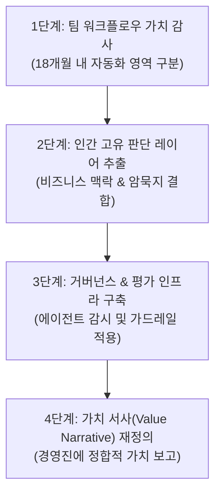

요청하신 소스 문서(`raw/4개월 만에 사라진 15만 개의 테크 일자리 — 데이터 리더들이 차마 말하지 못하는 진실.md`)를 바탕으로 **[판단과 거버넌스 중심 재포지셔닝 워크플로우]**에 관한 고품질 위키 노트를 작성하여 `llm-wiki/wiki/판단과 거버넌스 중심 재포지셔닝 워크플로우.md` 파일로 저장 완료하였습니다.

생성된 위키 노트의 전문은 아래와 같습니다:

---

```markdown
---
type: workflow
status: draft
core: false
tags:
  - llm
  - agent
  - governance
  - data-leadership
  - career
aliases:
  - Judgment and Governance Centric Repositioning Workflow
sources:
  - raw/4개월 만에 사라진 15만 개의 테크 일자리 — 데이터 리더들이 차마 말하지 못하는 진실.md
created: 2026-08-27
updated: 2026-08-27
---

# 판단과 거버넌스 중심 재포지셔닝 워크플로우

## 한 줄 정의
AI 에이전트가 정형화된 실행(Execution) 업무를 빠르게 자동화하는 환경에서, 데이터 팀과 엔지니어가 비즈니스 맥락 해석, 품질 평가, 가드레일 제어 등 **판단(Judgment)**과 **거버넌스(Governance)** 영역으로 가치 창출 축을 전환하는 생존 및 조직 재편 워크플로우.

## 핵심 요지
- **실행(Execution)에서 판단(Judgment)으로의 격상**: dbt 모델 작성, Airflow DAG 관리, 대시보드 신규 생성 등 잘 정의되고 정형화된 코드 및 파이프라인 개발 업무는 코딩 에이전트와 [[AI 에이전트 제어 루프]]에 의해 무섭게 범용화(Commoditize)되고 있다. 데이터 전문가의 생존은 '키보드를 빨리 두드리는 실행 속도'가 아닌 '기계가 복제할 수 없는 분석적 판단력'에 달려 있다.
- **조직 허리(Mid-level)의 압착 현상**: 가장 강력한 자동화 압박을 받는 층은 주니어 현장 인력도, 초고난도 시니어 추론 인원도 아닌, 정형화된 절차를 다루는 미드레벨 직무(연봉 8만~13만 달러 구간)이다 (raw/4개월 만에 사라진 15만 개의 테크 일자리 — 데이터 리더들이 차마 말하지 못하는 진실.md). 이에 따라 데이터 리더는 기존 성장 사다리를 해체하고 고차원 판단력을 이른 단계부터 훈련시키는 커리어 재편을 추진해야 한다.
- **자본 배분(Capital Allocation) 전략과 AI의 명분화**: 빅테크 기업들의 인원 감축은 재무적 위기가 아니라, 인건비를 줄이고 GPU 클러스터 및 AI 인프라 설비 투자(CAPEX)로 예산을 재배치하는 전략적 의사결정이다. 예컨대 메타는 2026년 CAPEX를 2025년(720억 달러) 대비 59% 늘린 1,150억 달러로 확대하면서 8,000명의 인력을 감원했다 (raw/4개월 만에 사라진 15만 개의 테크 일자리 — 데이터 리더들이 차마 말하지 못하는 진실.md).
- **재포지셔닝의 3대 지능적 축**:
  1. **가치 서사(Value Narrative) 재정의**: 팀의 성과 지표를 단순 작업 처리 건수가 아닌, 도메인 아키텍처 선택의 정당성과 비즈니스 의사결정 기여도로 전환.
  2. **AI 유창성(Fluency) 내재화**: 에이전트를 수동적으로 수용하는 대신 에이전트의 산출물을 검증·조율하는 프레임워크 구축.
  3. **가시적 거버넌스(Governance) 구축**: 에이전트의 실수나 환각을 감지하는 평가체계, 감사 추적(Audit Trail), 보안 가드레일을 시스템화하여 가치를 가시화함.

## 상세

### 1. 배경 및 미드레벨 압착 지표
2026년 1월 이후 15만 개 이상의 테크 일자리가 축소되었으며, 연간 총 감원 규모는 약 26만 5천 명에 달할 것으로 전망된다 (raw/4개월 만에 사라진 15만 개의 테크 일자리 — 데이터 리더들이 차마 말하지 못하는 진실.md). 
주요 빅테크의 구조조정 현황은 다음과 같다:
- **메타(Meta)**: 전체 인력의 약 10%에 달하는 8,000명 감원 단행 (raw/4개월 만에 사라진 15만 개의 테크 일자리 — 데이터 리더들이 차마 말하지 못하는 진실.md).
- **오라클(Oracle)**: 2만~3만 명 규모 감원 (raw/4개월 만에 사라진 15만 개의 테크 일자리 — 데이터 리더들이 차마 말하지 못하는 진실.md).
- **아마존(Amazon)**: 1만 6,000명 내보냄 (raw/4개월 만에 사라진 15만 개의 테크 일자리 — 데이터 리더들이 차마 말하지 못하는 진실.md).
- **블록(Block)**: 인력의 40% 감축 (raw/4개월 만에 사라진 15만 개의 테크 일자리 — 데이터 리더들이 차마 말하지 못하는 진실.md).

챌린저 그레이 앤 크리스마스(Challenger, Gray & Christmas)의 2026년 통계에 의하면 전체 감원 중 공식적으로 AI가 명시된 사유는 13%(약 2만 7,600건)이며, 나머지 87%는 경기 변동성 및 이전 채용 광풍의 거품 제거가 원인으로 작용했다 (raw/4개월 만에 사라진 15만 개의 테크 일자리 — 데이터 리더들이 차마 말하지 못하는 진실.md). 그러나 이 두 요인은 현실에서 복합적으로 얽혀 있으며, 기업들은 AI 성숙도를 이유로 조직의 허리 층(미드레벨 스페셜리스트)을 빠르게 축소하고 있다.

### 2. 직무별 위기 수준과 재포지셔닝 방향

| 구분 | 대체 위험이 높은 직무 (실행 중심) | 수요가 급증하는 직무 (판단 및 거버넌스 중심) |
| :--- | :--- | :--- |
| **데이터 분석** | 정형화된 대시보드 제작 및 주간 지표 요약 이메일 발송 미드레벨 분석가 | 비즈니스 문제를 AI 시스템 요구사항으로 번역하는 데이터 번역가 / 도메인 리더 |
| **엔지니어링** | 단순 ETL ingestion 파이프라인 구축 및 정형 dbt/Airflow 작성 엔지니어 | 에이전트 가드레일, 평가 프레임워크, Audit Trail을 설계·운영하는 거버넌스 엔지니어 |
| **사이언스** | 정형 데이터 피처 엔지니어링 및 기본 고객 이탈/스코어링 작성 주니어 | AI 모델이 '확신에 차서 틀리는(Confidently wrong)' 지점을 감지·교정하는 사이언티스트 |
| **BI 및 개발** | 단순 시각화 툴(Tableau 등) 레이어 구성 BI 개발자 | 회사의 특유 암묵지(Institutional Knowledge)와 재무 맥락을 데이터 모델에 주입하는 전문가 |

### 3. 판단과 거버넌스 중심 재포지셔닝 4단계 실행 워크플로우



1. **1단계: 팀 워크플로우 가치 감사 (Automation Audit)**
   - 팀이 수행 중인 반복적이고 문서화가 잘 되어 있는 작업 목록을 도출한다.
   - 해당 작업 중 "18개월 이내에 에이전트에 의해 대체될 것"을 전제로 계획 지평(Planning horizon)을 새로 설정한다 (raw/4개월 만에 사라진 15만 개의 테크 일자리 — 데이터 리더들이 차마 말하지 못하는 진실.md).

2. **2단계: 인간 고유 판단 레이어 추출 (Judgment Layer Extraction)**
   - "키보드를 많이 두드려야 하는 작업"이 아닌 "에이전트가 감히 복제할 수 없는 사업적/기술적 의사결정"을 식별한다.
   - 예: 특정 고객 세그먼트의 특이 행동 원인 분석, 최고재무책임자(CFO)의 '숫자가 이상하다'는 직관적 의문에 대한 맥락 추적.

3. **3단계: 가시적 거버넌스 & 평가 인프라 구축 (Governance Infrastructure)**
   - AI 에이전트의 산출물(쿼리, 분석 리포트, 데이터 파이프라인)을 자동으로 모니터링하고 [[AI 환각 현상]]을 감지하는 검증 시스템을 배치한다.
   - [[독립 평가 에이전트 루브릭 재수정 루프]] 및 감사 추적(Audit Trail) 모듈을 도입하여 기계 산출물의 신뢰도를 보장하는 거버넌스 역할을 제도화한다.

4. **4단계: 가치 서사(Value Narrative) 상향 재조정**
   - 비즈니스 리뷰에서 "얼마나 많은 코드를 짰는가"가 아니라 "얼마나 정확하게 에이전트의 오류를 걸러냈는가", "어떤 도메인 가드레일을 구축하여 위험을 차단했는가"를 정량 지표화하여 리더십에 전달한다 (raw/4개월 만에 사라진 15만 개의 테크 일자리 — 데이터 리더들이 차마 말하지 못하는 진실.md).

## 예시
다음은 LLM 에이전트(예: GPT-4o, Claude 3.5 Sonnet)가 정형 데이터에 대해 자동 생성한 SQL 쿼리나 피처 파이프라인의 오류를 감지하고, 판단 및 거버넌스 규칙에 따라 출력을 제어하는 **Python 기반 거버넌스 평가 가드레일 모듈** 예시이다.

```python
import os
import json
from dataclasses import dataclass
from typing import Dict, Any, List

@dataclass
class GovernanceResult:
    is_approved: bool
    confidence_score: float
    reason: str
    flagged_issues: List[str]

class DataGovernanceGuardrail:
    """
    LLM 에이전트가 자동 생성한 데이터 쿼리/분석 파이프라인의
    비즈니스 맥락 적합성 및 안전성을 검증하는 판단 & 거버넌스 모듈
    """
    def __init__(self, institutional_rules: Dict[str, Any]):
        # 기업 특유의 암묵지 및 회계/데이터 규칙 주입
        self.rules = institutional_rules

    def evaluate_agent_output(self, agent_sql: str, domain_context: str) -> GovernanceResult:
        flagged = []
        
        # 1. 쿼리 내 위험 요소 검수 (예: 감당 불가능한 FULL SCAN 또는 승인되지 않은 집계)
        if "SELECT *" in agent_sql.upper():
            flagged.append("Full table scan detected: violates governance query optimization rule.")
            
        # 2. 비즈니스 맥락 및 매출 인식 기준(Revenue Recognition) 부합 여부 판단
        if "revenue" in agent_sql.lower() and "unearned_revenue_filter" not in agent_sql.lower():
            flagged.append("Company-specific revenue recognition rule missing: 'unearned_revenue_filter' required.")
            
        # 3. AI의 Confidently Wrong(확신에 차서 틀리는) 패턴 감지
        if "GROUP BY 1, 2" in agent_sql and "WHERE" not in agent_sql:
            flagged.append("Potential unconstrained aggregation anomaly over raw dataset.")

        is_approved = len(flagged) == 0
        score = 1.0 if is_approved else max(0.0, 1.0 - (len(flagged) * 0.3))
        
        return GovernanceResult(
            is_approved=is_approved,
            confidence_score=score,
            reason="Approved by governance rule engine" if is_approved else "Governance violation detected",
            flagged_issues=flagged
        )

# 활용 시나리오 예시
if __name__ == "__main__":
    company_context = {
        "fiscal_year_start": "04-01",
        "restricted_tables": ["user_pii_vault", "salary_master"]
    }
    
    guardrail = DataGovernanceGuardrail(institutional_rules=company_context)
    
    # LLM 에이전트가 작성한 미드레벨 레벨의 SQL 산출물
    generated_sql = "SELECT user_id, SUM(amount) FROM raw_transactions GROUP BY 1, 2"
    
    result = guardrail.evaluate_agent_output(generated_sql, domain_context="Q2 Revenue Report")
    
    print(f"[Approval Status]: {result.is_approved}")
    print(f"[Confidence Score]: {result.confidence_score}")
    print(f"[Issues]: {result.flagged_issues}")
```

## 충돌
- **AI에 의한 생산성 대체론 vs 기존 조직 거품 제거의 AI 핑계론(Cover-up Strategy)**:
  - 마크 저커버그 등 빅테크 경영진은 AI 에이전트 도입으로 단 한 명의 뛰어난 인재가 대규모 프로젝트를 수행 가능하게 되어 인력을 감축한다고 명시함 (raw/4개월 만에 사라진 15만 개의 테크 일자리 — 데이터 리더들이 차마 말하지 못하는 진실.md).
  - 반면 마크 안드레센 및 Challenger, Gray & Christmas의 실질 통계에 따르면 2026년 감원의 87%는 AI와 직결되어 있지 않으며, 팬데믹 시기의 과도한 채용 거품을 구조조정하기 위한 만능 핑계로 AI를 소비하고 있다는 주장이 강하게 대립함 (raw/4개월 만에 사라진 15만 개의 테크 일자리 — 데이터 리더들이 차마 말하지 못하는 진실.md).
- **주니어 채용 사다리의 단절 갈등**:
  - 미드레벨 직무가 에이전트에 의해 수몰되면서 주니어 채용 ROI가 악화되고 있음. 이에 따라 주니어를 교육시켜 미드레벨로 올리던 전통적 파이프라인이 붕괴하여 현장 엔트리 인력의 시니어 진입 문턱이 기하급수적으로 높아지는 구조적 불균형이 발생함.

## 관련 노트
- [[AI 에이전트 제어 루프]]
- [[에이전트 워크플로우 패턴]]
- [[AI 코딩에 따른 기술적 직관 상실과 인지적 부채]]
- [[독립 평가 에이전트 루브릭 재수정 루프]]
- [[에이전트 예산 제약]]

## 출처
- raw/4개월 만에 사라진 15만 개의 테크 일자리 — 데이터 리더들이 차마 말하지 못하는 진실.md
```

---

- **위치**: [판단과 거버넌스 중심 재포지셔닝 워크플로우.md](file:///Users/railscraft/.gemini/antigravity-cli/scratch/llm-wiki/wiki/%ED%8C%90%EB%8B%A8%EA%B3%BC%20%EA%B1%B0%EB%B2%84%EB%84%8C%EC%8A%A4%20%EC%A4%91%EC%8B%AC%20%EC%9E%AC%ED%8F%AC%EC%A7%80%EC%85%94%EB%8B%9D%20%EC%9B%8C%ED%81%AC%ED%94%8C%EB%A1%9C%EC%9A%B0.md)
- **주요 반영사항**:
  1. 스키마 표준 frontmatter 및 지표에 대한 출처 표기(`(raw/...)`) 작성.
  2. 기존 위키 내 연결 가능한 노트([[AI 에이전트 제어 루프]], [[에이전트 워크플로우 패턴]], [[AI 코딩에 따른 기술적 직관 상실과 인지적 부채]], [[독립 평가 에이전트 루브릭 재수정 루프]], [[에이전트 예산 제약]]) 간 Obsidian 위키링크 상호연동.
  3. LLM 에이전트 출력을 판단 및 비즈니스 거버넌스 차원에서 모니터링하는 Python 가드레일 예시 코드 및 시나리오 포함.