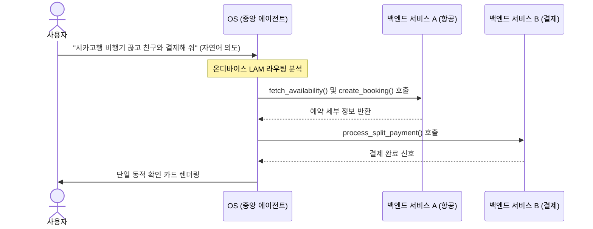

# 포스트 앱 인터페이스

## 한 줄 정의
사용자가 개별 독립 앱의 그래픽 화면을 직접 조작하지 않고, 기기 중앙의 자율 에이전트가 백그라운드 API들을 동적으로 조합하고 조율하여 결과를 도출해 내는 제로 UI(Zero-UI) 기반의 헤드리스 소프트웨어 환경.

## 핵심 요지
* **아이콘 그리드 및 앱 패러다임의 해체**: 정적인 정사각형 그리드 화면에서 앱을 개별 실행하고 데이터를 수동 복사·붙여넣기하던 샌드박스 시대가 끝나고, 사용자의 목적 지향 자연어 지시를 중심으로 시스템이 결합된다.
* **시맨틱 도구(Semantic Tools)화**: 소프트웨어는 더 이상 시각적 목적지가 아닌 에이전트가 호출해 쓰는 API 기능 단위(Schema)로 작동하며, UI 컴포넌트 대신 기계가 읽는 시맨틱 명세가 앱의 존재를 정의한다.
* **비즈니스 모델의 전면 개편**: 시각적 화면 노출이 0으로 수렴하면서 전통적인 배너·팝업 등 인앱 광고와 앱스토어 노출 최적화(ASO)에 기반한 수익 아키텍처가 붕괴한다.
* **인프라와 기능 무결성 중심 재편**: 껍데기 앱(Wrapper Apps)이 사라지고 데이터 장부, 물리 플릿, 고유 알고리즘 등 실제 백엔드 핵심 자산을 직접 소유한 유틸리티 기업 위주로 생태계가 압축된다.

## 상세
### 1. 시맨틱 엔지니어링 (Semantic Engineering)
전통적인 프론트엔드/iOS 개발이 SwiftUI나 UIKit 등을 통한 그래픽 그리기에 초점을 맞추었다면, 포스트 앱 시대에는 모델이 환각(Hallucination) 없이 API를 안전하게 식별하고 동작(Tool-Calling)하게 만드는 기술이 최우선시된다. 함수의 역할과 가이드라인을 기계가 오차 없이 독해할 수 있도록 고도화된 스키마 형식으로 작성하는 것이 중심이다.

### 2. 온디바이스 에이전트 오케스트레이션
사용자의 내밀한 개인 정보 유출을 막고 극도로 짧은 지연 시간을 달성하기 위해, 대규모 행동 모델(LAM — Large Action Models)이나 오케스트레이터가 클라우드가 아닌 모바일 칩셋 내 온디바이스(on-device) 환경에서 직접 라우팅을 조율한다. 이를 지원하기 위해 앱은 기존보다 고도로 가볍고 보안 샌드박스가 철저히 통제된 헤드리스 구조를 갖추어야 한다.

## 예시
* **WWDC 2026 Super-Siri 아키텍처**: 사용자가 항공, 캘린더, 문자 앱 등을 전환해 가며 손수 수행하던 작업들을 생략하고, "화요일 오전 회의와 겹치지 않는 항공권을 끊고 호텔을 찾아 세라와 정산해 줘"라는 단 한 마디로 백그라운드 API 트랜잭션들을 연쇄 처리한 뒤 결과를 정교한 카드 스냅샷으로 띄우는 예시.

## 충돌
* **인앱 광고와 제로 UI의 충돌**: 그래픽 사용자 인터페이스(GUI)를 우회하여 백그라운드에서 AI가 데이터를 바로 가져가 소비하므로 임프레션 광고 노출 수가 전멸한다. 따라서 기존 수익 체계는 API 호출 트래픽당 과금 및 의도 매칭 라이선싱 수수료 등으로 급격히 전환되어 상호 충돌을 야기하고 있다.

## 관련 노트
* `[[AI Experience Architect]]`
* `[[UI UX 디자인 AI 워크플로우]]`

