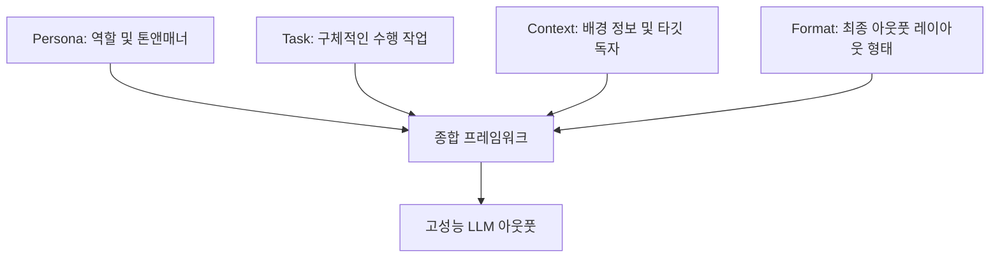

# 프롬프트 구성 4대 요소

## 한 줄 정의
원하는 수준의 LLM 아웃풋을 유도하기 위해 프롬프트를 작성할 때 유기적으로 결합해야 하는 네 가지 골격 요소(Persona, Task, Context, Format).

## 핵심 요지
* **구조적 입력 설계**: 모호한 단발성 질문 대신 페르소나(Persona), 수행 작업(Task), 맥락(Context), 출력 형태(Format)를 명확히 구조화하여 프롬프트를 설계할 때 인공지능 응답의 신뢰도가 크게 상승한다.
* **반복적 프롬프팅 (Iterative Prompting)**: 일회성 명령으로 백점짜리 결과물을 기대하기보다, 3단계 피드백 루프(차이 규명 -> 변수 튜닝 -> 수정 명령)를 거쳐 점진적으로 의도를 좁혀 나간다.
* **주도권 유지**: 모호한 지시는 AI에게 설계 주도권을 양도하게 만들어 보편적이고 쓸모없는 텍스트를 양산하게 하므로, 구체성 확보를 통해 인간 설계자가 통제 주도권을 쥐고 가야 한다.
* **컨텍스트 한계 극복**: 대화가 누적되며 발생하는 인지 저하(Context rot) 현상을 차단하기 위해 핵심 규칙 리마인드, 데이터 경량화, 모듈형 분할을 병행한다.

## 상세
### 1. 4대 구성 요소의 정의
* **Persona (페르소나)**: AI에게 구체적인 역할과 전문성 수준을 주입한다. (예: "당신은 B2B SaaS 전문 시니어 카피라이터입니다") 이를 통해 아웃풋의 어조와 전문적 배경지식의 깊이가 결정된다.
* **Task (수행 작업)**: 수행할 비즈니스 행위를 정교하고 구체적으로 묘사한다. (예: "바쁜 창업자를 위한 할 일 목록의 실패 원인을 다룬 300단어 분량의 글 작성")
* **Context (맥락)**: 타깃 오디언스, 실행 배경, 예외 제약 조건 및 참조 데이터를 제공하여 AI가 자의적인 추정으로 문맥의 공백을 채우는 현상을 방지한다.
* **Format (출력 형태)**: 불릿 리스트, 마크다운 표, 번호별 단계 등 수령하고자 하는 레이아웃 구조를 확실하게 지정하여 2차 가공 시간을 최소화한다.

### 2. 반복 피드백 루프 (3-Step Loop)
첫 프롬프트에서 도출된 결과물이 미흡한 경우, 세션을 닫기보다 아래 단계를 수동 반복해 튜닝한다.
1. **차이(Gap) 규명**: 톤이 어긋났는지, 아키텍처 뼈대가 생략되었는지 오류를 규정한다.
2. **변수 튜닝**: 4대 요소 중 문제가 되는 하나의 변수만 조절하여 인과 관계를 통제한다.
3. **수정 명령**: 타깃 구간을 짚어 한 문장 단위로 정확하게 수정 지시를 하달한다.

## 예시
### 빈칸 채우기형(Fill-in-the-Blank) 범용 템플릿
> "당신은 **[역할/Persona]**입니다. **[구체적인 작업/Task]**을 지시합니다. 대상 독자는 **[타깃]**이며, 배경은 **[맥락/Context]**입니다. 결과는 **[포맷/Format]** 형태로 구조화해 주시고, 톤앤매너는 **[형용사]** 느낌으로 구성해 주십시오."

## 충돌
* **지속 튜닝 vs 새 세션 생성**: 이전 대화 맥락이 너무 길어지면 컨텍스트 윈도우 메모리가 꽉 차 최초 설정한 페르소나와 제약조건을 LLM이 상실하는 충돌이 일어난다. 아웃풋의 50% 이상을 수정해야 할 정도로 뼈대가 흐트러졌다면 기존 세션에서 튜닝을 이어가기보다 대화창을 리셋하고 새 백지 상태에서 시작해야 효율적이다.

## 관련 노트
* `[[클로드와 ChatGPT 프롬프트 설계 차이]]`
* `[[AI 코딩 에이전트 검증 전략]]`

