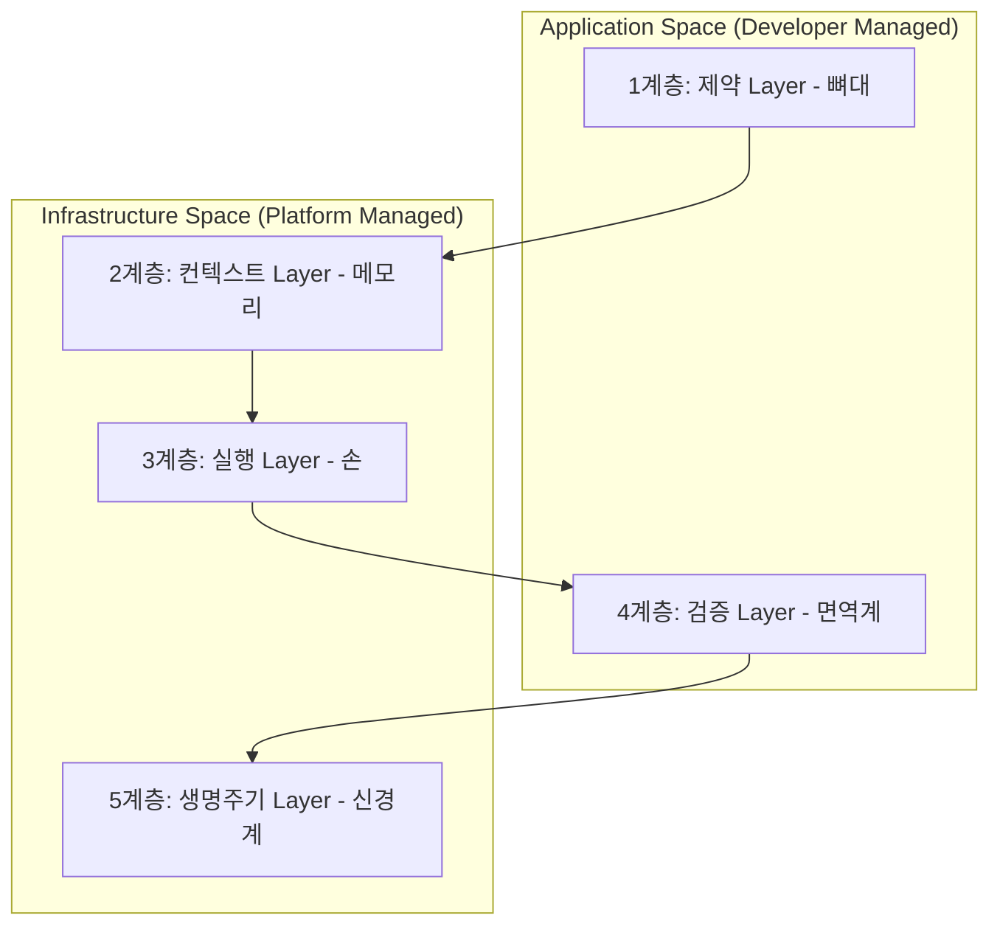

# 하네스 5계층 모델

## 한 줄 정의
에이전트를 둘러싼 비결정론적 실행 환경을 체계적으로 구조화하고 통제하기 위해 제약, 컨텍스트, 실행, 검증, 생명주기의 5개 레이어로 세분화한 아키텍처 프레임워크.

## 핵심 요지
* **단일화 해소 (De-monolithing)**: 하네스를 막연한 단일 덩어리가 아닌 5개의 명확한 역할과 소유권을 지닌 계층으로 구분함으로써, 시스템의 공백을 진단하고 체계적인 개선을 가능하게 한다.
* **역할 분할 (Responsibility Split)**: 2계층(컨텍스트), 3계층(실행), 5계층(생명주기)은 비즈니스 로직과 무관한 플랫폼 인프라의 성격을 띠어 관리형 플랫폼 벤더가 제공하기 용이한 반면, 1계층(제약)과 4계층(검증)은 각 비즈니스의 고유 도메인 규칙을 포함하므로 개발자가 직접 빌드해야 한다.
* **제약 계층(1계층)의 효율성**: 1계층은 100% 결정론적으로 작동하여 비용이 거의 발생하지 않으며, 토큰을 소모하기 전에 구조적 에러를 사전 차단하므로 후속 계층의 부담을 줄이는 강력한 레버리지 역할을 수행한다.
* **면역계로서의 검증 계층(4계층)**: 에이전트의 출력이 프로덕션에 배포되기 전 최종 검증하는 레이어로, 성공 시에는 침묵하고 실패 시에는 에러만을 노출하여 컨텍스트 윈도우 오염을 차단해야 한다.

## 상세
하네스 5계층 모델의 구체적인 정의와 역할 분담 구조는 다음과 같다.

### 1계층: 제약 계층 (Constraint Layer - 뼈대)
* **목적**: 코드가 가질 수 있는 구조적 형태에 대한 절대적 규칙을 강제한다.
* **특징**: LLM을 개입시키지 않고 100% 결정론적으로 작동하며, 단 하나의 토큰도 소비하지 않고 거대한 실패 가능성을 원천 차단한다.
* **구성 요소**: 맞춤형 ESLint/Biome 린터 규칙, ArchUnit과 같은 모듈 경계 및 의존성 방향 구조 테스트 프레임워크, 파일 구조 유효성 검사, API 규약(OpenAPI 스키마) 검증기.

### 2계층: 컨텍스트 계층 (Context Layer - 메모리)
* **목적**: 에이전트 실행 단계에서 모델이 인지하는 지식과 정보를 조율한다.
* **특징**: 양보다는 질이 중요하며, 사람이 직접 관리하고 신선도가 유지되는 간결한 문서를 지향한다.
* **구성 요소**: 시스템 프롬프트용 지침 문서(CLAUDE.md 등), 점진적 공개(Progressive Disclosure) 스킬, 에이전트 작업 기록 메모장, 기계 가독형 아키텍처 결정 기록(ADR).

### 3계층: 실행 계층 (Execution Layer - 손)
* **목적**: 에이전트가 호출할 수 있는 도구와 디스패치 방식을 제어한다.
* **특징**: 도구가 과다할 경우 에이전트가 의사결정 장애에 빠지는 '덤 존(dumb zone)' 현상을 겪으므로, 동적 도구 범위 지정을 통해 실행 시점에 필요한 도구만 제한적으로 열어주어야 한다.
* **구성 요소**: MCP([[Model Context Protocol]]) 프록시 라우터, 샌드박싱 환경, 권한 모델, 하위 에이전트 캡슐화를 위한 컨텍스트 방화벽(Context Firewall).

### 4계층: 검증 계층 (Verification Layer - 면역계)
* **목적**: 에이전트 결과물의 안정성을 승인, 재시도, 에스컬레이션 기준으로 판별한다.
* **특징**: 에러 상황에서 실패 로그 전체를 컨텍스트 윈도우에 집어넣어 에이전트가 방향성을 잃게 만드는 현상을 피하기 위해, 성공 로그는 가리고 에러 메시지만 노출하는 '성공 시 침묵, 실패 시 고함' 아키텍처를 도입해야 한다.
* **구성 요소**: 프리 스톱 훅(Pre-stop hook), 포맷터, 정적 타입 체크 자동 유효성 검사기.

### 5계층: 생명주기 계층 (Lifecycle Layer - 신경계)
* **목적**: 에이전트를 러닝 프로세스로 다루며 정상 작동성, 예산 준수 여부, 세션 상태를 복구 및 통제한다.
* **특징**: 무한 루프로 인한 요금 폭탄을 방지하기 위한 루프 감지 미들웨어와 영속성 있는 세션 복구 기능이 핵심이다.
* **구성 요소**: 우아한 종료(Graceful shutdown) 제어기, 비용 가버너, 인간 참여형 승인 게이트, 세션 체크포인트 복구기(`wake(sessionId)` 패턴).

## 예시
* **Anthropic Claude Managed Agents의 메타 하네스**: 2계층의 이벤트 기록 로그 세션, 3계층의 일회성 샌드박스 컨테이너, 5계층의 에이전트 헬스체크 및 크래시 세션 복구 루프를 플랫폼의 기본 인프라로 virtualize하여, 뇌(모델)와 손(실행 인프라)을 비동기적으로 디커플링한 구현 예시.

## 충돌
* **테스트 로그 과다 주입 vs 컨텍스트 효율**: 4계층(검증)의 테스트 피드백 루프에서 수천 줄의 테스트 통과 로그를 에이전트 셸에 그대로 피드백할 경우, 에이전트의 최초 지침(Context)이 소실되는 인지 부패(Context rot) 충돌이 일어난다. 따라서 실패 원인(Stderr 등) 및 종료 코드만 선별 주입하는 가공 절차가 수반되어야 한다.

## 관련 노트
* `[[Agent Harness]]`
* `[[Harness Engineering]]`

## 출처
* `raw/Anthropic Just Shipped Three of the Five Harness Layers for Managed Agent, and The Other Two Are on You.md`
