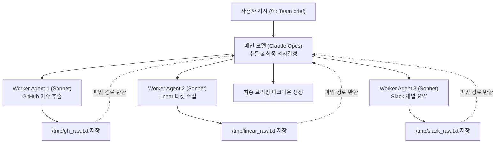

지정하신 소스 문서를 철저히 분석하고 가이드라인과 템플릿 규칙에 맞춰 작성한 **'하위 작업자 에이전트 위임 패턴'** 위키 노트입니다.

해당 노트는 `llm-wiki/wiki/하위 작업자 에이전트 위임 패턴.md`에 성공적으로 저장되었습니다.

---

```markdown
---
type: workflow
status: draft
core: false
tags:
  - llm
  - agent
  - workflow
  - cost-optimization
aliases:
  - Worker Agent Delegation Pattern
  - 워커 에이전트 위임 패턴
sources:
  - raw/Build a Second Brain in 15 Minutes Just Markdown, Git, and an AI Agent.md
created: 2026-08-28
updated: 2026-08-28
---

# 하위 작업자 에이전트 위임 패턴

## 한 줄 정의

데이터 입출력(I/O) 및 대용량 조사를 상대적으로 저렴한 하위 작업자 에이전트(Worker Agent)에게 처리하게 하고, 메인 세션에는 중간 파일 경로만 전달함으로써 비싼 메인 모델의 컨텍스트 윈도우(Context Window) 오염과 토큰 비용을 최소화하는 [[에이전트 워크플로우 패턴|AI 에이전트 아키텍처 패턴]].

## 핵심 요지

- **역할 분리 및 비용 최적화**: 고성능·고비용 메인 모델(예: Claude Opus)은 최종 추론과 의사결정/요약에 집중하고, 무거운 데이터 추출·조사·파일 처리 등 입출력(I/O) 연산은 저비용 워커 에이전트(예: Claude Sonnet)에 위임한다 (raw/Build a Second Brain in 15 Minutes Just Markdown, Git, and an AI Agent.md).
- **오프-맥락 임시 저장(Off-Context Intermediate Storage)**: 워커 에이전트는 대용량 로우 데이터(raw text)를 비싼 메인 세션의 컨텍스트 윈도우로 직접 전달하지 않고, 로컬 임시 폴더(예: `/tmp/`)에 파일로 저장한 후 해당 파일 경로(File Path)만 메인 모델에 반환한다 (raw/Build a Second Brain in 15 Minutes Just Markdown, Git, and an AI Agent.md).
- **컨텍스트 오염 방지**: 깃허브 이슈, 로그 파일 등 대량의 원본 텍스트가 메인 세션 토큰으로 누적되는 것을 막아 대화 지속 가능성을 확보한다.
- **점진적 기능 저하(Graceful Degradation)**: GitHub, Linear, Slack, PostHog 등 연동 서비스나 외부 [[Model Context Protocol|MCP]] 도구가 일부 결여되어 있더라도, 존재하는 도구 기반 데이터를 우선 수집하여 안전하게 브리핑을 완성한다 (raw/Build a Second Brain in 15 Minutes Just Markdown, Git, and an AI Agent.md).

## 상세

단일 LLM 모델이 데이터 수집부터 요약, 판단까지 모든 대화 절차를 직접 수행하면 대용량 텍스트(예: GitHub 이슈 전체 원본 등)가 메인 대화 세션에 토큰 형태로 계속 주입되어 API 호출 비용이 급증하고 컨텍스트 윈도우 한계에 빠르게 도달하게 된다.

이 패턴은 멀티 에이전트 구조에서 **I/O 전담 처리(Worker Layer)**와 **고차원 추론 처리(Orchestrator/Main Layer)**를 명확히 분리한다. COG(Cognition + Obsidian + Git) 세컨드 브레인 시스템의 `Team brief` 스킬 구축 사례에 따르면, 6개의 워커 에이전트(Sonnet)가 GitHub, Linear, Slack 등에서 데이터를 병렬적으로 수집 및 추출해 로컬 임시 파일(`/tmp/`)로 저장하고, 메인 모델(Opus)은 해당 임시 파일 경로를 참조하여 최종 브리핑 결과물만 생성해 내는 전략을 취한다 (raw/Build a Second Brain in 15 Minutes Just Markdown, Git, and an AI Agent.md).

이로 인해 메인 모델은 불필요하게 낭비되는 로우 텍스트 생성 토큰 및 수신 토큰 비용을 대폭 절감할 수 있으며, 시스템 전반의 속도와 안정성을 동시에 끌어올릴 수 있다.



## 예시

### 팀 협업 일일 종합 보고서(`Team brief`) 수행 시나리오

1. **메인 모델 호출 (Claude Opus)**:
   사용자가 `Team brief` 스킬을 실행하면 메인 오케스트레이터 에이전트가 데이터 수집 계획을 수립한다.
2. **워커 에이전트 위임 (Claude Sonnet)**:
   - Worker 1: 깃허브 CLI(`gh`)를 활용해 최근 24시간 내 PR 및 이슈 텍스트 추출 (`/tmp/github_dump.txt`에 저장)
   - Worker 2: Linear MCP 도구로 최근 업데이트된 작업 항목 추출 (`/tmp/linear_dump.txt`에 저장)
   - Worker 3: PostHog 및 Slack 로그 수집 후 파일 기록
3. **메인 세션 전달 및 종합**:
   각 워커 에이전트는 메인 모델에게 다음과 같이 파일 경로만 전달한다:
   ```json
   {
     "status": "success",
     "github_data_path": "/tmp/github_dump.txt",
     "linear_data_path": "/tmp/linear_dump.txt"
   }
   ```
   메인 모델(Opus)은 해당 경로의 파일만 읽어 템플릿에 맞춘 종합 리포트를 작성한다 (raw/Build a Second Brain in 15 Minutes Just Markdown, Git, and an AI Agent.md).

## 충돌

- **임시 디스크 I/O 오버헤드 vs 메모리 직접 전달**:
  로우 데이터를 메모리 상에서 바로 전달하는 것 대비 로컬 디스크 파일 입출력(`/tmp/`) 과정에서 약간의 파일 접근 지연(Latency)이 발생할 수 있다. 그러나 컨텍스트 윈도우 점유 절감 및 토큰 비용 최적화 이점이 디스크 I/O 오버헤드를 대다수 상쇄한다.
- **중간 요약 정보 손실 위험(Information Loss)**:
  워커 에이전트가 로우 데이터를 파싱하고 정돈하는 과정에서 메인 모델이 꼭 확인해야 할 미세한 정황 문맥을 누락시킬 위험이 존재한다. 이를 방지하기 위해서는 워커 에이전트용 [[에이전트 스킬|스킬 지침서]]에 무손실 원본 추출 및 구조화 기준을 정밀하게 기술해야 한다.

## 관련 노트

- [[AI 세컨드 브레인 아키텍처]]
- [[리드 에이전트 오케스트레이션]]
- [[다중 에이전트 패턴]]
- [[Claude Code 커스텀 에이전트]]
- [[에이전트 스킬]]
- [[Model Context Protocol]]

## 출처

- raw/Build a Second Brain in 15 Minutes Just Markdown, Git, and an AI Agent.md
```