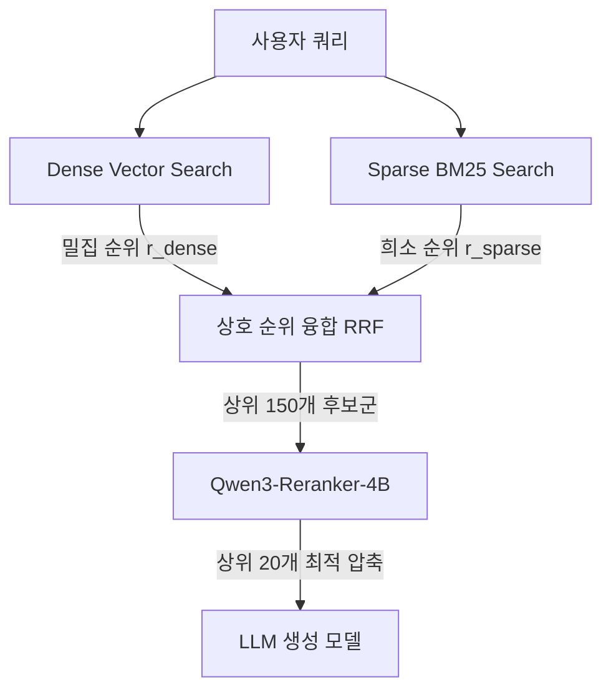

# 하이브리드 검색 인덱스

## 한 줄 정의
고차원적 맥락 유사도를 추적하는 밀집 벡터(Dense Vector) 검색과 고유 대명사 및 정밀 키워드 매칭에 특화된 희소 어휘(Sparse BM25) 검색을 병렬 가동하고, 상호 순위 융합(RRF) 및 재정렬(Rerank) 아키텍처를 통해 대규모 데이터셋에서 검색 재현율(Recall)과 신뢰성을 보장하는 검색 인덱스 기법.

## 핵심 요지
* **상호보완적 검색 모델 결합**: 의미적 추론에 강한 벡터 스캔과 고유 식별자, 제품명, 코드 기호 등에 강한 어휘식 역색인(Inverted Index)을 융합하여 단일 채널 검색 시 발생하는 정보 유실 및 누락을 예방한다.
* **상호 순위 융합 (RRF, Reciprocal Rank Fusion)**: 인덱스별로 판이한 점수(Score) 분포를 비모수적(Non-parametric) 방식인 순위 기반 스코어 합산 기법으로 일관성 있게 조율하여 통합 후보군을 추출한다.
* **Causal Reranker 기반 2차 여과**: 1차 융합 스캔으로 추출한 거친 후보군(e.g., 150개)을 대상으로 순방향 연산 기반 Reranker 모델을 통과시켜, 에이전트에 공급할 핵심 컨텍스트(e.g., 20개)로 압축 및 정렬한다.
* **인덱스 전처리 정제 연동**: MinHash LSH 알고리즘으로 유사 복사본 문서를 솎아내어 인덱스 비대화를 막고, Qwen3 로컬 모델을 통해 문서 전체 요약 프리픽스(Contextualized prefix)를 붙여 청킹 유실을 극복한다.

## 상세
### 1. 하이브리드 인덱스 구성의 축
* **밀집 벡터 인덱스 (Dense Vector Index)**: LanceDB 등의 임베디드 벡터 DB에 Qwen3-Embedding-4B 등으로 코딩된 벡터 값을 임베딩하여 문장들의 고차원적 개념 거리를 탐색한다.
* **희소 어휘 인덱스 (Sparse BM25 Index)**: 단어 빈도 및 문서 빈도를 따져 키워드 일치도를 채점하는 BM25 포스팅 목록을 디스크에 적재한다. 어휘 오인식을 줄이기 위해 NFKC 유니코드 정규화 및 공백 정규화 처리가 선행되어야 한다.

### 2. 상호 순위 융합(RRF) 및 재정렬(Rerank) 아키텍처
두 채널의 검색 엔진에서 나온 결과 문서들은 점수 스케일이 다르기 때문에 직접 비교할 수 없다. RRF 공식을 이용해 각 문서 $d$에 대한 융합 점수를 계산한다.

$$RRF\_Score(d \in D) = \sum_{m \in M} \frac{1}{k + r_m(d)}$$

여기서 $r_m(d)$는 개별 검색기 $m$에서 반환한 문서 $d$의 순위(1부터 시작)이며, $k$는 순위 가중치가 극단적으로 쏠리는 현상을 완화하는 상수(보통 60)이다.

## 예시
* **다중 인물 비교 질의**: "Scott Derrickson과 Ed Wood가 같은 국적인가요?"라는 쿼리가 유입되었을 때, 벡터 검색은 '국적', '인물'의 의미적 연관성으로 Wikipedia 단락들을 모으고, BM25는 쿼리에 적힌 'Scott Derrickson'과 'Ed Wood'라는 고유 인명 키워드를 정확히 색인 매핑한다. RRF와 Reranker는 두 정보 소스를 융합하여 두 미국인 감독의 미국 국적 서술이 명시된 gold passage들을 최상단에 정확하게 배치한다.

## 충돌
* **임베딩의 개념 뭉개짐 vs BM25의 단순 매칭 노이즈**: 밀집 벡터 임베딩은 고차원 투영 시 미세한 단어 차이(예: 고유 식별 명칭)를 뭉개뜨려 엉뚱한 문서를 긁어오고, BM25는 본문 의미와 무관한 단순 오타나 유사 단어 반복에 휘둘려 관련성 없는 문서를 제공한다. 이 충돌을 해결하기 위해 RRF 융합 파이프라인 후단에 Causal LLM 기반 Reranker를 연동하여 의미 무관 노이즈를 수술적으로 걸러내야 한다.

## 관련 노트
* `[[RAG 아키텍처 선택]]`
* `[[LLM 메모리 시스템 아키텍처]]`

